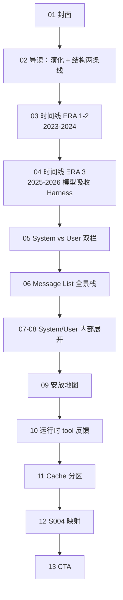

# E01-S004 小红书内容规划（阶段 B · v3）

> **当前阶段**：E · 出图完成（13 页 PNG 已校验，待阶段 F 文案确认）
> **叙事策略**：**先演化（WHY）→ 再结构（WHAT）**——两件事结合说，不互斥。
> **尚未进入**：C 风格选型 / D 视觉设计 / E 出图 / F 文案定稿

## 双线叙事：如何结合

| 线索 | 作用 | 页码区间 |
|---|---|---|
| **行业演化** | 回答「为什么 Prompt 长成今天这样」——2023→2026 时间线，模型变强、Harness 变薄 | 第 02-04 页 |
| **结构化可视化** | 回答「今天 Prompt 到底怎么摆」——System/User、Message List、Cache | 第 05-12 页 |

**衔接句**（第 04→05 页）：演化到今天，行业共识不是「写更长的 prompt」，而是**把信息拆到对的通道里**——下面用结构图展开。

**核心洞察（贯穿全文，措辞克制）**：
> Harness 远不止 Prompt——工具编排、循环、上下文管理都是 Harness。Prompt 只是其中一个侧面。近两三年的一个**趋势**是：模型变强后，部分原本写在 Harness 里的「教学性指令」在收缩；同期 Message List 的分工在变得更清晰。本期用 Prompt 结构的变化来**印证**这个趋势，而非断言「模型已吸收整个 Harness」。

## 阶段 A 摘要

| 项 | 结论 |
|---|---|
| 主题 | Prompt 行业演化（2023-2026）+ 当下结构化摆放 |
| 内容来源 | zero2agent S004 + `researches/prompt-structure/` + 竞品 git 历史 |
| 视觉策略 | 前半 **Timeline** 纵向时间轴；后半 **消息栈 / 双栏 / 嵌套盒** 工程制图 |

## 叙事主线



## 页面规划表（13 页 · v3）

### Part 1 · 行业演化（Timeline，2 页主内容 + 导读）

| 页 | 分区名 | 标题 | 主视觉 | 核心信息 |
|---|---|---|---|---|
| 01 | 封面 | 固定 Prompt 结构 | 系列封面模板 | Epic.01 / Story 004 |
| 02 | 导读 | 演化趋势 + 结构图，两条线一起讲 | 简图：时间轴箭头 → 结构图箭头 | 本期先看清「为什么变」，再看清「今天长什么样」 |
| 03 | 时间线 | 2023-2024：从泥球到分层 | **纵向 Timeline**（SERIES-RULES 5.3）：左年份标签 + 中轴线 + 右事件卡 | 2023 Aider 单字符串 → main_system + system_reminder；2024 工具描述外移 schema、动态信息开始独立 |
| 04 | 转折时间线 | 2025-2026：一个值得留意的趋势 | **Timeline 续 + 深色强调**：prompt 体量下降趋势（附注：仅为 Prompt 侧面） | Pi ~150 词 base；Codex 新模型 67 行 vs 旧模型 330 行；措辞：**部分指令在收缩，Harness 仍负责工具与循环** |

**第 03-04 页 Timeline 节点草案**：

```
2023.06  Aider 早期 — 身份+格式+流程，全写在一个字符串
2023.xx  第一次拆分 — main_system / system_reminder 分工
2024     工具时代 — 完整工具描述搬进 tool schema
2024     通道分化 — cwd / AGENTS.md 不再硬拼进 base
2025     Codex — 工具说明彻底离开 system prompt
2025-26  Pi 极简 — ~150 词 base，信任预训练
2026     新模型更短 — 同框架不同模型，prompt 重写而非删减
```

### Part 2 · 结构化可视化（承接演化结论）

| 页 | 分区名 | 标题 | 主视觉 | 核心信息 |
|---|---|---|---|---|
| 05 | 总览 | 今天的结构：System vs User | **双栏结构图** | 演化终点：两大分块职责边界 |
| 06 | 消息栈 | Message List 全景 | **纵向 Message Stack** | system → instruction → user → assistant → tool → tool result |
| 07 | System 内部 | Default System 五段式 | **嵌套 Section 盒** | Role / Scope / Policy / Workflow / Output |
| 08 | User 内部 | User Prompt 两层包装 | **XML 边界块** | runtime_context + user_task |
| 09 | 安放地图 | 各种上下文该放哪 | **通道地图表** | 信息类型 × message 角色 × cache 属性 |
| 10 | 运行时 | Tool 反馈插入对话 | **循环流程图** | tool_call / tool_result 是 message list 条目 |
| 11 | Cache（深色） | 什么该缓存、什么每轮刷新 | **双色分区带** | 静态区 vs 动态区；OpenCode system[] 等行业做法 |
| 12 | 落地 | zero2agent S004 对齐 | **映射图** | buildSystemPrompt / buildUserTaskMessage |
| 13 | CTA | 开源跟练 | 系列 CTA 模板 | Next Story 005 |

## 演化 ↔ 结构的对应关系（逻辑自检）

| 演化阶段（Part 1） | 对应结构页（Part 2） |
|---|---|
| 单字符串 → 身份/格式拆分 | 第 07 页 System 五段式（把职责拆开） |
| 工具描述外移 schema | 第 09 行「工具参数 → Tool schema」 |
| cwd/AGENTS 独立通道 | 第 08 页 User runtime；第 09 安放地图 |
| 模型变强 base 变短 | 第 07 页 System 只留 Policy 不写工具清单 |
| tool 反馈进对话 | 第 10 页 Message List 循环 |
| 静态/动态分离利于 cache | 第 11 页 Cache 分区 |

## 核心视觉语言

| 组件 | 用于 |
|---|---|
| **Timeline（5.3）** | 第 03-04 页，左标签+中轴+右内容，「We Are Here」标 2026 |
| **Message Stack** | 第 06 页 |
| **双栏结构图** | 第 05 页 |
| **嵌套 Section 盒** | 第 07 页 |
| **XML 边界块** | 第 08 页 |
| **通道地图表** | 第 09 页 |
| **Cache 分区色带** | 第 11 页（深色） |

## 推荐标题（草案）

1. 翻了 6 家 Agent 的 git 历史：Prompt 怎么演化，又怎么结构化？
2. 模型越强，Prompt 越短？先看时间线，再看 System/User 结构
3. 2023→2026：Coding Agent 的 Prompt 演化与分层摆放

## 阶段 B 确认记录

- [x] 先 2 页 Timeline、再进结构
- [x] 第 04 页论点：有趋势但不夸大；Prompt 只是 Harness 的一个侧面
- [x] 13 页总量可接受

## 阶段 C · 风格选型（3 个候选）

**约束**：延续系列 `editorial-print` 基底（纸色底、衬线标题、红色点缀、封面双层边框、页眉页脚骨架不变）。

**发挥空间**：本期主视觉是 Timeline / Message Stack / 双栏结构图——可在「结构化组件」的制图语言上做文章，而不改系列品牌色和封面模板。

### 方向 A · 稳妥：期刊 + 协议栈制图（推荐）

- **画面感**：纸色底不变；Timeline 和 Message Stack 用等宽字体 + 细黑框 + 红色节点圆点，像技术文档里的协议分层图
- **适配理由**：与 S001-S003 系列气质一致，读者无认知跳跃；结构化信息用「工程制图」组件呈现，正好服务本期主题
- **发挥点**：新增 Message Stack / 嵌套 Section 盒组件，仅在本期结构页使用

### 方向 B · 跨界：蓝图线稿（Blueprint Overlay）

- **画面感**：在 editorial-print 纸色上叠加极淡蓝色工程网格（5% 透明度）；结构页的主视觉块用「蓝图线框」——细线、标注引线、角落坐标刻度
- **适配理由**：本期讲「Prompt 结构」，蓝图隐喻「看设计图」；封面/CTA/页眉仍走系列模板，只有 Part 2 结构页进入蓝图模式
- **发挥点**：Timeline 页保持纯期刊风；第 05-11 页结构段切换蓝图线稿，形成「演化用时间轴、结构用设计图」的节奏

### 方向 C · 反差：双模态（期刊 + 终端日志）

- **画面感**：浅色页（Timeline、导读）维持系列期刊风；Message Stack / Cache / 运行时循环页切换为深色「终端日志」模式——黑底、等宽绿/琥珀文字、行首 `[system]` `[tool]` 角色标签
- **适配理由**：Message List 本质上就是对话日志；用终端视觉读栈更直觉；与系列深色反差页（#1A1A1A + 红点缀）兼容，只是把内容区做成 log 样式
- **发挥点**：第 06/10/11 页终端化，其余页期刊化；红强调色保留在页码和节点标记

### 阶段 C 确认记录

- [x] **选定风格 A**：期刊 + 协议栈制图（2026-06-21 用户确认）

**锁定设计变量**：
- 纸色底 `#F4F1EA`，衬线标题 + 无衬线正文 + 等宽标签
- Timeline / Message Stack：细黑框 + 红色节点 + 等宽 ERA/MSG 标签
- 页眉/总结栏/封面骨架遵守 `SERIES-RULES.md`

## 文件状态

| 文件 | 状态 |
|---|---|
| `CONTENT-PLAN.md` | ✅ v3（本文件） |
| `01-cover.html` ~ `13-cta.html` + `output/*.png` | ✅ 13 页完整出图（已逐张校验） |
| `post-copy.md` | ✅ v3 草案（阶段 F 待确认） |
