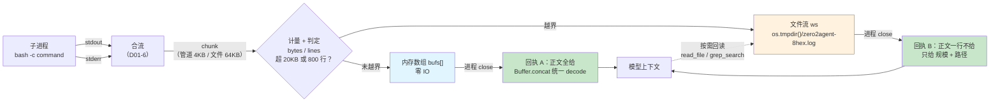
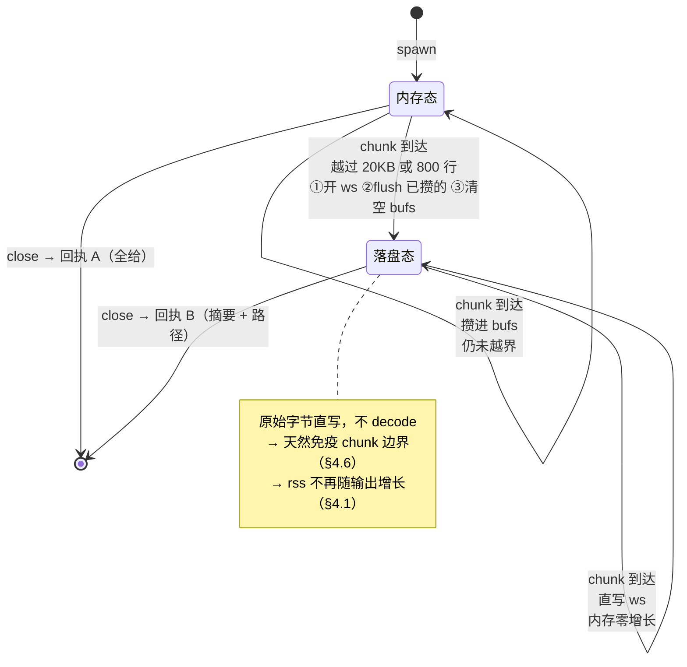
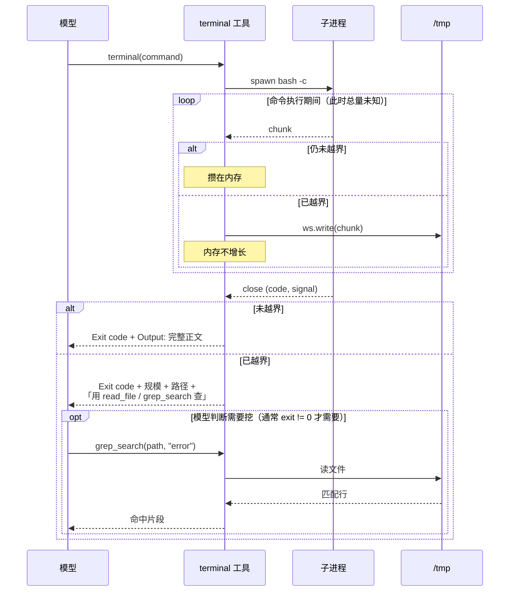

# D02：超长输出 —— 不截断，改为「落盘 + 渐进式披露」

> 议题 ②｜覆盖：T05（截断策略）
>
> 状态：✅ **已收敛**（21 项决策，待定全清；含技术架构图 + token 校准）
>
> **定位**：本文建立的不是「一个截断函数」，而是 S003 的**第一个基础设施**。
> 议题 ③（长命令转后台）会直接复用它，不再重复论证。
>
> ⚠️ **本文三次推翻了自己。** 保留这些推翻过程，它们本身是教学内容：
>
> | # | 初稿写的 | 推翻理由 |
> | - | -------- | -------- |
> | 1 | 跟五家竞品做「截尾 + 落盘」 | **问题问错了** —— 该问「要不要一次性给完」（§3.0） |
> | 2 | 全量收内存，退出后一次性落盘 | 性能取样不足，真实命令 rss +346MB（§4.1） |
> | 3 | 阈值沿用竞品 2000 行 / 50KB | 分布取样不足 + 从未换算成 token = **7% 上下文**（§3.3.1） |
>
> 三次的共同点：**每次都自称"有实测支撑"**。

---

## 一、问题：D01 留下的那个缺口

D01 §4 确定了「什么信息进上下文」，但它默认了一个前提：**输出放得下**。

一旦放不下，前面所有决策都失效：

```
git log -p -50    → 本机实测 33,552 行 / 1.4 MB
npm ls --all      → 本机实测 54,569 行 / 117 MB
cat 一个日志       → 无上限
```

（全部为本仓库真实命令，完整分布见 §7.2）

这不是极端情况。**Agent 不知道一条命令会吐多少**，它只能事后处理。

朴素做法「截断到 N 行」有个致命性质：**被丢掉的部分永久消失了**。
模型看到 `pnpm build` 的最后 500 行，发现报错指向第 1200 行的某个警告 —— 它没有任何办法拿回来。
于是它只能重跑一次命令加 `| head`，浪费一整轮。

→ 第一反应是「那就截长一点」。但这条路走不通 —— 见 §三，
**本议题最终的决策是不截断**。

---

## 二、竞品实证

| 竞品                  | 阈值                                    | 方向                            | 落盘                                  | 告知模型                                                            |
| --------------------- | --------------------------------------- | ------------------------------- | ------------------------------------- | ------------------------------------------------------------------- |
| **OpenCode V1** | 2000 行 / 50KB 双阈值                   | **保尾** `tail()`       | ✅`<data>/tool-output/`，7 天清理   | ✅ 头部插`...output truncated...\n\nFull output saved to: <file>` |
| **pi-mono**     | 2000 行 / 50KB 双阈值                   | **保尾** `truncateTail` | ✅`os.tmpdir()/pi-bash-<16hex>.log` | ✅ 尾注带**绝对行号区间** + 路径                              |
| **Codex**       | 按 token 预算（4 字节 ≈ 1 token 粗估） | **掐中间保头尾**          | ❌                                    | ✅ marker 带被删数量                                                |
| **Gemini CLI**  | 16 MB（有意放宽）                       | 保尾去头                        | ❌（后台任务另有日志）                | ✅`[GEMINI_CLI_WARNING: ...]`                                     |
| **Aider**       | **无截断**                        | ——                            | ——                                  | 只报行数问人                                                        |

关键出处：

- OpenCode 阈值 `tool/truncate.ts:15-16`；`tail()` 在 `tool/shell.ts:225-261`；
  落盘与提示 `shell.ts:578-580`；清理 `truncate.ts:13,54-66`
- pi-mono 阈值 `coding-agent/src/core/tools/truncate.ts:11-12`；
  保尾理由写在注释 `truncate.ts:162-167`；尾注 `bash.ts:414-424`
- Codex `utils/string/src/truncate.rs:15-36`；`APPROX_BYTES_PER_TOKEN = 4`（`truncate.rs:4`）
- Gemini `shellExecutionService.ts:49`（16MB）、L392-419（`appendAndTruncate`）、L743-749（warning）
- Aider 零命中：`run_cmd.py` / `commands.py` / `linter.py` 检索 `truncat|max_output` 无结果

### 2.1 三个「同一仓库内自我对照」的强证据

第一条最有说服力的不是跨竞品对比，而是**同一个仓库里两个方向相反的选择**：

> OpenCode 有一个通用 `Truncate` 服务，默认**截头**（`truncate.ts:89`）。
> 但 shell 工具**不用它**，自己实现了 `tail()` 截尾（`shell.ts:225-261`）。

pi-mono 完全同型：`read` 类工具用 `truncateHead`，bash 用 `truncateTail`，
且注释直说理由 —— `Suitable for bash output where you want to see the end (errors, final results)`（`truncate.ts:163-164`）。

→ **截头还是截尾不是风格问题，取决于数据形态**：
文件 / grep 结果的关键信息在开头，命令输出的关键信息（报错、汇总、失败列表）在结尾。

⚠️ 但这条洞察有个隐含前提 —— 「命令输出」是一种**形态一致**的数据。
§3.0 会指出这个前提不成立：`pnpm build` 和 `pnpm test` 的关键信息位置就不一样。
**同一个仓库里的自我对照证明了"要按形态选方向"，却没证明"命令输出只有一种形态"。**

### 2.2 Codex 的分歧：掐中间

Codex 唯一选择保头尾。**它的理由是成立的**：命令回显和早期报错在开头，
最终结论在结尾，中间往往是重复的进度条。

但它有个隐藏耦合值得记（`codex.md:394`）：
Codex 把超时提示放在输出**前面**，因为它自己是掐中间的 ——
若改成截尾，提示放后面就有被切掉的风险。
→ **截断策略与「附加信息放哪」是耦合的。**
⚠️ 这条耦合在 §3 的决策下**整个消失**（正文为空，没有"被切掉"这回事），
但它是"截断会派生出意想不到的约束"的一个好例子，保留。

### 2.3 Gemini 的反向选择：不截

`SCROLLBACK_LIMIT = 300000` 的注释直说动机（`shell.ts:64-66`）：
「We want to allow shell outputs that are close to the context window in size」。

→ 这是**有意不在工具层做小额截断，把预算判断交给上层**。
教学项目不该抄：我们要的是把取舍讲清楚，不是把问题推给上下文窗口。

---

## 三、决策

### 3.0 先推翻默认前提：不要截断

上面五家全在做同一件事 —— **想办法把输出尽量装进上下文**，
分歧只在「装多少」「装哪一段」。竞品调研看多了，很容易默认这就是问题的形状。

但它有个致命性质：**阈值是在跟一个未知量赌**。

| 命令                    | 关键信息在哪                               |
| ----------------------- | ------------------------------------------ |
| `pnpm build` 失败     | **开头**（第一个报错，后面全是级联） |
| `pnpm test` 失败      | **中间**（失败用例列表）             |
| `curl` / `git push` | **结尾**                             |
| `find` 大量结果       | **均匀分布**，哪段都可能有用         |

截尾赌第三种，掐中间赌第一和第三种。**没有一种截法对所有命令成立。**

更根本的是：截断是**我们代替模型做取舍**，而我们并不知道它接下来要干嘛。
"保留末尾 2000 行" 这个决定，是在模型还没看过输出的时候替它做的。

⚠️ 我在本文初稿里选了截尾，还把 Codex 的反例（编译报错在开头）记成 backlog。
**那是搞错了层次** —— 那不是"截尾方案的一个边缘情况"，
那是"截断这个方案本身选错了"的证据。

→ **换问题**：不是「截多少」，而是「**要不要一次性给完**」。

### 3.1 决策一：不截断，改为渐进式披露

**决策：输出未超阈值 → 原样全给；超阈值 → 一行都不给正文，只给一份「摘要 + 入口」。**

这个形状 zero2agent 里已经有了先例 —— **Skill 的加载方式**：
`SKILL.md` 不会把全部内容塞进上下文，而是先给一份元信息，
模型判断需要时再读细节。同一个模式：**先给足以判断的信息，把内容留在原地。**

两条路径：

```
输出 ≤ 阈值        →  Output: <完整输出>          ← 绝大多数命令走这里
输出 > 阈值        →  Output: <不放正文>
                      [Output too large: 3000 lines / 1.2 MB.
                       Saved to <path>. Use read_file / grep_search to inspect.]
```

关键差别不在于省了多少 token，在于**取舍权的归属**：

|              | 截断                                       | 渐进式披露                               |
| ------------ | ------------------------------------------ | ---------------------------------------- |
| 谁决定看哪段 | **我们**（在模型看之前）             | **模型**（拿着行数和路径自己决定） |
| 猜错的后果   | 模型拿到无关的 2000 行，且不知道自己缺什么 | 无 —— 没猜                             |
| 上下文占用   | 截断后仍有 2000 行                         | **两三行**                         |
| 模型可用动作 | 只能重跑命令                               | `grep` 报错关键词 / 读头部 / 读尾部    |

→ **第三行是意外收获**：不截断反而比截断更省 token。
截断方案里那 2000 行是"赌对了才有用"，赌错就是纯浪费。

### 3.2 为什么这比截断更好管理（用户的第二个论点）

截断方案要维护的东西比它看起来多：

| 截断要处理                                              | 渐进式披露                               |
| ------------------------------------------------------- | ---------------------------------------- |
| 截头还是截尾（按数据形态选）                            | —— 不需要选                            |
| 双阈值取先命中                                          | 仍需要，但只作**开关**，不作切割点 |
| 单行超长的特殊分支（pi-mono`truncate.ts:205-212`）    | —— 不切，就没有半行问题                |
| 按字节截时的 UTF-8 边界对齐（OpenCode`shell.ts:243`） | ——**整类消失**                   |
| 尾注必须在截断后追加（否则自己被切掉）                  | —— 没有拼接顺序问题                    |
| 截断标记放头还是放尾（Codex`codex.md:394` 的耦合）    | —— 正文为空，无耦合                    |

→ **六件事去掉五件。** 这不是省事，是**这些复杂度本来就全是"要在正确位置下刀"派生出来的**，
一旦不下刀，它们同时消失。

⚠️ 这一条对 D01-14（代码要能切出 ~20 行 happy path）是直接的加分：
截断分支从「一套带边界对齐的切割逻辑」变成「一个 if + 一次 writeFile」。

### 3.3 决策二：阈值退化为开关，不再是切割点

仍然需要一个阈值，但它的**角色变了**：

|            | 截断方案                             | 本方案                                                         |
| ---------- | ------------------------------------ | -------------------------------------------------------------- |
| 阈值的作用 | **切割点** —— 选错就丢错东西 | **开关** —— 选错只影响"走哪条路"                       |
| 选错的代价 | 信息错配，模型不知情                 | 小输出被误判 → 多一次 read_file；大输出被漏放 → 多占点上下文 |

→ **阈值从"必须选对"降级成"选个大概就行"**，这本身就说明方案更稳健。

**决策：20KB / 800 行，取先命中者。**（不是两家竞品的 2000 行 / 50KB —— 理由见 §3.3.1）

为什么两条都要（实测支撑，§7.3）：

```
head -c 3000000 /dev/zero | tr "\0" "x"   →  3,000,000 字节，换行数 0
seq 1 3000                                →  13,893 字节（未超 20KB），但 3000 行
```

一条没有换行的 3MB 长行，纯行数限制完全拦不住；
反过来 `seq 1 3000` 只有 13KB 却有 3000 行、**8001 token** —— 纯字节限制放它过去了。
**两条阈值分别防两种形态**，且第二种在实测里真的存在（§7.3）。

#### 3.3.1 ⚠️ 为什么偏离竞品的 2000 行 / 50KB：把阈值换算成 token 才发现问题

初稿沿用了 OpenCode / pi-mono 的 2000 行 / 50KB，理由是"§7.1 实测双峰分布，此值落在空档"。
**这个理由站不住,两个错误叠在一起。**

**错误一：从没把阈值换算成上下文占比。**

| 阈值 | ≈ tokens | 占 200K 上下文 |
| --- | --- | --- |
| **50KB（竞品 / 初稿）** | **≈ 14,200** | **7.1%** |
| **20KB（定案）** | ≈ 5,700 | **2.8%** |
| 8KB | ≈ 2,300 | 1.1% |

**一次工具回执吃掉 7% 上下文**，而 Agent 一轮里往往要连开三四个命令。
"双峰分布证明了阈值好选"是真的，但它**根本没回答"选得对不对"** ——
落在空档里的值有一个数量级的区间，14K token 和 5.7K token 都在空档里。

**错误二：§7.1 那个"双峰、中间是空的"结论，是取样太窄造出来的假象。**

初稿只测了 11 条命令。扩测到 40+ 条后，中间填满了（§7.2 完整表）：

```
 4,117 tok   find . -name "*.md"
 7,999 tok   git log -p -1
 8,686 tok   cat packages/core/src/tools/*.ts
 8,918 tok   git diff HEAD~1
12,113 tok   git diff HEAD~2
12,969 tok   git log -p -3
13,745 tok   npm ls --depth 1
```

**这批全是最典型的 Agent 用法**（看 diff、读一批源码、查依赖树）。
在 50KB 阈值下它们**全部原样进上下文**，每条 8K–14K token。

⚠️ **这是同一个错误的第二次犯案**：§4.1 是性能取样不足（`find /` vs `npm ls --all`），
这里是**分布取样不足**（11 条 vs 40 条）。
→ **教学点**：「实测支撑」这四个字本身不构成证据，**样本量和样本代表性才是**。

**为什么最终选 20KB / 800 行而不是更小的 8KB：**

| 候选 | 越界率（24 条真实命令） | 未越界的最大命令 |
| --- | --- | --- |
| 50KB / 2000 行 | 13% | 13,745 tok（`npm ls --depth 1`）—— 太大 |
| **20KB / 800 行（定案）** | **38%** | **4,117 tok**（`find . -name "*.md"`）—— 合理 |
| 8KB / 400 行 | **50%** | 3,365 tok | 

8KB 让**一半命令都要多一轮回读**（§3.9 代价 1 的发生率翻倍）。
20KB 的越界名单恰好是 `git diff HEAD~2` / `git log -p -3` / `npm ls` 这类
**本来就该让模型自己 grep、而不是整份糊进上下文的输出** —— 阈值落在了语义边界上，不只是数值上。

#### 3.3.2 ⚠️ 顺带纠正一条：「字节比 token 更诚实」说反了

初稿写「不抄 Codex 的 token 预算（`APPROX_BYTES_PER_TOKEN = 4`，`truncate.rs:4`），
对英文成立，对中文严重低估」。**实测推翻（§7.4）**：

| 内容类型 | bytes/token |
| --- | --- |
| 纯中文 | **4.15** |
| 纯英文 | **4.62** |
| 英文日志（结构化） | **2.66** |
| JSON 依赖树 | 3.13 |

中文是 3 字节/字，但约 1.4 字/token，**摊下来和英文几乎一样**。
真正让 bytes/token 离散的不是语言，是**结构化程度** —— 日志 / JSON / 长 hash 里
大量符号与数字各占一个 token，2.66 到 4.19 差 1.6 倍。

→ **改口**：不用 token 计数不是因为"字节更诚实"，而是因为
**字节和行数是零成本的近似，而引入 tokenizer 要给教学项目加一个重量级依赖**。
Codex 的 4 字节/token 粗估对中文其实是**对的**，我原来的批评是错的。

⚠️ 但这条同时说明**为什么阈值必须靠 token 校准过一次**：
字节做运行时开关没问题，可"20KB 到底意味着多少上下文"只能靠 tokenizer 算 ——
**近似值可以用来执行，但不能用来定值。**

### 3.4 决策三：全量落盘，路径写进回执

落盘在截断方案里是"补救"，在本方案里是**前提** —— 正文不给了，落盘是唯一入口。

**决策：超阈值时把完整输出写到磁盘，路径 + 规模写进回执。**

|              | 只截断       | 本方案                          |
| ------------ | ------------ | ------------------------------- |
| 被丢掉的信息 | 永久消失     | **没有"被丢掉的信息"**    |
| 模型想找     | 只能重跑命令 | `grep_search` / `read_file` |

⚠️ OpenCode V2 把落盘砍了（`bash.ts:21` 只留 1MB 内存上限，
TODO `bash.ts:77` 标着「以后再做流式落盘」），pi-mono 的 `OutputAccumulator` 有 220 行。
**我们要的不是那套工业实现，是最小可用版本** —— 见 §4。

### 3.5 决策四：**零新工具** —— 回读复用 `read_file` / `grep_search`

这是本议题最舒服的一处，也是前 7 个工具的复利。

本机实证（`/tmp/p3.mjs`）：现有 `read_file` 用的是
`path.resolve(ctx.cwd, filePath)`（`read-file.ts:37`），**不走 `resolveInsideCwd`**。
传绝对路径 `/tmp/x.log` 会原样解析 —— **模型读得到**。

| 工具                                              | 路径处理                                   | 能读工作区外吗 |
| ------------------------------------------------- | ------------------------------------------ | -------------- |
| `read_file`                                     | `path.resolve`（`read-file.ts:37`）    | ✅             |
| `grep_search`                                   | `path.resolve`（`grep-search.ts:283`） | ✅             |
| `write_file` / `delete` / `replace_in_file` | `resolveInsideCwd`                       | ❌             |

→ **读工具没有硬边界，写工具有** —— 正是我们需要的形状：落盘文件可读不可写。
这不是巧合，是 S001/S002「读宽写严」决策的自然结果。

**所以议题 ② 不新增任何工具。** 而且这一点对渐进式披露比对截断更关键：
截断方案里回读是"锦上添花"，本方案里回读是**唯一路径** ——
若 `read_file` 当初也走了 `resolveInsideCwd`，本方案根本不成立。

⚠️ 对照 Gemini：它为后台任务专门做了 `read_background_output`
（`tools/shellBackgroundTools.ts:253`），因为要带**运行状态**（进程还活着吗）。
② 的落盘文件是静态的，不需要状态。→ **状态需求属于议题 ③**（D03 Q3）。

### 3.6 决策五：回执写什么 —— 模型必须能"不看内容就做判断"

正文不给了，那这几行就是模型唯一的依据。借 pi-mono 尾注的三段式思路
（`bash.ts:414-424`：区间 + 总量 + 路径），按新方案调整：

```text
Exit code: 0
Output: (3182 lines / 1.4 MB — too large to inline)
Saved to: /tmp/zero2agent-a3f9c1b2.log
Use read_file or grep_search on that path to inspect it.
```

四个信息缺一不可：

| 信息                    | 模型据此判断                                              |
| ----------------------- | --------------------------------------------------------- |
| **exit code**     | 成功了就多半不用看；失败了才要挖                          |
| **行数 / 字节数** | 是 3000 行还是 30 万行，决定用`grep` 还是 `read_file` |
| **路径**          | 去哪拿                                                    |
| **明示可用工具**  | 不用它自己猜（省一轮试错）                                |

⚠️ **exit code 在这里的价值被放大了**。D01-7 定的"无条件写 exit code"，
在截断方案里只是"多一个字段"；在本方案里它是**模型决定要不要回读的主要依据** ——
`exit 0` + 大输出，绝大多数情况下不必看。
→ **D01 的一个决策，在 ② 里第二次收到回报。**

### 3.7 决策六：落盘到 `os.tmpdir()`，不落工作区

| 方案                                  | 问题                                            |
| ------------------------------------- | ----------------------------------------------- |
| 工作区内（如`.zero2agent/output/`） | 污染用户仓库，进 git status，要教`.gitignore` |
| `os.tmpdir()`                       | ✅ 系统自带清理，跨平台，pi-mono 同选           |

pi-mono 用 `os.tmpdir()/pi-bash-<16hex>.log`（`output-accumulator.ts:19-22`）。
OpenCode 用 `<data>/tool-output/` + 自写 7 天清理（`truncate.ts:13,54-66`）——
**多一个清理调度器**，S003 不要。

**决策：`os.tmpdir()`，随机后缀，不做清理**（交给系统），并在文档里写明这是有意简化。

### 3.8 决策七：只在超阈值时落盘

`echo hi` 也落盘是纯浪费。**内存累积，退出后判定，超阈值才 `writeFile` 一次。**
（与 §4「不做流式落盘」是同一个决定的两面。）

### 3.9 这个方案的代价，如实写下来

不能只说好处。渐进式披露有两个真实代价：

1. **小概率多一轮**。命令失败、输出又超阈值时，模型必须再发一次 `read_file`。
   截断方案在"赌对了"的情况下省掉这一轮。
   → 但代价可控：`exit 0` 时通常不需要回读，而 `exit != 0` 时截断方案本来也常赌错。
2. **模型可能不回读**。它看到 `Exit code: 1` + 一个路径，可能直接开始猜。
   → 缓解手段在工具描述（§5）：明确写"失败且输出被折叠时，应先回读再下结论"。
   ⚠️ **这是提示词兜底，不是工程保证** —— 承认这一点，别假装它是硬约束。

## 四、实现：内存 / 落盘的切换点

初稿在这里写了「**S003 不做流式落盘**，全量收内存、退出后一次性处理」。
**这条被实测推翻了** —— 见 §4.1。

### 4.1 ⚠️ 推翻 D02-9：全量内存累积扛不住真实命令

初稿的论据是「常见大输出在 10MB 量级，Node 完全扛得住」，
数据取自 `find / -xdev`（7.9 MB）和 `yes | head`（1.2 MB）。

**取样本身就错了** —— 那两条是我为了测试构造的，
不是开发者真的会让 Agent 跑的命令。

改用**本仓库里真实会跑的命令**重测（§7.2 完整表）：

| 命令                   | 行数   | 字节             |
| ---------------------- | ------ | ---------------- |
| `npm ls --all`       | 54,569 | **117 MB** |
| `git log -p -50`     | 33,552 | 1.4 MB           |
| `cat pnpm-lock.yaml` | 21,515 | 772 KB           |

`npm ls --all` 是一条**完全正常的排查命令**，不是恶意构造。而全量内存方案在它身上：

```
concat 前 rss 增长  122 MB     ← 光是攒 Buffer
concat 后 rss 增长  346 MB     ← Buffer.concat + toString 又复制两份
耗时              10.7 秒
```

**一条正常命令让进程 rss 涨 346MB。** 而且这还没算它最终要被丢掉 ——
渐进式披露决定了这 117MB 一个字节都不会进上下文。

⚠️ 还有一个硬天花板：`buffer.constants.MAX_STRING_LENGTH` 实测 **512 MB**。
超过就直接抛异常，而不是降级。全量内存方案在 512MB 处有一堵墙。

→ **`Buffer.concat(...).toString()` 是"为了丢掉它而先把它完整复制三份"。**

### 4.2 新方案：超阈值即弃内存、只写盘

渐进式披露给了一个截断方案没有的自由 —— **超阈值之后，正文一个字节都不要了**。
所以内存里也没必要留。

```
每个 chunk 到达：
  未越界 → push 进内存数组（正常小输出走这条，零 IO）
  刚越界 → 开文件流，把已攒的一次性写出，然后 **清空内存数组**
  已越界 → 直接写文件流，内存一个字节不留
```

实测（`/tmp/p10.mjs`，§7）：

> ⚠️ 下面的图不是「实现细节示意」，它就是本议题的**方案本体** ——
> §3 讲的是「给模型什么」，这一节讲的是「**在还不知道会有多少输出的时候，怎么做到**」。

#### 图 1：数据流总览 —— 一条流，两个出口

关键在于：**阈值判定发生在数据流内部**，而不是命令跑完之后。
所以「输出会去哪」这件事，在命令执行到一半时才被决定。



三个要点，图上看得出来但值得点明：

1. **`bufs[]` 与 `ws` 不是并存的两份数据**，是同一份数据的两个**先后**归宿 ——
   越界那一刻，`bufs[]` 里的东西被冲进 `ws` 然后清空。
2. **虚线（回读）是回执 B 唯一的信息通路。** 这就是 §3.4 说的「落盘从补救升级为唯一入口」。
3. **回执 A 那条路上没有文件系统。** `echo hi` 不会碰磁盘一次（D02-8）。

#### 图 2：chunk 到达时的状态机 —— 单向、不可回退

`over` 这个布尔量是整个方案的全部状态。它**只会 false → true，永不回退**，
所以不存在「输出后来又变小了」这种情况要处理。



⚠️ **「刚越界」那一格是全方案唯一的复杂点**，而它只有三行：开流、把已攒的倒进去、清空。
所有其他格子都是一行。这是 §4.3 说的「~10 行」的具体来源。

#### 图 3：时序 —— 为什么必须是流式，而不能先收完再判断

这张图要回答用户的那个反问：**「先全收进内存再写文件，其实就不行了」**。



**为什么「先全收再判断」不成立**，两条独立的理由：

| 理由           | 内容                                                                                                                              |
| -------------- | --------------------------------------------------------------------------------------------------------------------------------- |
| **内存** | 收完才判断，等于必须先把 117 MB 完整持有一遍 —— 而其中一个字节都不会进上下文（§4.1 实测 rss +346MB）                           |
| **时间** | 「总量」这个信息**只在 close 之后才存在**。而落盘决定必须在 chunk 到达时做，否则议题 ③（命令还在跑就要看输出）根本无从下手 |

→ 第二条比第一条更根本：**内存问题可以靠加内存缓解，时间问题不能。**
一个还在输出的命令，它的「全部输出」在物理上尚不存在。

实测（`/tmp/p10.mjs`，§7）：

| 命令                   | 输出   | 越界 | rss 增长        | 内存残留               |
| ---------------------- | ------ | ---- | --------------- | ---------------------- |
| `npm ls --all`       | 112 MB | ✅   | **40 MB** | **0 字节**       |
| `git log -p -50`     | 1.4 MB | ✅   | 0 MB            | **0 字节**       |
| `echo hi`            | 3 B    | ❌   | 0 MB            | 3 字节（就该在内存里） |
| `cat grep-search.ts` | 9.5 KB | ❌   | 0 MB            | 9,514 字节             |

**346 MB → 40 MB，且内存残留恒为 0。**（40MB 是流写入的背压缓冲，非累积。）

### 4.3 为什么这不违背「教学版要简单」

这不是把 pi-mono 那 220 行的 `OutputAccumulator` 抄回来了。对比一下：

|        | pi-mono`OutputAccumulator`                    | 本方案                             |
| ------ | ----------------------------------------------- | ---------------------------------- |
| 目标   | 内存里**始终保有**一个可用的滚动尾巴      | 越界后**什么都不保**         |
| 要处理 | 滚动窗口、`trimTail()` 从头砍、UTF-8 边界对齐 | —— 无                            |
| 行数   | ~220 行                                         | **~10 行**（上面那三个分支） |

→ **差别的根源还是渐进式披露**：pi-mono 要截断，所以必须一直维护"哪 2000 行该留"；
我们不截断，越界后**没有任何需要保留的东西**。

⚠️ 这是 §3.2 那张表的第二次兑现：**"不下刀"不只省掉了切割逻辑，
还顺带让内存管理从"滚动窗口"退化成"清空数组"。**

### 4.4 顺带解掉 Q4：③ 的流式追加是**免费**的

D02 Q4 原本担心：② 定了「不做流式」，而 ③ 的后台命令要边跑边追加，两者冲突。

**现在这个张力消失了** —— 新方案本身就是流式写盘。③ 需要的"边跑边追加"
就是 4.2 那个 `ws.write(b)` 分支，**一行都不用改**。

⚠️ ③ 只需在此基础上加一件事：**越界与否都开文件流**（因为跳过可能发生在越界之前）。
→ 这正是 Q5「未超阈值时是否也落盘」的答案：**② 不落，③ 落**，
判据是「有没有可能中途要看」。

### 4.5 二进制输出

实测：`head -c 200 /dev/urandom` → 200 字节里 82 个替换符。
随机二进制转 UTF-8 后大面积乱码，进上下文是纯污染。

Gemini 做了嗅探：前 4096 字节 `isBinary()` 命中就停止累积、只汇报字节数
（`shellExecutionService.ts:662-687`、`shell.ts:626-641`）。

**决策：S003 不做二进制嗅探**，记 backlog 并在文档写明缺口。
理由：模型主动 `cat` 二进制是罕见误操作，而嗅探要引入启发式判定。

⚠️ 但渐进式披露**顺手削弱了这个缺口**：二进制通常也很大 → 越界 → 正文不返回，
乱码进不了上下文。真正漏网的只有"小体积二进制"。

### 4.6 一个必须踩的坑：多字节字符被 chunk 边界切开

D01 §3.2 已列出这条，本议题给出**可复现的实证**（`/tmp/p7.mjs`，§7）：

```
构造：65535 个 'a' + "中文测试"（让 65536 边界正好切在汉字中间）
chunk sizes: [65536, 11]

逐 chunk toString('utf-8') → 尾部 "aa���文测试"   ← 3 个替换符
Buffer.concat 后统一 decode → 尾部 "aaaa中文测试"  ← 正确
```

⚠️ **这个 bug 很难自然复现**：随手跑 `yes 中文 | head -n 50000` 是复现不出来的
（实测坏字 0），因为边界恰好没切在字符中间。
→ **它是一个概率性 bug，会在演示时不出现、在用户那里出现。**

两家竞品都踩过并各自解决：

- OpenCode：`while ((buf[start] & 0xc0) === 0x80) start++`（`shell.ts:243`）手动对齐
- Gemini：stdout / stderr 各一个流式 `TextDecoder`，进程结束时 flush 残留
  （`shellExecutionService.ts:666-669, 822-866`）

**决策：未越界路径用 `Buffer.concat(bufs).toString('utf-8')` 统一 decode。**

⚠️ §4.2 的新方案让这条**变得更简单，而不是更难**：

| 路径                           | 怎么处理                        | 边界问题                  |
| ------------------------------ | ------------------------------- | ------------------------- |
| **未越界**（要进上下文） | `Buffer.concat` 后统一 decode | ✅ 天然规避               |
| **已越界**（只写盘）     | `ws.write(buffer)` 原样写字节 | ✅**根本不 decode** |

→ **越界路径压根不碰字符串**，文件里是原始字节，模型后续用 `read_file` 读时
由 fs 层统一 decode —— 那时是完整文件，没有 chunk 边界。

**两条路径各自免疫，中间不需要任何对齐代码**（OpenCode `shell.ts:243` 那几行位运算不用写）。
这是渐进式披露 + 弃内存流式写的复合收益。

### 4.7 分层结构（承接 D01-14）

D01 要求代码能切出 ~20 行 happy path。新方案的分层：

```
runCommand()          ← happy path：spawn + 收流 + 等退出
  ↓ 内部只有一个分支：越界 → 转文件流并清空内存
countAndSwitch()      ← ~10 行，§4.2 那三个分支
  ↓
formatReceipt()       ← 拼 D01 的回执骨架（正文 or 摘要）
```

⚠️ **这里有个诚实的代价必须记下来。**
初稿的分层是「`runCommand()` 返回完整输出 → 纯函数判定 → 装饰层落盘」，
四层完全解耦、中间两层无 IO。**新方案做不到** ——
「越界即转文件流」必须发生在数据流内部，落盘不再是可拆掉的装饰层。

|                  | 初稿（全量内存） | 新方案（越界转盘）       |
| ---------------- | ---------------- | ------------------------ |
| happy path 纯度  | ✅ 完全无 IO     | ⚠️ 内含一个写盘分支    |
| 分层可测性       | 四层各自纯函数   | 判定可测，转盘要 mock fs |
| 真实命令能不能跑 | ❌ rss +346MB    | ✅ rss +40MB             |

→ **这是"叙事洁癖"与"方案正确性"的一次真实冲突，选后者。**
D01-14 的要求是「能切出一段贴进文章的 happy path」，
新方案仍然能切（越界分支可以在文章里第二步再引入），
但不能再宣称「落盘是纯装饰层」。**改口比硬撑好。**

---

## 五、工具描述要写什么（回填 D01 §5.2）

pi-mono 的描述把输出治理契约直接写进去了（`bash.ts:57`）：

> `Output is truncated to last 2000 lines or 50KB (whichever is hit first). If truncated, full output is saved to a temp file.`

OpenCode 更进一步，描述里明确**劝阻模型自己截断**（`opencode.md:118-120`）：

> `Do NOT use head, tail, or other truncation commands to limit output; the full output will already be [saved]`

→ **这条反直觉但很重要**：模型如果自作主张写 `pnpm build | tail -50`，
它就绕过了我们的落盘机制，被它自己丢掉的部分**真的没了**。

**决策：描述里写四句** ——

1. 输出超 800 行 / 20KB 时，**正文不会返回**，只给规模 + 路径
2. 完整输出落在那个路径上，用 `read_file` / `grep_search` 查
3. **不要自己加 `head` / `tail`** —— 会绕过落盘，真的丢数据
4. 命令**失败**且输出被折叠时，**先回读再下结论**（对应 §3.9 代价 2）

⚠️ 第 1 句比截断方案的措辞更重要：模型必须知道"这次一行正文都没有"，
否则它会以为命令没输出（对照 D01 §4.2 里 OpenCode V1 那个 `(no output)` bug —— 同型陷阱）。

⚠️ 与 D01 Q3 联动：阈值写死在描述字符串里，就必须和常量保持同步。
OpenCode 用运行时渲染解决（`prompt.ts:97-98`）并**用测试断言描述文本**
（`shell.test.ts:1067`）。教学版可以用模板字符串插常量 —— 零成本，且天然同步。
→ **这条顺带把 D01 Q3 解掉了：用模板字符串插常量，不做完整运行时渲染。**

---

## 六、本议题的决策清单

| #      | 决策                                                                                              | 类型           |
| ------ | ------------------------------------------------------------------------------------------------- | -------------- |
| D02-1  | **不截断**（五家竞品全做截断，本项目有意偏离）；截断把取舍权错放在我们这边                  | 产品（核心）   |
| D02-2  | 两条路径：未超阈值原样全给；超阈值**正文一行不给**，只给摘要 + 入口                         | 产品（核心）   |
| D02-3  | **超阈值时全量落盘**，落盘从「补救」升级为「唯一入口」                                      | 产品（核心）   |
| D02-4  | **零新工具**：回读复用 `read_file` / `grep_search`（读工具无 cwd 硬边界）               | 架构           |
| D02-5  | 双阈值取先命中，**角色降级为开关**（数值见 D02-17）                                          | 产品           |
| D02-6  | 摘要四要素：exit code + 规模 + 路径 + 明示可用工具                                                | 产品           |
| D02-7  | 落盘到`os.tmpdir()`，不落工作区，不做清理                                                       | 技术           |
| D02-8  | 只在超阈值时落盘，不是每次都写                                                                    | 技术           |
| D02-9  | ~~不做流式落盘~~ → **改为「越界即弃内存、只写盘」**（被实测推翻，§4.1）                  | 技术           |
| D02-10 | 不做二进制嗅探，记 backlog 并写明缺口                                                             | 技术           |
| D02-11 | 描述写四句，含**劝阻模型自己加 head/tail** 与「失败时先回读」                               | 产品           |
| D02-12 | 描述用模板字符串插常量（**解掉 D01 Q3**）                                                   | 技术           |
| D02-13 | ~~防 OOM 上限记 backlog~~ → **越界弃内存已顺带解决防 OOM**，无需第二道上限                | 技术           |
| D02-14 | 如实记录两条代价：可能多一轮、模型可能不回读（提示词兜底非工程保证）                              | 产品（诚实度） |
| D02-15 | 未越界路径`Buffer.concat` 统一 decode；**越界路径原样写字节、不 decode**                  | 技术           |
| D02-16 | 承认落盘不再是纯装饰层（§4.7）：方案正确性优先于分层洁癖                                         | 架构（诚实度） |
| D02-17 | 阈值定 **800 行 / 20KB**（≈5.7K token ≈ 2.8% 上下文）；**有意偏离竞品的 2000 行 / 50KB**，后者 ≈14.2K token ≈ 7.1% | 产品（解 Q1）  |
| D02-18 | 落盘文件名`zero2agent-<8hex>.log`，**不带命令摘要**（命令可能含敏感参数）                 | 技术（解 Q2）  |
| D02-19 | ⚠️ **已被 D03-16 修订**：③ 不是「无条件落盘」而是「超 10 秒才落盘」，且**落盘 / 弃内存 / 回执给不给正文是三个正交开关**（见 D03 §5.5.2） | 架构（解 Q5，已修订） |
| D02-20 | **越界后不给首尾任何行**：尾部在落盘决定的那一刻物理上不存在，要给就得重建滚动窗口          | 产品（解 Q6）  |
| D02-21 | 落盘判定**必须在 chunk 到达时做**，不能等 close ——「总量」在 close 前不存在（§4.2 图 3） | 架构           |

## 七、本机实测记录

### 7.1 ⚠️ 初稿的取样（11 条命令）—— 保留下来当反面教材

初稿据此得出「双峰分布、中间是空的」，并用它支撑「2000 行 / 50KB 落在空档」。
**结论是错的，因为样本只有 11 条**。完整纠正见 §7.2。

| 命令                              | 行数   | 字节       |
| --------------------------------- | ------ | ---------- |
| `pnpm -v`                       | 0      | 33 B       |
| `git diff --stat HEAD~3`        | 9      | 651 B      |
| `npm run`                       | 22     | 533 B      |
| `tsc --noEmit -p packages/core` | 8      | 543 B      |
| `eslint packages --ext .ts`     | 12     | 1.3 KB     |
| `wc -l packages/core/src/**/*.ts` | 31   | 1.5 KB     |
| `find packages -name '*.ts'`    | 73     | 2.9 KB     |
| `cat grep-search.ts`            | 319    | 9.5 KB     |
| `cat pnpm-lock.yaml`            | 21,515 | 772 KB     |
| `git log -p -50`                | 33,552 | 1.4 MB     |
| `npm ls --all`                  | 54,569 | **117 MB** |

看这 11 条，9.5KB 到 772KB 之间确实是空的 —— **但那是因为没测中间那段**。

### 7.2 扩测到 40+ 条命令 + token 换算（定案依据）

`/tmp/p11.mjs` ~ `/tmp/p14.mjs`，tokenizer 用 `gpt-tokenizer`（cl100k 系）。

| 命令                                   | 行数   | 字节    | **tokens** | 占 200K |
| -------------------------------------- | ------ | ------- | ---------- | ------- |
| `pnpm -v`                            | 1      | 41 B    | 14         | 0.01%   |
| `tsc --noEmit -p packages/core`      | 9      | 544 B   | 135        | 0.07%   |
| `git status`                         | 13     | 540 B   | 160        | 0.08%   |
| `npm run`                            | 24     | 535 B   | 184        | 0.09%   |
| `eslint packages --ext .ts`          | 14     | 1.3 KB  | 251        | 0.13%   |
| `git log --oneline -20`              | 20     | 1.5 KB  | 432        | 0.22%   |
| `cat read-file.ts`                   | 73     | 2.2 KB  | 560        | 0.28%   |
| `ls -la`                             | 39     | 2.4 KB  | 1,021      | 0.51%   |
| `git log --oneline -100`             | 92     | 6.8 KB  | 1,929      | 0.96%   |
| `cat grep-search.ts`                 | 320    | 9.5 KB  | 2,243      | 1.12%   |
| `cat README.md`                      | 198    | 8.6 KB  | 2,366      | 1.18%   |
| `ps aux`                             | 25     | 6.0 KB  | 2,815      | 1.41%   |
| `env`                                | 167    | 7.5 KB  | 3,365      | 1.68%   |
| `find . -name '*.md'`                | 209    | 12.8 KB | 4,117      | 2.06%   |
| —— **定案阈值线：800 行 / 20 KB** —— |        |         | **≈5,700** | **2.8%** |
| `git log -p -1`                      | 394    | 25.3 KB | 7,999      | 4.00%   |
| `cat src/tools/*.ts`                 | 1,088  | 35.1 KB | 8,686      | 4.34%   |
| `git diff HEAD~1`                    | 431    | 28.1 KB | 8,918      | 4.46%   |
| `git diff HEAD~2`                    | 570    | 38.2 KB | 12,113     | 6.06%   |
| `git log -p -3`                      | 633    | 40.6 KB | 12,969     | 6.48%   |
| `npm ls --depth 1`                   | 342    | 38.1 KB | 13,745     | 6.87%   |
| —— **竞品 / 初稿阈值线：2000 行 / 50 KB** —— | |    | **≈14,200** | **7.1%** |
| `npm ls --depth 2`                   | 2,307  | 365 KB  | 134,916    | 67.5%   |
| `git log -p -10`                     | 18,567 | 792 KB  | ≈287,900   | 144%    |
| `cat pnpm-lock.yaml`                 | 21,516 | 772 KB  | ≈348,800   | 174%    |

**「中间是空的」被推翻**：4K–14K token 这段挤着 7 条命令，
且全是**最典型的 Agent 用法**（看 diff、读一批源码、查依赖树）。
初稿阈值把这 7 条全部放行，每条吃 4%–7% 上下文。

各候选阈值的越界率（24 条真实命令）：

| 候选                     | 越界率        | 未越界的最大命令                        |
| ------------------------ | ------------- | --------------------------------------- |
| 50KB / 2000 行（初稿）   | 13% (3/24)    | 13,745 tok（`npm ls --depth 1`）—— 太大 |
| **20KB / 800 行（定案）** | **38% (9/24)** | **4,117 tok（`find . -name '*.md'`）**  |
| 8KB / 400 行             | 50% (12/24)   | 3,365 tok（`env`）—— 但一半命令要多一轮 |
| 4KB / 200 行             | 63% (15/24)   | 1,021 tok —— 过度触发                   |

### 7.3 行阈值到底拦住了什么（支撑双阈值仍保留）

24 条真实命令里，**行阈值单独命中 0 次** —— 一度让我想砍掉它。
但构造「机器生成的极短行」场景后它就有用了：

| 命令                        | 行数  | 字节    | tokens | 20KB/800 行判定    |
| --------------------------- | ----- | ------- | ------ | ------------------ |
| `seq 1 3000`              | 3,000 | 13.9 KB | 8,001  | ⚠️ **仅行阈值命中** |
| `for(i<1500) console.log` | 1,500 | 6.4 KB  | 3,500  | ⚠️ **仅行阈值命中** |
| `ls -R packages`          | 314   | 4.1 KB  | 1,164  | 未越界（正确）     |
| `git ls-files`            | 350   | 17.6 KB | 5,180  | 未越界（贴边）     |

`seq 1 3000` 只有 13.9KB（未超 20KB）却是 **8,001 token**，
因为 `4.6 字节/行` 的超短行让字节数严重低估了 token 数。
→ **双阈值保留（D02-5）**：字节防长行，行数防短行洪水。

### 7.4 bytes/token 的离散来源（纠正 §3.3.2）

| 内容类型               | bytes/token | tok/line |
| ---------------------- | ----------- | -------- |
| 纯中文短句             | **4.15**    | ——       |
| 纯英文短句             | **4.62**    | ——       |
| 英文日志（时间戳+kv）  | **2.66**    | 32.0     |
| JSON 依赖树            | 3.13        | 32.0     |
| 英文代码               | 3.80        | 25.0     |
| 中英混合文档           | 3.34        | 35.0     |

→ **语言不是离散源，结构化程度才是**（2.66 ~ 4.62，差 1.7 倍）。
初稿「4 字节/token 对中文严重低估」的批评**是错的**，已在 §3.3.2 改口。

实测里 `tok/line` 波动 **7.0（源码）~ 58.5（`npm ls`）**，
这也说明**行数与上下文成本相关性弱** —— 它只适合当短行洪水的兜底，不适合当主阈值。

### 7.5 内存方案对比（推翻 D02-9）

| 方案                           | 命令                   | rss 增长                                                | 内存残留                     | 结论                    |
| ------------------------------ | ---------------------- | ------------------------------------------------------- | ---------------------------- | ----------------------- |
| 全量内存（初稿）               | `npm ls --all`       | concat 前**122 MB** → concat 后 **346 MB** | 全量                         | ❌ 一条正常命令涨 346MB |
| 纯流式写盘                     | `npm ls --all`       | 40 MB                                                   | 0                            | ✅ 但小命令也白开文件   |
| **越界即弃内存**（定案） | `npm ls --all`       | **40 MB**                                         | **0 字节**             | ✅                      |
| 越界即弃内存                   | `git log -p -50`     | 0 MB                                                    | **0 字节**             | ✅                      |
| 越界即弃内存                   | `echo hi`            | 0 MB                                                    | 3 字节（未越界，就该在内存） | ✅ 不开文件             |
| 越界即弃内存                   | `cat grep-search.ts` | 0 MB                                                    | 9,514 字节（未越界）         | ✅ 不开文件             |

硬天花板：`buffer.constants.MAX_STRING_LENGTH` 实测 **536,870,888 ≈ 512 MB**。
全量内存方案在此处**抛异常而非降级**。

### 7.6 编码与边界

| 场景                                           | 结果                                                                                          | 支撑                                |
| ---------------------------------------------- | --------------------------------------------------------------------------------------------- | ----------------------------------- |
| chunk 大小                                     | 管道 4096 B；文件`cat` 可达 65536 B                                                         | 边界坑前提                          |
| `head -c 3000000 /dev/zero \| tr "\0" "x"`    | 3,000,000 字节，**换行数 0**                                                            | ⚠️ 必须双阈值（D02-5）            |
| `yes 中文测试abc \| head -n 50000`            | 逐 chunk decode**坏字 0**                                                               | ⚠️ 边界坑**随手复现不出来** |
| 65535 ×`'a'` + `中文测试`（`cat` 文件） | chunk`[65536, 11]`；逐 chunk → `aa���文测试`（3 个替换符）；`Buffer.concat` → 正确 | ⚠️ D02-15 关键实证                |
| `head -c 200 /dev/urandom`                   | 200 字节 → 82 个替换符                                                                       | D02-10 缺口                         |

### 7.7 路径能力（支撑零新工具）

| 场景                                  | 结果                                                                           |
| ------------------------------------- | ------------------------------------------------------------------------------ |
| `read_file` 传 `/tmp/x.log`       | `path.resolve` 原样返回绝对路径 → ✅ D02-4 成立                             |
| `read_file` 传 `../../etc/passwd` | 解析到`/home/etc/passwd`，**不拦截**（读工具本就无边界，非本议题引入） |
| `resolveInsideCwd(".")`             | 返回`null` → 支撑 D01-3                                                     |

### 7.8 派生结论

1. **取样方式决定结论。** 初稿用构造命令（`find /` / `yes`）测出"10MB 量级，扛得住"，
   换成真实命令立刻出现 117MB。
   → **性能取样必须取自真实工作负载**，否则量化只是给错误结论盖了个章。
   ⚠️ 这条比 D02-9 本身更值得进文章。
2. ⚠️ **"输出规模双峰、中间是空的"是取样不足造出来的假象。**
   11 条样本看确实空，扩到 40+ 条后 4K–14K token 这段挤着 7 条最典型的 Agent 命令（§7.2）。
   → **同一个取样错误在本文犯了两次**：一次在性能（结论 1），一次在分布。
   ⚠️ 「实测支撑」这四个字本身不是证据，**样本量与代表性才是**。
3. **阈值必须换算成上下文占比才算定完。** 字节数是运行时开关的正确单位，
   但"20KB 意味着多少上下文"只能靠 tokenizer 算一次 ——
   → **近似值可以用来执行，不能用来定值。** 50KB 看着不大，其实是 7% 上下文。
4. **bytes/token 的离散源是结构化程度，不是语言。** 纯中文 4.15、纯英文 4.62、
   英文日志 2.66（§7.4）。初稿"4 字节/token 对中文严重低估"的批评是错的。
5. **行数与上下文成本相关性弱**（tok/line 波动 7.0 ~ 58.5），
   所以行阈值只配当"短行洪水"的兜底，不配当主阈值 —— 但也不能删（§7.3 `seq 1 3000`）。
6. **多字节边界 bug 是概率性的** —— 随手测不出来，必须刻意构造。
   正确应对不是"测到了再修"，而是**用结构性做法让它不可能发生**（两条路径各自免疫）。
7. **落盘方案能成立，靠的是前 7 个工具早就定好的「读宽写严」** ——
   若当初 `read_file` 也走 `resolveInsideCwd`，这里就得新增工具。
   → **早期的一个边界决策，两个 Story 之后免费兑现。**

## 八、待定

| #       | 待定                                               | 结论                                                                                                                               |
| ------- | -------------------------------------------------- | ---------------------------------------------------------------------------------------------------------------------------------- |
| ~~Q1~~ | 阈值取值                                           | ✅ **800 行 / 20KB**（≈5.7K token ≈ 2.8% 上下文）。初稿定的 2000 行 / 50KB ≈14.2K token ≈7.1%，且「双峰空档」是 11 条样本造出的假象 → D02-17、§3.3.1、§7.2 |
| ~~Q2~~ | 落盘文件名格式                                     | ✅`zero2agent-<8hex>.log`，**不带命令摘要** —— 命令可能含 token / 密码等参数，进文件名等于泄漏到 `/tmp` 列表 → D02-18 |
| ~~Q3~~ | 超阈值时还要不要`<untrusted_context>`            | ✅**不加**。正文为空，整个回执都是我们自己写的（D01-10 的边界正好画在此处）；未越界时才包 `Output:` 段                     |
| ~~Q4~~ | ③ 的持续追加写与「不做流式」冲突                  | ✅**张力消失**。§4.2 的新方案本身就是流式写盘，③ 直接复用同一分支，一行不改                                                |
| ~~Q5~~ | 未超阈值时是否也落盘                               | ✅**② 不落，③ 落**。判据：有没有可能「中途要看」→ D02-19                                                                  |
| ~~Q6~~ | 越界后是否要在回执里给**首尾各几行**作为提示 | ✅**不给。** 不是因为"渐进式披露要纯粹"，而是**尾部在物理上拿不到** —— 见下方 → D02-20                              |

### ⚠️ Q6 被否掉的真正理由：尾部在越界那一刻还不存在

我原本的犹豫是价值权衡（「目录页」vs「截断回归」）。用户给了一个更硬的技术理由：

> **有些命令还在持续输出，所以它的尾部不一定能拿到。**

把它放到 §4.2 的状态机上看，这条立刻成立：

| 时刻                                 | 头部                             | 尾部                               |
| ------------------------------------ | -------------------------------- | ---------------------------------- |
| **越界那一刻**（做落盘决定时） | ✅ 有（就在`bufs[]` 里）       | ❌**不存在** —— 命令还在跑 |
| close 之后                           | 要么已冲进文件，要么得单独留一份 | ✅ 才存在                          |

于是「首尾各 3 行」要成立，必须**额外维护一个滚动尾窗口**：
落盘之后仍在内存里保留最后 N 行，每来一个 chunk 就 trim 前面的。
**那正好就是 pi-mono 那 220 行 `OutputAccumulator`**（§4.3 表格里我们刚刚摆脱的东西）——
滚动窗口、`trimTail()` 从头砍、还得处理 UTF-8 边界（因为要 decode 成行）。

→ **「给个首尾几行几乎零成本」这个判断是错的。** 它零成本的前提是「反正全量在内存里」，
而 §4.1 刚刚把那个前提推翻了。**方案 A 的廉价特性不能拿到方案 B 里用。**

而议题 ③ 把这条推到极端：后台命令**永远没有 close**，尾部不是「暂时没有」，是**根本不会有终态**。

⚠️ 补一句诚实的：Q6 想解决的问题是真的 —— **模型可能不知道该 grep 什么**（§3.9 代价 2）。
但正确的解法不是塞几行正文，而是 D02-6 的四要素本身：
`exit code` 告诉它要不要挖，行数告诉它用 `grep` 还是 `read_file`，
而"该 grep 什么关键词"**模型比我们清楚** —— 它知道自己刚跑的是 `pnpm build` 还是 `pytest`。
→ **这正是 §3.0 的立论：不要替模型做它信息更充分的判断。**

## 九、教学价值

1. **五家都这么做，不等于问题的形状就是这样** ——
   本文最大的教学点是 §3.0 那次推翻：竞品调研看多了，会不自觉接受
   「怎么把输出装进上下文」这个问题设定，而正确的问题是「要不要一次性给完」。
   ⚠️ **调研的风险不是抄错答案，是抄走了问题。**
2. **截断是替模型做取舍，而我们没有做取舍的信息** ——
   关键信息在开头/中间/结尾，取决于哪条命令。没有一种截法通吃（§3.0 表）。
3. **渐进式披露不是"省 token 的技巧"，是"把决策权还给决策者"** ——
   附带效果才是更省 token（截断后剩 2000 行 vs 摘要 3 行）。
4. **好方案会让一堆配套复杂度自己消失** —— §3.2 六件事去掉五件。
   如果一个"更好的方案"让复杂度变多了，值得回头看看是不是没选对。
5. **一个简化可以顺手消掉一整类 bug** ——
   不做流式 + 不做截断，两个决策各灭掉多字节边界 bug 的一半。
   ⚠️ 但代价要量化（§4.1），不能靠感觉。
6. **概率性 bug 的正确应对是结构性消除，不是加测试** —— §7.8 派生结论 6。
7. **早期的边界决策会在后面免费兑现** —— "读宽写严"让 ② 零新工具；
   D01「无条件写 exit code」在这里成了模型判断要不要回读的主要依据。
8. **要防着模型"帮倒忙"** —— 它自己加 `| tail -50` 会绕过落盘。
   工具描述要显式劝阻（OpenCode 已经这么做）。
9. **写下方案的代价（§3.9）** —— 尤其"模型可能不回读"这条只能靠提示词兜底。
   承认工程手段的边界，比假装方案完美更有教育意义。
10. **性能取样必须取自真实工作负载** —— 本文第二次推翻自己（§4.1）：
    用 `find /` 测出"扛得住"，换成 `npm ls --all` 立刻 346MB。
    ⚠️ **量化不等于正确**。用错的样本做量化，只是给错误结论盖了个章 ——
    这比"没量化"更危险，因为它看起来有据可依。
11. **换了方案，要重算每个选项的成本** —— Q6（给首尾几行）在全量内存方案里几乎免费，
    在流式方案里要重建一个滚动窗口。我差点用 A 方案的价格去买 B 方案的功能。
    ⚠️ **推翻一个决策之后，所有"当时算过很便宜"的附加想法都要重新算一遍。**
12. **阈值不换算成「占多少上下文」，就等于没定** —— 本文第三次推翻自己（§3.3.1）：
    50KB 抄自两家竞品、落在"双峰空档"里，看着很有依据，
    换算成 token 才发现是**7% 上下文**。
    ⚠️ **工程量纲（字节）和资源量纲（token）不是一回事。** 用前者做开关没问题，
    但定值必须过一遍后者 —— 否则你是在用一个自己没算过的数字做决策。
13. **同一个取样错误可以犯两次** —— §4.1 是性能取样不足（11 条里全是构造命令），
    §3.3.1 是分布取样不足（11 条里没有中间段）。两次都自称"实测支撑"。
    ⚠️ **「我测过了」和「我测够了」之间差着样本代表性**，而后者没有自动提醒。
14. **有些约束是时间性的，不是资源性的** —— 「先收完再判断」的问题不只是内存爆
    （那还能靠加内存缓解），而是**「全部输出」这个东西在命令跑完前物理上不存在**（§4.2 图 3）。
    ⚠️ 分清"贵"和"不可能"：前者可以谈，后者只能换设计。

## 十、向议题 ③ 的顺延

本议题把「输出落盘 + 模型按需回读」建成了基础设施。议题 ③ 直接复用：

| 触发           | 超了什么             | 落盘内容                             |
| -------------- | -------------------- | ------------------------------------ |
| 输出太长（②） | **上下文预算** | 全量输出，一次写完                   |
| 命令太久（③） | **等待耐心**   | 到目前为止的输出，**持续追加** |

⚠️ 差别在最后一格：③ 要**边跑边写**。
初稿曾把这当成 ②→③ 之间唯一的真实张力（旧 Q4），因为当时 D02-9 写着「不做流式」。
→ **§4.1 推翻 D02-9 之后，这个张力自己消失了**：② 已经是流式写盘，
③ 直接复用 §4.2 图 2 的「落盘态」分支，但**触发条件换成时间**（超 10 秒）。
⚠️ **D03-16 修订了这里**：③ 不是「不等越界就开流」（那会让 `echo hi` 也拉一个文件），
而是「到 10 秒才开流」；且超时触发的那条路**不弃内存、回执正文照给** ——
因为量必然小于 20KB，否则早就被越界触发了。完整状态机见 D03 §5.5.2。

✅ 而且改成渐进式披露之后，②→③ 的**回执形状**也对齐了：

```
② 超阈值：  Output: (3182 lines / 1.4 MB — too large to inline)
            Saved to: <path>

③ 已跳过：  Status: running in background (pid 12345)
            Output so far saved to: <path>
```

两者都是「**正文不给，给规模 + 路径**」，模型用同一套动作（`read_file` / `grep_search`）应对。
→ 若当初选了截断，② 给的是"截断后的 2000 行"、③ 给的是"路径"，
**两个议题的回执形状不一致，模型要学两套。**
这是渐进式披露在架构上的额外收益 —— 当时没预料到。
