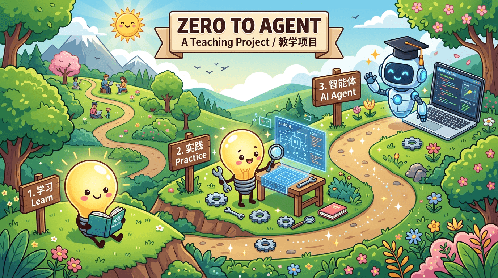
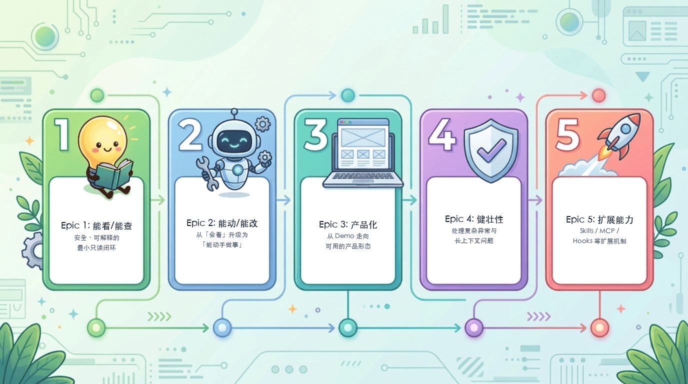

<p align="center">
  
</p>

<h1 align="center">Zero2Agent</h1>

<p align="center">
  <a href="https://github.com/alienzhou/zero2agent"></a>
  <a href="https://github.com/alienzhou/zero2agent/blob/main/LICENSE"></a>
  <a href="https://github.com/alienzhou/zero2agent"></a>
</p>

<p align="center">
  <a href="./README.md">Chinese</a> | <a href="./README.en.md">English</a>
</p>

<h3 align="center">🚀 Build a Production-Grade Agent Harness from Scratch, Learn by Doing</h3>

<p align="center">
  <i>Dive into engineering details and hands-on build your first Agent Harness</i>
</p>

---

## 🎯 Project Introduction

> There is a lot of content about Agents on the market—papers, tutorials, products, open-source projects—but few teach you how to "build a production-grade Agent Harness from scratch." This repository is exactly that kind of **teaching case project**.

- **Start from the first line of code**, step-by-step implementation of the **Agent Harness** required for Coding Agents like Claude Code / Codex (loop orchestration, tool calling, context, and host capabilities)
- **Fully open and transparent**, including requirement analysis, design decisions, pitfalls encountered, and detours taken
- **Records the real process of collaborating with AI**, Vibe Coding / Agentic Engineering will be applied throughout the development process

---

## How is it different from other learning resources?

| Dimension              | Other Courses                     | Open-Source Products            | Zero2Agent                                    |
| ---------------------- | --------------------------------- | ------------------------------- | --------------------------------------------- |
| **Engineering Practice** | Mostly conceptual, code is mostly demos | Only final code, lacks process | Dives into real engineering problems, based on accumulated experience from past Agent Harness / Agent development |
| **Production-Grade**   | Basic features and cases          | Complete but complex, hard to learn | Curated features from real products, used as follow-along material    |
| **Step-by-Step Follow-Along** | Chapter-based, large leaps, not detailed  | Massive code and changes, hard to follow | Each iteration can be followed independently, moderate size, progressive      |

> Take a concrete example to intuitively feel the difference:
>
> Implementing the Grep Search tool. It not only explains how to implement it, but also breaks down the three-layer reasons from a product and engineering perspective why RAG code search is not used—effectiveness, cost, and controllability. (→ [grep search vs codebase search](./specs/E01-read-and-search/S002-content-search/deep-dive/04-grep-search-vs-codebase-search.md))

---

## Is it right for you?

If you:

- **Want to get started with LLM application development**, but don't know where to begin
- **Want to learn how to implement an Agent Harness**, but others' blogs are too abstract and frameworks are too black-box
- **Want to understand what real AI-assisted development looks like**, rather than the "done in 10 minutes" hype in marketing articles
- **Prefer learning by doing**, rather than just reading theory

Then this teaching project is for you.

---

## 📦 What You'll Get

### Witness the complete/real Agent Harness building process

Content summarized from production projects, used as teaching cases. Not a complete toy project, but based on real development.

> This incorporates the author's real product development experience—pitfalls encountered in actual product teams, design decisions made, and even detours taken.

- Starts from real problems/requirements
- Includes requirement discussion records (why do it this way instead of that), design documents (specs for each iteration, with `details/` under each Story entry page to collect technical details)
- Accompanying code implementation
- Retrospective notes (what went right, what went wrong)

### Pressure-free follow-along mode

Each iteration has a Git tag, so you can:

```bash
git checkout E01-S001-react-basic  # Jump to any iteration
```

Forking the repo and doing it yourself is the best way to learn. Don't worry, you can jump in and follow along at **any time, from any progress point** (git tag), or just pick topics you're interested in to explore.

### Learn AI collaborative development

At the same time, this project will be developed collaboratively with AI throughout, making it a journey of Vibe Coding/Agentic Engineering in itself. You will see:

- What the conversations and prompts with AI look like during actual coding
- Practices of patterns like SSD development
- How to use AI to do more things

---

## 🗺️ Course Roadmap

Course content is organized in a four-layer structure:

- **README / Homepage**: Quickly understand the project's positioning and entry point
- **Roadmap Overview Page**: Start with the complete learning map
- **Epic Page**: Understand why a certain phase exists
- **Story Page**: Dive into specific topics, start with the course entry, then enter `details/` as needed for technical deep dives

### Current Roadmap

<p align="center">
  
</p>

| Epic | Objective | Status |
| ---- | --------- | ------ |
| [Epic 1: Read / Search](./specs/E01-read-and-search/README.md) | Run a secure, interpretable minimal read-only closed loop for Agent Harness | ✅ Done |
| Epic 2: Act / Modify / Execute | Move Agent Harness from "being able to read" to "being able to take action" | [In Progress](./specs/E02-act-and-execute/README.md) |
| Epic 3: Core Capabilities & Productization | Move Agent Harness from demo to a usable product form | Planned |
| Epic 4: Robustness & Context Management | Handle exceptions, long contexts, and complex runtime scenarios | Planned |
| Epic 5: Extensibility | Introduce extensibility features like AGENTS, Skills, MCP, Hooks, etc. | Planned |

### How to Get Started

- If you are new to this project, start with the [Course Roadmap Overview](./docs/roadmap/README.md)
  - First, build a complete learning map, then dive into specific Epics and Stories
- If you want to start directly with the first complete example, begin with [E1-S1: Run the minimal read-only closed loop for Agent Harness](./specs/E01-read-and-search/S001-react-basic/README.md)
  - This will first tell you what we are solving; when you want to go deeper, enter the `details/` under the Story to read the design documents
- If you want to see what's been done recently, check [CHANGELOG.md](./CHANGELOG.md)
  - You can follow the iteration records, then jump into the corresponding Epic or Story

**Recommended order for first-time visitors**:

1. [Course Roadmap Overview](./docs/roadmap/README.md)
2. [Epic 1: Read / Search](./specs/E01-read-and-search/README.md)
3. [E1-S1: Run the minimal read-only closed loop for Agent Harness](./specs/E01-read-and-search/S001-react-basic/README.md)

---

## What this is NOT

This is not an Agent product intended for direct production use. It is more of a "teaching aid"—focusing on teaching you how to implement an **Agent Harness**, rather than giving you a ready-made product.

If you are looking for an out-of-the-box Coding Agent or assistant product, try products like Claude Code, Cursor, Codex, or projects like Open Code, PI.

This is a **learning resource**, not a pure tool.

---

## Project Structure

```
zero2agent/
├── packages/           # Code
│   ├── core/           # Agent Harness core logic
│   ├── tui/            # CLI interface
│   └── shared/         # Shared code
├── specs/              # Course entry points + Story technical docs
├── retros/             # Retrospective notes
├── .vibecoding/        # AI collaboration records
├── .discuss/           # Requirement discussion records
└── CHANGELOG.md        # Iteration log
```

---

## Iteration Progress

**Latest Update**: E01-S004 Fixed Prompt Structure Completed — [View Details](./CHANGELOG.md#e01-s004-prompt-structure-done)

| Iteration | Content | Status |
| --------- | ------- | ------ |
| [E01-S001](./specs/E01-read-and-search/S001-react-basic/README.md) | Basic Agent Harness Loop | Done |
| [E01-S002](./specs/E01-read-and-search/S002-content-search/README.md) | Content Search (grep_search) | Done |
| [E01-S003](./specs/E01-read-and-search/S003-file-search/README.md) | File Search (find_files) | Done |
| [E01-S004](./specs/E01-read-and-search/S004-prompt-structure/README.md) | Prompt Structuring (buildSystemPrompt) | Done |

View full iteration records and learning guide: [CHANGELOG.md](./CHANGELOG.md) | [Course Roadmap](./docs/roadmap/README.md)

---

## 🚀 Quick Start

```bash
git clone git@github.com:alienzhou/zero2agent.git
cd zero2agent
pnpm install && pnpm build

# Set API Key (supports official Anthropic or compatible APIs)
export ANTHROPIC_API_KEY="your-api-key"
# export ANTHROPIC_BASE_URL="https://api.example.com"  # Optional: proxy URL

# Run CLI demo (Agent Harness, execute in project root directory)
node packages/tui/dist/cli.js "your prompt"
```

Requirements: Node.js >= 22.0.0, pnpm >= 9.0.0

---

## 📄 License

MIT
