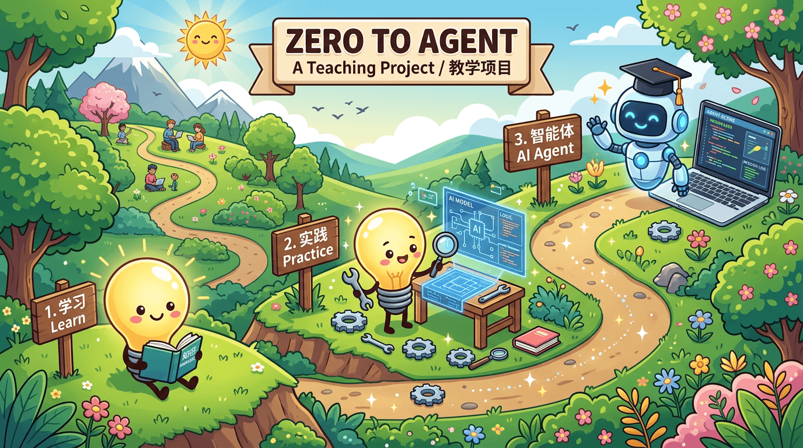

<p align="center">
  
</p>

<h1 align="center">Zero2Agent</h1>

<p align="center">
  <a href="https://github.com/alienzhou/zero2agent"></a>
  <a href="https://github.com/alienzhou/zero2agent/blob/main/LICENSE"></a>
  <a href="https://github.com/alienzhou/zero2agent"></a>
</p>

<p align="center">
  <a href="./README.md">中文</a> | <a href="./README.en.md">English</a>
</p>

<h3 align="center">🚀 从零开始构建产品级智能体的跟练课程</h3>

<p align="center">
  <i>深入工程细节，动手实现你的第一个 Coding Agent</i>
</p>

---

## 🎯 项目介绍

> 市面上有很多 Agent 相关的内容——有论文、有教学、有产品、有开源项目——但很少有人教大家"从零开始做一个产品级 Agent"。这个仓库就是这么一个**教学案例项目**。

- **从第一行代码开始**，一步步构建一个类似 Claude Code / Codex 的产品级 Coding Agent
- **完全公开透明**，包括需求分析、设计决策、踩过的坑、走过的弯路
- **记录和 AI 协作的真实过程**，Vibe Coding / Agentic Engineering 会应用在开发过程中

---

## ✨ 和其他学习资源有什么不同？

| 维度               | 其他课程                    | 开源产品               | Zero2Agent                                    |
| ------------------ | --------------------------- | ---------------------- | --------------------------------------------- |
| **工程实践** | 概念讲解为主，代码多为 demo | 只有最终代码，缺少过程 | 深入真实工程问题，过往 Agent 开发实际经验沉淀 |
| **产品级**   | 功能与案例问题较基础        | 完整但复杂，难以学习   | 从实际产品中筛选与整理的功能，作为跟练素材    |
| **小步跟练** | 章节式学习，跨度大，不细致  | 代码与变更庞杂，难跟练 | 每个迭代都可独立跟练，大小适中，循序渐进      |

---

## 🎓 适合你吗？

如果你：

- 🌱 **想入门 LLM 应用开发**，但不知道从哪开始
- 🤖 **想学习 AI Agent 开发**，但看别人的博客太抽象、看框架又太黑盒
- 🛠️ **想了解真实的 AI 辅助开发是什么样的**，而不是营销文里那种"10 分钟搞定"
- 📚 **喜欢通过实战学习**，而不是只看理论

那这个教学项目适合你。

---

## 📦 你能获得什么

### 📖 看到完整/真实的 AI Agent 构建过程

从生产项目中总结出来的内容，作为教学案例，不是完全的 Toy Project，而是基于真实的开发：

- 从实际问题/需求出发
- 包括需求讨论记录（为什么这么做，而不是那么做）、设计文档（每次迭代的 spec）
- 配套的代码实现
- 复盘笔记（哪里做对了，哪里搞砸了）

### 🤖 学习和 AI 协作开发

同时，这个项目也会全程用 AI 协同开发，本身也是一次 Vibe Coding/Agentic Engineering 的旅程。你可以看到：

- 实际编码时和 AI 的对话和 prompt 长什么样
- SSD 开发等模式的实践
- 如何用 AI 来做更多的事情

### 🔧 无压力的跟练模式

每个迭代都有 Git tag，你可以：

```bash
git checkout E01-S001-react-basic  # 跳到任意迭代
```

Fork 后自己动手，是最好的学习方式。别担心，你可以在**任意时间、从任意进度**（git tag）进入来跟练，或者挑选你感兴趣的来了解。

---

## 🗺️ 课程路线图

课程内容按四层结构组织：

- **README / 首页**：快速理解项目定位与入口
- **Roadmap 总览页**：先看完整学习地图
- **Epic 页**：理解一个阶段为什么存在
- **Story 页**：进入具体课题，理解如何观看实现

### 当前 Roadmap

| Epic | 目标 | 状态 |
| ---- | ---- | ---- |
| [Epic 1：能看 / 能查](./specs/E01-read-and-search/README.md) | 让 Agent 跑起安全、可解释的最小只读闭环 | 🚧 In Progress |
| Epic 2：能动 / 能改 / 能执行 | 让 Agent 从“会看”走向“能动手做事” | 📝 Planned |
| Epic 3：基础能力与产品化 | 让 Agent 从 demo 走向可使用的产品形态 | 📝 Planned |
| Epic 4：健壮性与上下文管理 | 处理异常、长上下文和复杂运行情况 | 📝 Planned |
| Epic 5：扩展能力 | 引入 AGENTS、Skills、MCP、Hooks 等扩展能力 | 📝 Planned |

**推荐起点**：

- 先看 [课程 Roadmap 总览](./docs/roadmap/README.md)
- 然后进入 [Epic 1：能看 / 能查](./specs/E01-read-and-search/README.md)
- 如果你想直接看一个完整的 Story 样例，可以从 [E1-S1：让 Agent 跑起最小只读闭环](./specs/E01-read-and-search/S001-react-basic/README.md) 开始

---

## ⚠️ 这不是什么

这不是一个希望让你直接用于生产的 Agent 产品，更多还是作为“教具"。

如果你想找一个开箱即用的 AI Agent，去试试 Claude Code、Cursor、Codex 这些产品，或者 Open Code、PI 这些项目。

这里是**学习资源**，不是纯粹的工具。

---

## 📁 项目结构

```
zero2agent/
├── packages/           # 代码
│   ├── core/           # Agent 核心逻辑
│   ├── tui/            # CLI 界面
│   └── shared/         # 共享代码
├── specs/              # 设计文档
├── retros/             # 复盘笔记
├── .vibecoding/        # AI 协作记录
├── .discuss/           # 需求讨论记录
└── CHANGELOG.md        # 迭代日志
```

---

## 📈 迭代进度

| 迭代 | 内容            | 状态      |
| ---- | --------------- | --------- |
| E01-S001 | 基础 Agent 循环 | ✅ Done |

👉 查看完整迭代说明和学习指南：

- [课程 Roadmap](./docs/roadmap/README.md)
- [CHANGELOG.md](./CHANGELOG.md)

---

## 🚀 快速开始

```bash
git clone git@github.com:alienzhou/zero2agent.git
cd zero2agent
pnpm install && pnpm build
pnpm --filter @zero2agent/tui start
```

环境要求：Node.js >= 22.0.0, pnpm >= 9.0.0

---

## 📄 License

MIT
