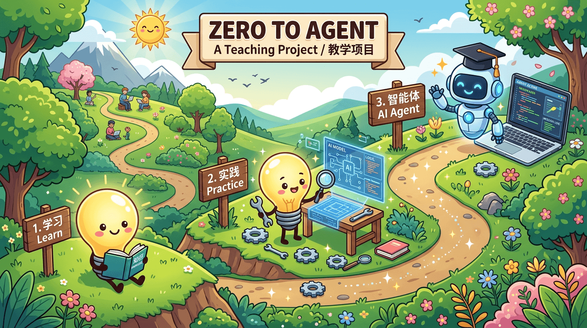
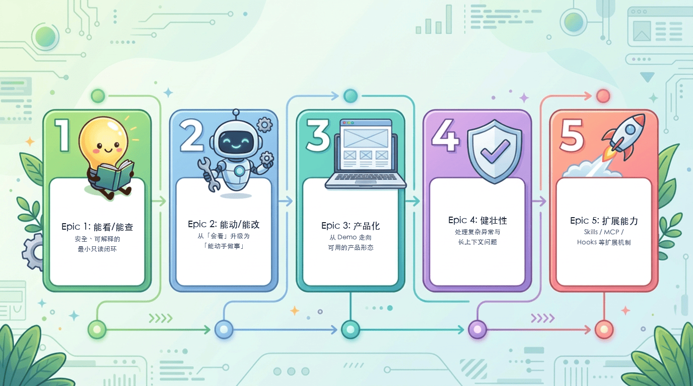

<p align="center">
  
</p>

<h1 align="center">Zero2Agent</h1>

<p align="center">
  <a href="https://github.com/alienzhou/zero2agent"></a>
  <a href="https://github.com/alienzhou/zero2agent/blob/main/LICENSE"></a>
  <a href="https://github.com/alienzhou/zero2agent"></a>
</p>

<p align="center">
  <a href="./README.md">中文</a> | <a href="./README.en.md">English</a>
</p>

<h3 align="center">🚀 从零开始，实现产品级 Agent Harness，边学边练</h3>

<p align="center">
  <i>深入工程细节，动手实现你的第一个 Agent Harness</i>
</p>

---

## 🎯 项目介绍

> 市面上有很多 Agent 相关的内容——有论文、有教学、有产品、有开源项目——但很少有人教大家"从零开始实现一个产品级 Agent Harness"。这个仓库就是这么一个**教学案例项目**。

- **从第一行代码开始**，一步步实现类似 Claude Code / Codex 的 Coding Agent 所需的 **Agent Harness**（循环调度、工具调用、上下文与宿主能力）
- **完全公开透明**，包括需求分析、设计决策、踩过的坑、走过的弯路
- **记录和 AI 协作的真实过程**，Vibe Coding / Agentic Engineering 会应用在开发过程中

---

## 和其他学习资源有什么不同？

| 维度               | 其他课程                    | 开源产品               | Zero2Agent                                    |
| ------------------ | --------------------------- | ---------------------- | --------------------------------------------- |
| **工程实践** | 概念讲解为主，代码多为 demo | 只有最终代码，缺少过程 | 深入真实工程问题，基于过往 Agent Harness / Agent 开发实际经验沉淀 |
| **产品级**   | 功能与案例问题较基础        | 完整但复杂，难以学习   | 从实际产品中筛选与整理的功能，作为跟练素材    |
| **小步跟练** | 章节式学习，跨度大，不细致  | 代码与变更庞杂，难跟练 | 每个迭代都可独立跟练，大小适中，循序渐进      |

> 看一个具体例子，你能直观感受到区别：
>
> 实现 Grep Search 工具。不仅介绍如何实现，还会从产品和工程角度，拆解为什么不用 RAG 代码搜索背后的三层原因——效果、成本、可控性。（→ [grep search vs codebase search](./specs/E01-read-and-search/S002-content-search/deep-dive/04-grep-search-vs-codebase-search.md)）

---

## 适合你吗？

如果你：

- **想入门 LLM 应用开发**，但不知道从哪开始
- **想学习如何实现 Agent Harness**，但看别人的博客太抽象、看框架又太黑盒
- **想了解真实的 AI 辅助开发是什么样的**，而不是营销文里那种"10 分钟搞定"
- **喜欢通过实战学习**，而不是只看理论

那这个教学项目适合你。

---

## 📦 你能获得什么

### 看到完整/真实的 Agent Harness 构建过程

从生产项目中总结出来的内容，作为教学案例，不是完全的 Toy Project，而是基于真实的开发。

> 这里融入了笔者真实的产品开发经验——来自于实际产品团队中踩过的坑、做过的一些设计决策，甚至走过的弯路。

- 从实际问题/需求出发
- 包括需求讨论记录（为什么这么做，而不是那么做）、设计文档（每次迭代的 spec，Story 入口页下再用 `details/` 收纳技术细节）
- 配套的代码实现
- 复盘笔记（哪里做对了，哪里搞砸了）

### 无压力的跟练模式

每个迭代都有 Git tag，你可以：

```bash
git checkout E01-S001-react-basic  # 跳到任意迭代
```

Fork 后自己动手，是最好的学习方式。别担心，你可以在**任意时间、从任意进度**（git tag）进入来跟练，或者挑选你感兴趣的来了解。

### 学习和 AI 协作开发

同时，这个项目也会全程用 AI 协同开发，本身也是一次 Vibe Coding/Agentic Engineering 的旅程。你可以看到：

- 实际编码时和 AI 的对话和 prompt 长什么样
- SSD 开发等模式的实践
- 如何用 AI 来做更多的事情

---

## 🗺️ 课程路线图

课程内容按四层结构组织：

- **README / 首页**：快速理解项目定位与入口
- **Roadmap 总览页**：先看完整学习地图
- **Epic 页**：理解一个阶段为什么存在
- **Story 页**：进入具体课题，先看课程入口，再按需进入 `details/` 深入技术细节

### 当前 Roadmap

<p align="center">
  
</p>

| Epic | 目标 | 状态 |
| ---- | ---- | ---- |
| [Epic 1：能看 / 能查](./specs/E01-read-and-search/README.md) | 为 Agent Harness 跑通安全、可解释的最小只读闭环 | ✅ Done |
| Epic 2：能动 / 能改 / 能执行 | 让 Agent Harness 从“会看”走向“能动手做事” | [内容已完成，S004 待 Tag](./specs/E02-act-and-execute/README.md) |
| Epic 3：基础能力与产品化 | 让 Agent Harness 从 demo 走向可使用的产品形态 | [S002 权限与 Approval 本地完成，未发布](./specs/E03-product-foundations/README.md) |
| Epic 4：健壮性与上下文管理 | 处理异常、长上下文和复杂运行情况 | Planned |
| Epic 5：扩展能力 | 引入 AGENTS、Skills、MCP、Hooks 等扩展能力 | Planned |

### 你可以这样进入

- 如果你是第一次了解这个项目，先看 [课程 Roadmap 总览](./docs/roadmap/README.md)
  - 先建立完整学习地图，再进入具体 Epic 和 Story
- 如果你想直接开始第一个完整样例，可以从 [E1-S1：为 Agent Harness 跑通最小只读闭环](./specs/E01-read-and-search/S001-react-basic/README.md) 开始
  - 这里会先告诉你这次要解决什么；想继续深入时，再进入 Story 下的 `details/` 看设计文档
- 如果你想先看最近做了什么，去看 [CHANGELOG.md](./CHANGELOG.md)
  - 可以顺着迭代记录，再进入对应的 Epic 或 Story

**首次进入建议顺序**：

1. [课程 Roadmap 总览](./docs/roadmap/README.md)
2. [Epic 1：能看 / 能查](./specs/E01-read-and-search/README.md)
3. [E1-S1：为 Agent Harness 跑通最小只读闭环](./specs/E01-read-and-search/S001-react-basic/README.md)

---

## 这不是什么

这不是一个希望让你直接用于生产的 Agent 产品，更多还是作为“教具"——教的是如何实现 **Agent Harness**，而不是给你一个现成产品。

如果你想找一个开箱即用的 Coding Agent 或助手产品，去试试 Claude Code、Cursor、Codex 这些产品，或者 Open Code、PI 这些项目。

这里是**学习资源**，不是纯粹的工具。

---

## 项目结构

```
zero2agent/
├── packages/           # 代码
│   ├── core/           # Agent Harness 核心逻辑
│   ├── tui/            # CLI 界面
│   └── shared/         # 共享代码
├── specs/              # 课程入口 + Story 技术文档
├── retros/             # 复盘笔记
├── .vibecoding/        # AI 协作记录
├── .discuss/           # 需求讨论记录
└── CHANGELOG.md        # 迭代日志
```

---

## 迭代进度

**最新更新**：[E03-S002：执行前，先判断是否允许](./specs/E03-product-foundations/S002-permissions/README.md)已完成三态权限、一次审批、TTY 交互和真实路径重查，候选待人工审阅与合入。已有 463 项离线与本机 50 项真实 MiniMax-M2.7 验收证据（本课 22 项、旧功能 28 项），固定跟练版本为 `E03-S002-permissions-approval-verified`。16 页图解已纳入[在线教程](./docs/site.md)，内容在本仓库维护；未对外发布。[验收证据](./researches/permissions/acceptance/README.md)与[跟练](./specs/E03-product-foundations/S002-permissions/follow-along.md)说明版本和范围；[本机实测记录](./researches/permissions/acceptance/runtime-audit/README.md)保留未测平台与原始失败记录。下一课：E03-S003 运行状态与 TUI。

| 迭代 | 内容            | 状态      |
| ---- | --------------- | --------- |
| [E01-S001](./specs/E01-read-and-search/S001-react-basic/README.md) | 基础 Agent Harness 循环 | Done |
| [E01-S002](./specs/E01-read-and-search/S002-content-search/README.md) | 内容搜索 (grep_search) | Done |
| [E01-S003](./specs/E01-read-and-search/S003-file-search/README.md) | 文件搜索 (find_files) | Done |
| [E01-S004](./specs/E01-read-and-search/S004-prompt-structure/README.md) | Prompt 结构化 (buildSystemPrompt) | Done |
| [E02-S001](./specs/E02-act-and-execute/S001-write-file/README.md) | 写文件 + 删文件 (write_file / delete) | Done |
| [E02-S002](./specs/E02-act-and-execute/S002-replace-in-file/README.md) | 局部修改 (replace_in_file) | Done |
| [E02-S003](./specs/E02-act-and-execute/S003-terminal/README.md) | 驱动执行环境 (terminal) | Done |
| [E02-S004](./specs/E02-act-and-execute/S004-interactive-commands/README.md) | 人工接管 bash / PTY | Done，已合入 main |
| [E03-S001](./specs/E03-product-foundations/S001-multi-turn/README.md) | 多轮会话、自动分级压缩与 /compact | Done，已合入 main、已打 Tag，未对外发布 |
| [E03-S002](./specs/E03-product-foundations/S002-permissions/README.md) | 权限与一次 Approval | 实现及课程候选完成，待人工审阅与合并，未发布 |

查看完整迭代记录和学习指南：[CHANGELOG.md](./CHANGELOG.md) | [课程 Roadmap](./docs/roadmap/README.md)

---

## 🚀 快速开始

```bash
git clone git@github.com:alienzhou/zero2agent.git
cd zero2agent
pnpm install && pnpm build

# 设置 API Key（支持 Anthropic 官方或兼容 API）
export ANTHROPIC_API_KEY="your-api-key"
# export ANTHROPIC_BASE_URL="https://api.example.com"  # 可选：代理地址

# 运行 CLI 演示（Agent Harness，在项目根目录执行）
node packages/tui/dist/cli.js "你的提示词"
```

环境要求：Node.js >= 22.0.0, pnpm >= 9.0.0

只体验人工终端，无需 API key：先按[固定版本跟练](./specs/E02-act-and-execute/S004-interactive-commands/follow-along.md)选择已包含 S004 的 `main` 或固定实现版本。构建后在仓库根目录的 POSIX 真实终端运行 `node packages/tui/dist/cli.js --terminal`，确认后进入 bash。输入 `exit` 返回；`Ctrl-]` 中止整个接管。已有 Agent REPL 中可用 `/terminal [command]`。macOS 已验证、Linux 未实测、Windows 不支持，隐私边界见 [S004](./specs/E02-act-and-execute/S004-interactive-commands/README.md)。

---

## 在线图解教程

课程 HTML 与阅读站点在本仓库的 site/ 中维护。包含章节目录、全文搜索、连续阅读和 PC／手机布局。

    pnpm site:build
    pnpm site:preview

打开 http://127.0.0.1:8788/。制作、检查和 Nginx 部署方式见 [在线课程说明](./docs/site.md)。

---

## 📄 License

MIT
