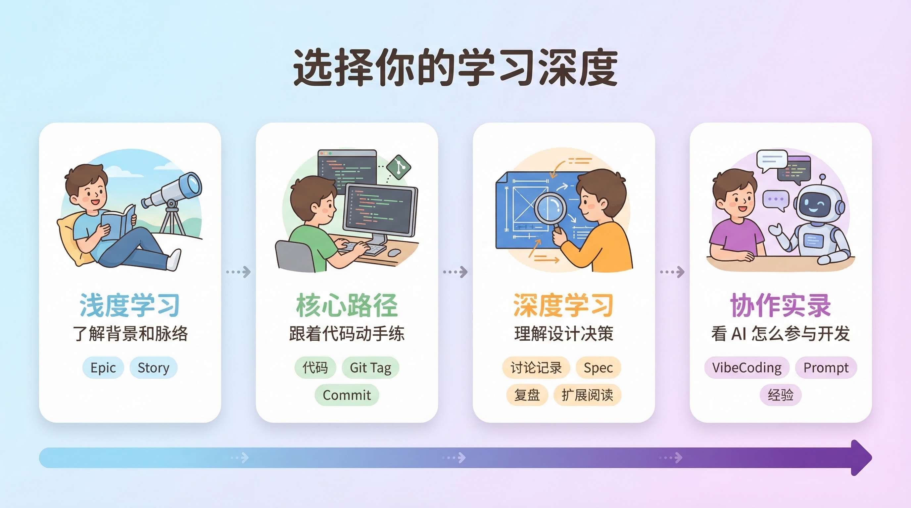

# Zero2Agent 课程 Roadmap

> 这个项目不只有代码——还有设计文档、讨论记录、AI 协作对话、复盘笔记等。不用全看，这页帮你按学习深度找到适合自己的路径。

[首页](../../README.md) | [Epic 1](../../specs/E01-read-and-search/README.md) | 入门：[E1-S1](../../specs/E01-read-and-search/S001-react-basic/README.md) | 已完成：[E1-S2](../../specs/E01-read-and-search/S002-content-search/README.md) · [E1-S3](../../specs/E01-read-and-search/S003-file-search/README.md) · [E1-S4](../../specs/E01-read-and-search/S004-prompt-structure/README.md)

---

## 从哪里开始

根据你当前的状态，选一条最短路径：

**第一次来？** 往下看「学习地图」建立全局感，然后直接进入 [Epic 1](../../specs/E01-read-and-search/README.md) → [E1-S1](../../specs/E01-read-and-search/S001-react-basic/README.md)，Story 页会告诉你先看什么、再看什么。

**想直接动手？** 跳过本页，从 [E1-S1：为 Agent Harness 跑通最小只读闭环](../../specs/E01-read-and-search/S001-react-basic/README.md) 开始。每个 Story 都是独立的跟练单元。

**回来看最新进展？** 去 [CHANGELOG](../../CHANGELOG.md) 找到最新迭代，顺着链接进入对应 Story。

---

## 学习地图

| Epic | 阶段目标 | 完成后你会得到什么 | 状态 | 入口 |
|------|----------|--------------------|------|------|
| Epic 1：能看 / 能查 | 为 Agent Harness 跑通安全、可解释的最小只读闭环 | 理解 ReAct 循环、只读工具和基础 Prompt 结构 | ✅ Done | [进入 Epic 1](../../specs/E01-read-and-search/README.md) |
| Epic 2：能动 / 能改 / 能执行 | 让 Agent Harness 从"会看"升级为"能动手做事" | 理解文件修改、终端执行与执行边界 | 📝 Planned | Coming soon |
| Epic 3：基础能力与产品化 | 让 Agent Harness 从 demo 走向可使用的产品形态 | 理解 TUI、会话、日志、Checkpoint 与安全边界 | 📝 Planned | Coming soon |
| Epic 4：健壮性与上下文管理 | 处理复杂异常与长上下文问题 | 理解异常处理、上下文管理与稳定性优化 | 📝 Planned | Coming soon |
| Epic 5：扩展能力 | 在核心能力稳定后继续扩展 | 理解 AGENTS、Skills、MCP、Hooks 等扩展能力 | 📝 Planned | Coming soon |

---

## 推荐的四种学习深度

这个项目的内容不只有代码。你可以按自己的目的，选择不同深度来学习。



### 1. 浅度学习：了解大体技术脉络

只看 **Epic 页**和 **Story 页**就够了。

Epic 页告诉你一个阶段要解决什么问题、为什么存在；Story 页告诉你一个具体课题的目标、边界、实现轮廓和学习重点。不看代码也能建立起对 **Agent Harness** 实现过程的整体理解。

- [Epic 1：能看 / 能查](../../specs/E01-read-and-search/README.md)
- [E1-S1：为 Agent Harness 跑通最小只读闭环](../../specs/E01-read-and-search/S001-react-basic/README.md)
- [E1-S2：让 Agent Harness 能在内容里定位信息](../../specs/E01-read-and-search/S002-content-search/README.md)
- [E1-S3：让 Agent Harness 能在项目里找到该看的文件](../../specs/E01-read-and-search/S003-file-search/README.md)
- [E1-S4：把 System Prompt 从字符串升级为可演化的结构化协议](../../specs/E01-read-and-search/S004-prompt-structure/README.md)

---

### 2. 实践型学习：跟着代码动手练

在 Epic 和 Story 的基础上，加入**代码阅读和跟练**。

每个 Story 都有对应的 Git Tag，可以切到该迭代完成时的代码状态。Story 页里有详细的阅读顺序建议（先看哪个文件、重点留意什么）。你也可以 Fork 后自己实现一遍，再对照参考实现。

```bash
git checkout E01-S001-react-basic   # 切到 S001 完成状态
git checkout E01-S002-grep-search   # 切到 S002 完成状态
git checkout E01-S003-file-search   # 切到 S003 完成状态
git checkout E01-S004-prompt-structure  # 切到 S004 完成状态
```

若本地尚未看到 `E01-S003-file-search`等 Tag，可用 `main` 最新提交对照 [CHANGELOG](../../CHANGELOG.md) 中的对应迭代说明。

每个迭代的 Commit 也遵循 [Conventional Commits](https://www.conventionalcommits.org/) 规范，带版本前缀（如 `[E01-S001]`），可以逐个 Commit 跟进实现过程。

---

### 3. 深度学习：理解设计决策和思考过程

如果你不只想知道"做了什么"，还想了解"为什么这么做"、"还有哪些没做"：

**(a) 讨论记录** — 每个迭代在动手之前，都有一轮需求讨论。讨论记录还原了决策的完整推导过程：为什么选这个方案、为什么不选那个、边界怎么划的。

- 位置：[`.discuss/`](../../.discuss/)，按日期和主题组织
- 结构：`outline.md`（讨论大纲）+ `decisions/Dxx-xxx.md`（每个决策点的结论与理由）

**(b) 技术文档（Spec）** — 每个 Story 有一套完整的设计文档：概述 → 技术设计 → 任务清单 → 验收检查 → Backlog。

- 位置：`specs/E0x-xxx/S0xx-xxx/details/` 下固定为 `00-overview.md`、`01-technical-design.md`、`02-task-list.md`、`03-verification-checklist.md`、`04-backlog.md`
- 示例：[S001 技术设计](../../specs/E01-read-and-search/S001-react-basic/details/01-technical-design.md)、[S002 技术设计](../../specs/E01-read-and-search/S002-content-search/details/01-technical-design.md)、[S003 技术设计](../../specs/E01-read-and-search/S003-file-search/details/01-technical-design.md)、[S004 技术设计](../../specs/E01-read-and-search/S004-prompt-structure/details/01-technical-design.md)

**(c) 复盘笔记** — 迭代完成后的反思：什么做对了、什么搞砸了、下次怎么改。

- 位置：[`retros/`](../../retros/)（部分内容还在补充中）

**(d) 扩展阅读** — 每个 Story 的 README 底部都有「扩展阅读」section，讨论当前迭代刻意没做但值得了解的话题。浅度学习和跟练时可以先跳过，想深入时再回来看。

- 示例：S001 讨论了"为什么只做只读闭环"、"为什么不急着讲复杂 Prompt"；S002 讨论了"参数设计的竞品对比"、"自动上下文丰富"、"截断和降级策略"
- 部分 Story 还有 `deep-dive/` 目录，放延伸阅读（如 [ReACT 模式](../../specs/E01-read-and-search/S001-react-basic/deep-dive/01-react-pattern.md)、[Tool Use 机制](../../specs/E01-read-and-search/S001-react-basic/deep-dive/02-tool-use.md)、[Benchmark 驱动技术选型](../../specs/E01-read-and-search/S003-file-search/deep-dive/01-benchmark-driven-tech-selection.md)）

---

### 4. 协作实录学习：看 AI 是怎么参与开发的

这个项目全程用 AI 协同开发——Vibe Coding、SDD（Spec-Driven Development）、Agentic Engineering 都有实际应用。如果你对这些方式感兴趣，可以看 VibeCoding 记录。

- 位置：[`.vibecoding/`](../../.vibecoding/)，按 Epic / Story 组织
- 每个 Story 对应一组对话记录，按阶段编号：`01-需求讨论` → `02-设计` → `03-Spec 输出` → `04-实现`
- 还有 `learnings.md` 总结协作过程中的经验和踩坑
- 示例：[E01-S001 VibeCoding 记录](../../.vibecoding/E01/S001/)、[E01-S002 VibeCoding 记录](../../.vibecoding/E01/S002/)、[E01-S003 VibeCoding 记录](../../.vibecoding/E01/S003/)、[E01-S004 VibeCoding 记录](../../.vibecoding/E01/S004/)

---

<details>
<summary><strong>名词速查</strong>（点击展开）</summary>

| 术语 | 说明 |
|------|------|
| **Roadmap** | 学习路线图。列出从头到尾要经历哪些阶段，帮你决定从哪开始、按什么顺序推进 |
| **Epic** | 一个大的学习阶段，围绕一个主题展开（如「能看/能查」），包含多个 Story |
| **Story** | 一个具体的迭代课题，是最小的跟练单元。每个 Story 有独立的目标、`README` 入口、设计文档和代码实现 |
| **Spec** | 设计文档，Specification 的缩写。当前放在 Story 下的 `details/` 目录里，描述一个 Story 要做什么、怎么做、边界在哪 |
| **Retro** | 复盘笔记，Retrospective 的缩写。记录迭代完成后的反思——什么做对了、什么搞砸了 |
| **Tag** | Git 标签，标记某个迭代完成时的代码快照。用 `git checkout <tag>` 可以切到那个状态 |
| **ReAct** | Agent Harness 内常见的一种运行模式：先推理（Reasoning）再行动（Acting），循环往复直到完成任务 |
| **Agent Harness** | 宿主层：把模型、循环（如 ReAct）、工具调用与运行上下文（如 `ToolContext`）组合起来，让 Agent 能稳定执行任务 |

</details>
