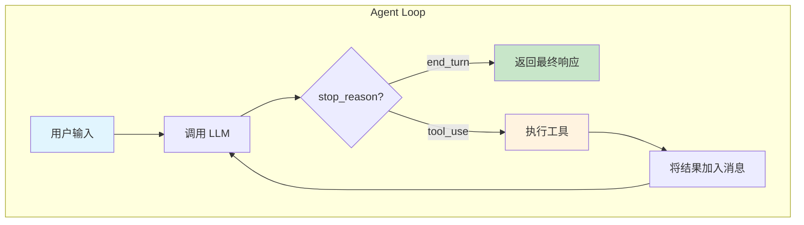

# ReACT 模式与 Agent Loop

> ReACT = **Re**asoning + **Act**ing

---

## 什么是 ReACT

ReACT 是一种让 LLM 解决复杂任务的模式。核心思想：

- **Reasoning**：LLM 思考下一步该做什么
- **Acting**：执行具体动作（调用工具）
- **循环迭代**：根据执行结果继续思考，直到任务完成

传统 LLM 只能根据已有知识回答问题。ReACT 模式让 LLM 能够**主动获取信息**、**执行操作**，从而完成更复杂的任务。

---

## Agent Loop

Agent Loop 是 ReACT 模式的实现机制：



**关键点**：
1. LLM 决定何时结束（`stop_reason: end_turn`）
2. LLM 决定调用哪个工具（`stop_reason: tool_use`）
3. 工具执行结果会反馈给 LLM，形成闭环

---

## 代码结构

```typescript
async function runLoop(userMessage: string): Promise<string> {
  const messages = [{ role: "user", content: userMessage }];
  
  while (iterations < MAX_ITERATIONS) {
    // 1. 调用 LLM
    const response = await client.messages.create({
      model,
      tools: toolDefinitions,
      messages,
    });

    // 2. 检查结束条件
    if (response.stop_reason === "end_turn") {
      return extractTextContent(response.content);
    }

    // 3. 处理工具调用
    if (response.stop_reason === "tool_use") {
      // 添加助手消息
      messages.push({ role: "assistant", content: response.content });
      
      // 执行工具
      const toolResults = await executeToolCalls(response.content, tools);
      
      // 将结果作为 user 消息返回
      messages.push({ role: "user", content: toolResults });
    }
  }
}
```

**核心逻辑**：
1. 循环调用 LLM，直到 `stop_reason === "end_turn"`
2. 当 `stop_reason === "tool_use"` 时，执行工具并将结果加入消息
3. 消息结构：`user → assistant (tool_use) → user (tool_result) → assistant ...`

---

## 消息流示例

用户问："项目里有哪些文件？"

```
┌─────────────────────────────────────────────────────────────────┐
│ Iteration 1                                                     │
├─────────────────────────────────────────────────────────────────┤
│ messages: [                                                     │
│   { role: "user", content: "项目里有哪些文件？" }                 │
│ ]                                                               │
│                                                                 │
│ LLM response:                                                   │
│   stop_reason: "tool_use"                                       │
│   content: [{ type: "tool_use", name: "list_directory", ... }]  │
└─────────────────────────────────────────────────────────────────┘
                              ↓
┌─────────────────────────────────────────────────────────────────┐
│ Iteration 2                                                     │
├─────────────────────────────────────────────────────────────────┤
│ messages: [                                                     │
│   { role: "user", content: "项目里有哪些文件？" },                │
│   { role: "assistant", content: [tool_use block] },             │
│   { role: "user", content: [tool_result block] }                │
│ ]                                                               │
│                                                                 │
│ LLM response:                                                   │
│   stop_reason: "end_turn"                                       │
│   content: [{ type: "text", text: "项目结构如下..." }]           │
└─────────────────────────────────────────────────────────────────┘
```

---

## 参考资料

- [ReAct: Synergizing Reasoning and Acting in Language Models](https://arxiv.org/abs/2210.03629) - 原始论文
- [Anthropic Tool Use](https://docs.anthropic.com/en/docs/build-with-claude/tool-use/overview) - 官方文档
