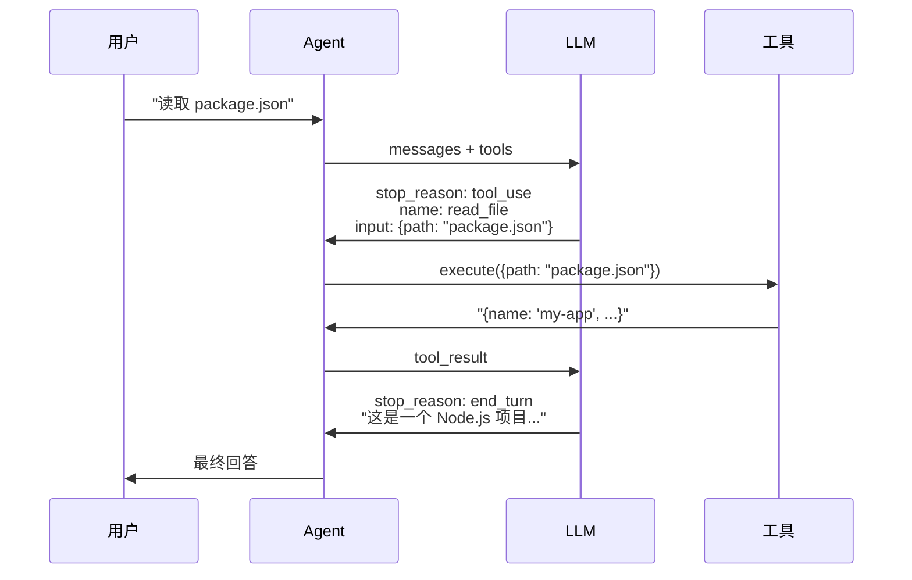

# Tool Use 机制

> Tool Use 让 LLM 从"只能说"变成"能做事"。

---

## 什么是 Tool Use

Tool Use（工具调用）是一种让 LLM 调用外部函数的机制：

1. **定义工具**：告诉 LLM 有哪些工具可用、参数是什么
2. **LLM 决策**：LLM 根据任务选择合适的工具
3. **执行工具**：程序执行工具并返回结果
4. **继续对话**：LLM 根据结果继续处理

```
用户提问 → LLM 选择工具 → 执行工具 → 返回结果 → LLM 生成回答
```

---

## 工具定义

每个工具需要三个部分：

```typescript
interface Tool {
  name: string;          // 工具名称
  description: string;   // 功能描述（LLM 根据这个选择工具）
  input_schema: {        // 参数定义（JSON Schema 格式）
    type: "object";
    properties: Record<string, unknown>;
    required?: string[];
  };
  execute: (input) => Promise<string>;  // 执行函数
}
```

**示例**：读取文件工具

```typescript
const readFileTool: Tool = {
  name: "read_file",
  description: "Read the contents of a file at the specified path",
  input_schema: {
    type: "object",
    properties: {
      path: {
        type: "string",
        description: "The path to the file to read",
      },
    },
    required: ["path"],
  },
  execute: async (input) => {
    const content = await fs.readFile(input.path, "utf-8");
    return content;
  },
};
```

---

## Anthropic API 的 Tool Use 协议

### 请求：传入工具定义

```typescript
const response = await client.messages.create({
  model: "claude-sonnet-4-20250514",
  tools: [
    {
      name: "read_file",
      description: "Read file contents",
      input_schema: { ... },
    },
  ],
  messages: [...],
});
```

### 响应：工具调用

当 LLM 决定调用工具时，返回：

```typescript
{
  stop_reason: "tool_use",
  content: [
    {
      type: "tool_use",
      id: "toolu_xxx",        // 工具调用 ID
      name: "read_file",      // 工具名称
      input: { path: "src/index.ts" },  // 参数
    },
  ],
}
```

### 返回结果：tool_result

执行工具后，将结果作为 `user` 消息返回：

```typescript
messages.push({
  role: "user",
  content: [
    {
      type: "tool_result",
      tool_use_id: "toolu_xxx",  // 对应的工具调用 ID
      content: "文件内容...",     // 执行结果
    },
  ],
});
```

---

## 工具执行流程



---

## 设计要点

### 1. 工具描述要清晰

LLM 根据 `description` 选择工具，描述不清会导致选错工具：

```typescript
// ❌ 不好
description: "读取文件"

// ✅ 好
description: "Read the contents of a file at the specified path. Returns the file content as a string."
```

### 2. 参数定义要完整

使用 JSON Schema 描述参数，让 LLM 知道该传什么：

```typescript
properties: {
  path: {
    type: "string",
    description: "The path to the file to read",
  },
  encoding: {
    type: "string",
    description: "File encoding (default: utf-8)",
    enum: ["utf-8", "ascii", "base64"],
  },
},
required: ["path"],
```

### 3. 输出格式对 LLM 友好

工具的输出会被 LLM 处理，格式要便于理解：

```typescript
// ❌ 不好：原始 JSON
return JSON.stringify(files);

// ✅ 好：结构化文本
return files.map(f => `[${f.type}] ${f.name}`).join("\n");
```

---

## 当前实现的工具

| 工具 | 功能 | 参数 |
|------|------|------|
| `read_file` | 读取文件内容 | `path`, `start_line?`, `end_line?` |
| `list_directory` | 列出目录结构 | `path`, `recursive?` |

这两个都是**只读工具**，安全性高，适合初学者入门。

---

## 参考资料

- [Anthropic Tool Use Docs](https://docs.anthropic.com/en/docs/build-with-claude/tool-use/overview)
- [JSON Schema](https://json-schema.org/) - 参数定义格式
