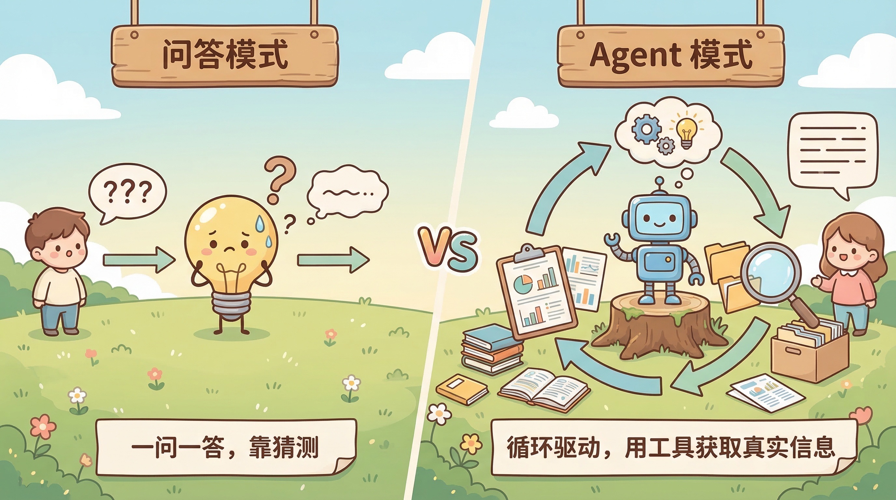
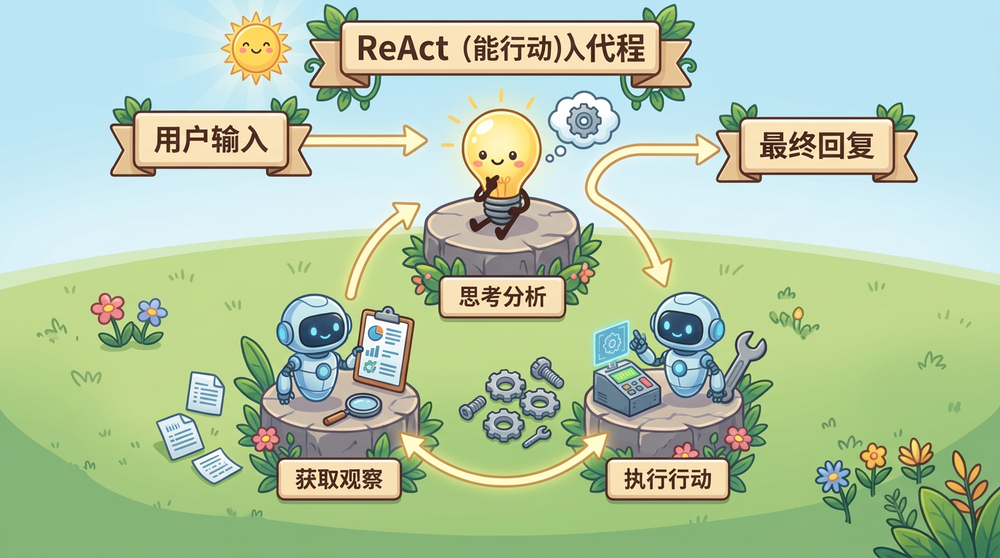
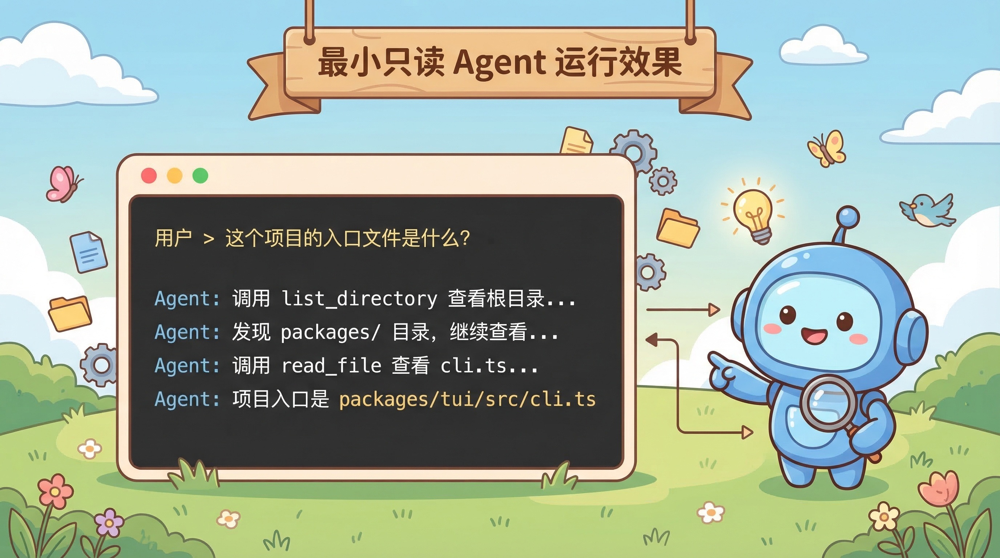

# E01-S001：让 Agent 跑起最小只读闭环

> 这是 Zero2Agent 的第一个 Story。在动手写代码之前，先理解一个核心问题：Agent 和你熟悉的"对话问答"到底有什么不同。

[Epic 1：能看 / 能查](../README.md) | [首页](../../../README.md) | [迭代日志](../../../CHANGELOG.md#e01-s001-react-basic-done)

---

## Agent 不是"更聪明的聊天"

你大概率用过 ChatGPT、Claude、豆包、Kimi 这类产品里的普通对话功能。你问一个问题，模型返回一段回答，对话结束。这是大多数人对大模型的认知，我们可以叫它**问答模式**：

```
你：这个项目的入口文件是什么？
模型：根据常见的 Node.js 项目结构，入口文件通常是 index.ts 或 main.ts……
```

模型在"猜"。它只能基于训练数据和你提供的上下文生成回答，没法真的去看你的项目。

**Agent 的工作方式完全不同**。它不是猜，而是去做——自己读文件、查目录、搜内容，拿到真实信息后再回答：

```
你：这个项目的入口文件是什么？
Agent（思考）：我需要先看一下项目结构
Agent（行动）：调用 list_directory 查看根目录
Agent（观察）：看到 packages/tui/src/cli.ts、packages/core/src/agent.ts……
Agent（思考）：cli.ts 是 CLI 入口，agent.ts 是核心入口
Agent（回答）：项目有两个入口——CLI 入口是 packages/tui/src/cli.ts，核心逻辑入口是 packages/core/src/agent.ts。
```

下面这张图展示了两者的根本差异：

<p align="center">
  
</p>

这就是 Agent 的核心：**不是一次性回答，而是循环驱动——思考、行动、观察，反复进行，直到任务完成**。这个循环在学术上叫 [ReAct](https://arxiv.org/abs/2210.03629)（Reasoning + Acting），我们后面会一直用到它。

更细的机制说明在本 Story 末尾的[延伸阅读](#延伸阅读)两篇里。

---

## 这个 Story 要做什么

理解了 Agent 的工作模式后，问题就具体了：怎么用代码实现这个"循环驱动"？

<p align="center">
  
</p>

### 问题

要让模型从"回答一次就结束"变成"能循环推进任务"，需要解决三个基础问题：

- **怎么循环**：模型响应后，程序怎么判断是结束还是继续？
- **怎么用工具**：模型想读文件时，程序怎么执行并把结果交回去？
- **怎么保证安全**：第一步只做只读操作，不动文件系统

### 目标

做完后，得到一个最小但完整的只读闭环：

- 能接收用户问题
- 能运行 ReAct 循环（思考 → 行动 → 观察 → 继续）
- 能调用 `read_file` 和 `list_directory` 两个只读工具
- 能把工具结果交回模型，直到拿到最终回答

### 边界

这一步故意只做到最小闭环，不继续往外扩：

- **做**：ReAct 循环、只读工具、基础 CLI 入口、过程日志
- **不做**：写文件、删除文件、终端执行、审批、安全权限控制
- **暂不展开**：grep / glob 搜索、复杂 Prompt 框架、会话管理

---

## 关键实现

### 关键设计判断

`S001` 看起来是在做一个最小可运行的 Agent，真正要学的是：**第一步应该把什么能力放进最小闭环。**

这里有两个关键判断。

#### 为什么第一步只做只读闭环

第一步最重要的不是"能力多"，而是"闭环清楚"。

如果一开始就把写文件、删文件、终端执行、审批控制一起塞进来，你会同时面对太多变量，反而看不清 Agent 最核心的工作机制。只做只读闭环，能把注意力集中在三件事上：

- [ReAct 循环是怎么跑起来的](./deep-dive/01-react-pattern.md)
- [工具调用是怎么接进循环的](./deep-dive/02-tool-use.md)
- 工具结果为什么还要继续回给模型

#### 为什么是 `read_file` 和 `list_directory`

这两个工具不是随便选的，而是最小查看闭环里刚好互补的一对：

| 工具 | 解决什么问题 | 没有它会怎样 |
|------|--------------|--------------|
| `list_directory` | 先知道项目里有哪些文件和目录 | Agent 没有全局视野，只能盲猜路径 |
| `read_file` | 再进入具体文件理解内容 | Agent 只能看到结构，不能看到细节 |

也就是说，这一步不是单独教你两个工具，而是在搭一个最小工作流：

```text
先看目录 -> 再读文件 -> 拿到结果 -> 继续下一轮决策
```

### 实现轮廓

这次实现可以按四个关键点来理解：

1. **先把 Agent 跑成一个循环**
   - 入口在 `packages/core/src/loop.ts`
   - 核心是让模型响应不再是"一次结束"，而是根据 `stop_reason` 决定继续循环还是结束

2. **接上最小工具集合**
   - `packages/core/src/tools/read-file.ts`
   - `packages/core/src/tools/list-directory.ts`
   - 这两个工具先满足"看文件、看目录"两类最基本需求

3. **把循环和工具封装成入口**
   - `packages/core/src/agent.ts`
   - 不是复杂抽象，而是一个方便调用的轻入口

4. **给一个可以直接运行的 CLI**
   - `packages/tui/src/cli.ts`
   - 把 system prompt、交互模式和结果输出串起来

### 推荐阅读顺序

1. 先看 [00-overview.md](./details/00-overview.md) — 建立整体设计感
2. 再看 [01-technical-design.md](./details/01-technical-design.md) — 理解循环、工具和消息如何串起来
3. 然后重点看代码：
   - `packages/core/src/loop.ts` — 循环核心
   - `packages/core/src/agent.ts` — Agent 入口
   - `packages/core/src/tools/read-file.ts` — 读文件工具
   - `packages/core/src/tools/list-directory.ts` — 列目录工具
   - `packages/tui/src/cli.ts` — CLI 入口
4. 最后回看 [CHANGELOG.md](../../../CHANGELOG.md) — 把这一步放回整个迭代演进里

看代码时，重点留意三件事：

- 循环是如何根据 `stop_reason` 前进的
- 工具结果是如何回传给模型的
- CLI 是如何把"一个能跑的 Agent"暴露出来的

---

## 做完后的效果

<p align="center">
  
</p>

完成这一步后，你会看到：

- Agent 不再只是"问一次答一次"，而是能多轮调用工具推进任务
- 遇到文件或目录问题时，Agent 会主动使用只读工具去获取真实信息
- 你能从日志里看清每一轮循环发生了什么

一个最直接的结果：你已经有了一个最小可运行的 Coding Agent 雏形。

资料入口：

- [总览](./details/00-overview.md)
- [技术设计](./details/01-technical-design.md)
- [任务清单](./details/02-task-list.md)
- [验收检查清单](./details/03-verification-checklist.md)
- [Backlog](./details/04-backlog.md)
- [迭代日志](../../../CHANGELOG.md#e01-s001-react-basic-done)
- Git tag：`E01-S001-react-basic`

---

## 技术实现细节

| 文档 | 说明 |
|------|------|
| [details/00-overview](./details/00-overview.md) | 设计概述 |
| [details/01-technical-design](./details/01-technical-design.md) | 技术设计方案 |
| [details/02-task-list](./details/02-task-list.md) | 开发任务清单 |
| [details/03-verification-checklist](./details/03-verification-checklist.md) | 验收检查项 |
| [details/04-backlog](./details/04-backlog.md) | 后续优化方向 |

## 延伸阅读

如果你已经理解「问答 vs Agent」的差别，还想把**循环结构**和**工具调用协议**单独吃透，可以继续读下面两篇（不要求为了跑通代码先读完它们）：

| 文档 | 说明 |
|------|------|
| [ReAct 模式与 Agent Loop](./deep-dive/01-react-pattern.md) | ReAct 里 Reasoning / Acting 各负责什么、`stop_reason` 如何驱动多轮循环，以及和本仓库 `loop.ts` 的对应关系 |
| [Tool Use 机制](./deep-dive/02-tool-use.md) | 工具定义长什么样、模型如何选工具、tool result 如何回到消息里，以及只读工具为什么适合作为第一课 |

---

下一篇：[E01-S002：让 Agent 能在内容里定位信息](../S002-content-search/README.md)
