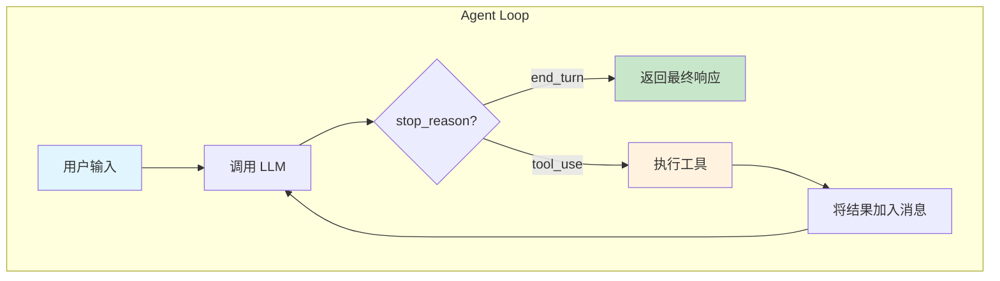
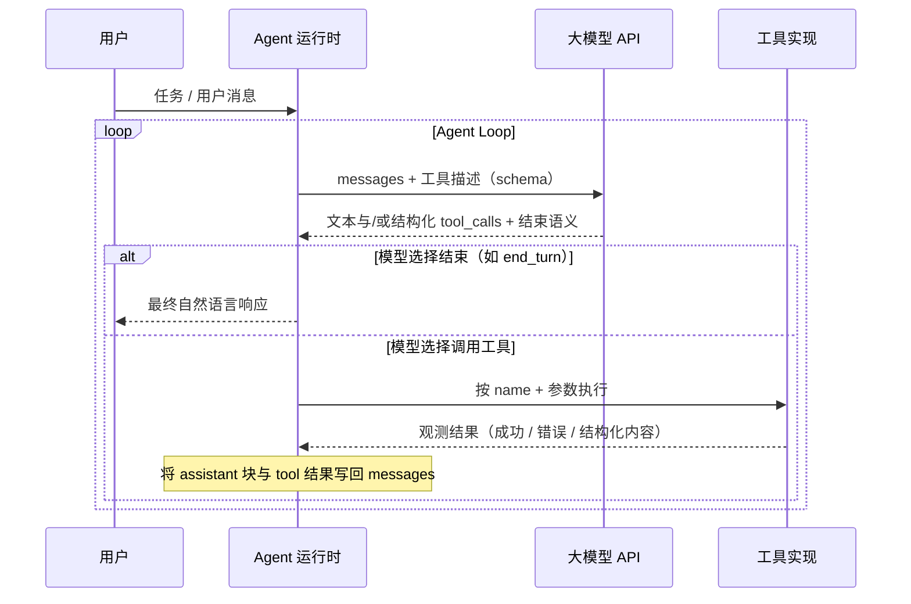

# ReACT 模式与 Agent Loop

> ReACT = **Re**asoning + **Act**ing

这一模式在文献中有明确定义：Google DeepMind 等提出的 **ReAct**（Reasoning and Acting 交错生成）让模型在「推理轨迹」与「对外动作」之间交替进行，用动作从环境/API 拉回真实观测，减轻纯链式推理里的幻觉与错误累积。详见论文 [ReAct: Synergizing Reasoning and Acting in Language Models](https://arxiv.org/abs/2210.03629)（Yao et al., arXiv:2210.03629）。

本文档里的「ReACT」与工业界常用拼写一致，语义上与上述 ReAct 框架对齐：**先想一步、再做一步（往往是对工具的调用）、再把结果喂回模型**，多轮直到收束。

---

## 什么是 ReACT

ReACT 是一种让 LLM 解决复杂任务的模式。核心思想：

- **Reasoning**：LLM 思考下一步该做什么
- **Acting**：执行具体动作（调用工具）
- **循环迭代**：根据执行结果继续思考，直到任务完成

传统 LLM 只能根据已有知识回答问题。ReACT 模式让 LLM 能够**主动获取信息**、**执行操作**，从而完成更复杂的任务。

---

## Agent Loop

**Agent Loop**（智能体循环）指的是：**运行时在「调用大模型」与「执行环境与工具」之间反复切换**，直到满足结束条件的一条控制回路。它不负责「模型内部怎么算」，只负责：

1. **组上下文**：把用户目标、历史多轮对话、以及上一轮工具的输出整理成模型 API 能接受的消息序列。
2. **问模型**：在附带工具协议（名称、参数 schema、返回值约定等）的前提下，向 LLM 要「下一拍」的决策：要么收束成自然语言答复，要么结构化地声明要调哪些工具。
3. **执行与回注**：若模型选择走工具路径，运行时在沙箱/进程内执行对应实现，把**可审计的观测结果**（成功/失败、stdout、结构化 payload 等）写回消息，再进入下一轮；若模型选择结束，则把最终文本返回给用户。

因此，Agent Loop 是 ReACT 在工程上的**调度壳**：论文侧重「推理—动作—观测」交错；我们这里具体化为 `call LLM → 分支（结束 | 工具）→ 必要时 append 结果 → 再 call LLM`。

下面用**流程图**表达运行时在分支之间如何打转（与具体厂商的 `stop_reason` 字段名无关，仅示意）：



**关键点**：

1. LLM 决定何时结束（`stop_reason: end_turn`）
2. LLM 决定调用哪个工具（`stop_reason: tool_use`）
3. 工具执行结果会反馈给 LLM，形成闭环

---

## 运行时与你的系统如何跟大模型打交道（时序）

下面从**调用方**视角画出一条典型链路：用户只和「Agent 运行时」交互；运行时多次请求 LLM，并在需要时代为调工具。



---

## 控制逻辑（伪代码）

下面的伪代码描述「循环 + 分支」，**不绑定**某一门语言或某一_sdk_ 的方法名；真实工程里会再补上超时、限次、串并行工具策略、流式输出等。

```text
function run_agent_loop(initial_user_message, tool_registry, max_iterations):
  messages = [user_turn(initial_user_message)]
  iterations = 0

  while iterations < max_iterations:
    iterations += 1
    response = llm_complete(messages, tools = tool_registry.schemas)

    if response.stop == END_TURN:
      return response.final_text_for_user

    if response.stop == TOOL_USE:
      messages.append(assistant_turn(response.blocks_including_tool_calls))
      observations = []
      for each call in response.tool_calls:
        result = tool_registry.run(call.name, call.arguments)
        observations.append(tool_result(call.id, result))
      messages.append(user_turn_with_tool_results(observations))
      continue

    // 协议异常或模型未按约定返回时，由运行时降级处理（重试、报错、安全中止等）
    handle_protocol_error(response)
```

**核心逻辑**：

1. 循环调用 LLM，直到 `stop === END_TURN`（或等价结束语义）。
2. 当 `stop === TOOL_USE` 时，执行工具并将观测以约定格式追加到 `messages`。
3. 典型消息形状（概念上）：`user → assistant（含 tool 调用）→ user（仅承载 tool 结果）→ assistant → …`，具体 role/block 类型依你所用的 API 而定。

---

## 消息流示例

用户问："项目里有哪些文件？"

```
┌─────────────────────────────────────────────────────────────────┐
│ Iteration 1                                                     │
├─────────────────────────────────────────────────────────────────┤
│ messages: [                                                     │
│   { role: "user", content: "项目里有哪些文件？" }                 │
│ ]                                                               │
│                                                                 │
│ LLM response:                                                   │
│   stop_reason: "tool_use"                                       │
│   content: [{ type: "tool_use", name: "list_directory", ... }]  │
└─────────────────────────────────────────────────────────────────┘
                              ↓
┌─────────────────────────────────────────────────────────────────┐
│ Iteration 2                                                     │
├─────────────────────────────────────────────────────────────────┤
│ messages: [                                                     │
│   { role: "user", content: "项目里有哪些文件？" },                │
│   { role: "assistant", content: [tool_use block] },             │
│   { role: "user", content: [tool_result block] }                │
│ ]                                                               │
│                                                                 │
│ LLM response:                                                   │
│   stop_reason: "end_turn"                                       │
│   content: [{ type: "text", text: "项目结构如下..." }]           │
└─────────────────────────────────────────────────────────────────┘
```

---

## 还有哪些常见范式？

除本文主线的 ReAct / Agent Loop 外，行业里还会遇到别的调度思路；这里仅作常识性介绍，便于日后读到相关术语时对号入座。

### Plan-and-Solve

**Plan-and-Solve** 可以理解为「先规划、再按规划求解」：**先把任务拆成若干子步骤或子问题，理清先后顺序或依赖**，再**逐步推理或执行**去完成它们。它偏重**任务拆解与推进顺序**，不一定每一步都要调外部工具；很多实现里会在首轮或某一轮让模型先输出一份计划 / 待办，再进入日常的推理或 tool loop。

### Reflexion

**Reflexion** 强调在**结果不好**（失败、测试不过、评分低等）之后，让模型写一段**文字层面的反思**——错在哪、下次怎么改——把这段反思**并入后续轮次的上下文或记忆**，再**重试**。它常常套在普通 Agent Loop **外面**：内层仍是「调模型 → 调工具」，外层多了一圈「评估 → 反思 → 再跑一遍」。

---

## 参考资料

- [ReAct: Synergizing Reasoning and Acting in Language Models](https://arxiv.org/abs/2210.03629) — 推理与动作交错、与外部环境交互的经典表述；本文「ReACT / Agent Loop」与其对齐。
- Wang L, Xu W, Lan Y, et al. [Plan-and-solve prompting: Improving zero-shot chain-of-thought reasoning by large language models](https://arxiv.org/abs/2305.04091). *arXiv preprint* arXiv:2305.04091, 2023.
- Shinn N, Cassano F, Gopinath A, et al. [Reflexion: Language agents with verbal reinforcement learning](https://proceedings.neurips.cc/paper_files/paper/2023/hash/1b44b878bb782e6954cd888628510e90-Abstract-Conference.html). *Advances in Neural Information Processing Systems*, 2023, 36: 8634–8652. 预印本：[arXiv:2303.11366](https://arxiv.org/abs/2303.11366).

---

[← Story 入口](../README.md) · [Tool Use 机制](./02-tool-use.md) · [Backlog](../details/04-backlog.md)
