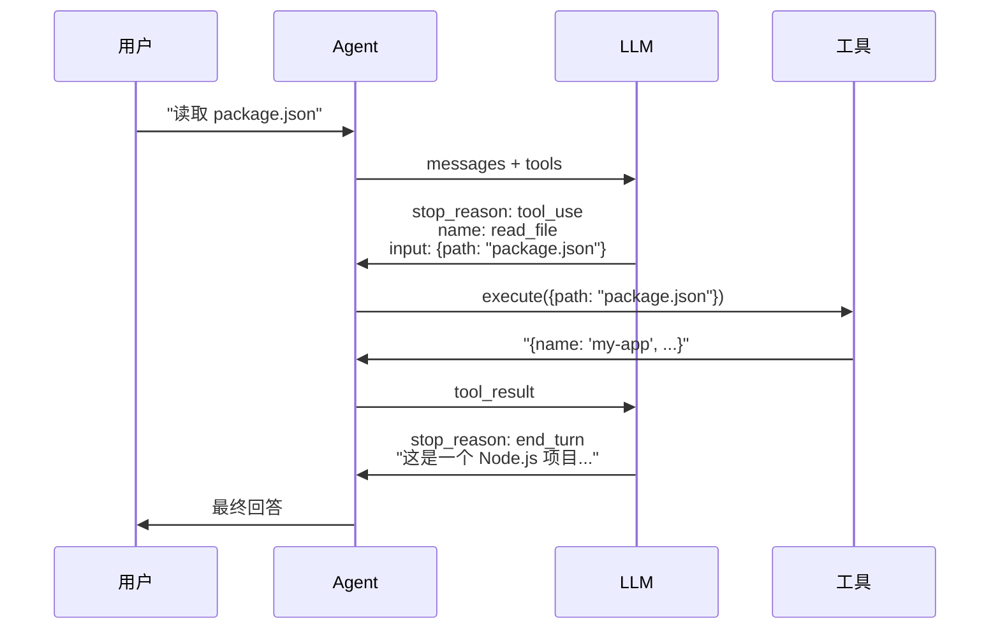

# Tool Use 机制

> Tool Use 让 LLM 从「只能说」变成「能做事」

---

## 为什么要有 Tool Use

语言模型本身只会产出文本 token：它不能直接读磁盘、发 HTTP、查数据库。要让系统真正「做事」，必须在模型与**真实环境**之间加一层宿主（你的 Agent）：由宿主执行读写、调用 API、跑命令。

若完全不用 Tool Use，常见的替代方案是：**只靠 Prompt**，要求模型用自然语言或半结构化片段描述「建议你执行某某命令」。宿主再 regexp/启发式去抠参数。这条路能跑通不少原型，但问题也很集中：

- **格式不稳**：模型一换 prompt、一长上下文，就容易偏离约定模板，解析失败或 silent wrong。
- **难校验**：自由文本里的路径、SQL、URL 难事先做 JSON Schema 级别的校验，安全边界（白名单工具、只读目录）不好落。
- **难对账**：没有标准的 `tool_use_id`，多步调用里「这一轮到底调了啥」不好回放和调试。

Tool Use 的核心价值，是把「选哪个能力 + 参数是什么」从散文里**抽成结构化字段**（通常配套 JSON Schema）：宿主可以拒绝非法参数、只执行注册过的工具、把执行结果以 `tool_result` 再喂回模型，形成可预期的闭环。所以它不是为了换一个好听的 API 名，而是为了解决**可靠接地（grounding）**与**可控执行**的问题。

---

## Tool Use 是怎么演变过来的

下面是一条很粗、但有助于建立直觉的时间线；各家产品细节不同，**共性**都是：从「纯文本里假装在调工具」走到「响应里有明确的结构化 tool/function 槽位」。

### 1. 只有 Prompt：纯文本里「约定格式」

早在专用 API 之前，常见做法是：在 system/user prompt 里写死输出规范，让模型交替产出「推理 / 计划」和「我主张要调用的动作」。典型代表包括 ReAct 式的 *Thought → Action → Observation*，或「请只输出 JSON」之类约束。宿主读完整段 assistant 文本，再用规则、JSON 抽取或小型解析器，把 **Action / 函数名 / 参数**抠出来，自己去调真实函数，Observation 再拼进下一轮对话。

这一阶段**不依赖**模型供应商提供 `tool_use` 字段；缺点是 fragile、对提示工程敏感，且与安全策略的集成要自己做全套。

### 2. 原生 Function Calling / Tool Calls

约 2023 年起，主流 API 开始在**协议层**支持：响应中除了 assistant 文本，还可以带上**结构化的函数或工具调用**（名称 + 参数对象）。模型侧往往经过对齐/训练，更倾向于在「该动手」时走这条通道，而不是只写一句「我会帮你读文件」。

OpenAI 生态里早期常叫 **function calling**（后随消息格式泛用 **tool calls**）；Anthropic 文档里常用 **Tool Use**；其它厂商也大同类比。名称不同，**形状**高度相似：预先注册一组带 schema 的工具 → 模型返回结构化选择 → 宿主执行 → 结果作为用户/工具消息写回。

下文以 **Anthropic Messages API 的 Tool Use** 为例讲字段与循环；若在别的栈上开发，把 `tool_use` / `tool_result` 对应到该平台的 **tool_calls / function_call** 即可，思路一致。

---

上文已从动机与历史描述过同一套闭环（注册 schema → 模型择工具 → 宿主执行 → 结果写回）。**Tool Use** 在协议/文档语境里通常特指：这些步骤由**结构化内容块**承载（助手消息里的 `tool_use` 等），而不是再从自由文本里解析——下文从 TypeScript 形状到 Anthropic 消息格式把块长什么样说清楚。若只记一条线：

```
用户提问 → LLM 选择工具 → 执行工具 → 返回结果 → LLM 生成回答
```

---

## 工具定义

每个工具需要三个部分：

```typescript
interface Tool {
  name: string;          // 工具名称
  description: string;   // 功能描述（LLM 根据这个选择工具）
  input_schema: {        // 参数定义（JSON Schema 格式）
    type: "object";
    properties: Record<string, unknown>;
    required?: string[];
  };
  execute: (input) => Promise<string>;  // 执行函数
}
```

**示例**：读取文件工具

```typescript
const readFileTool: Tool = {
  name: "read_file",
  description: "Read the contents of a file at the specified path",
  input_schema: {
    type: "object",
    properties: {
      path: {
        type: "string",
        description: "The path to the file to read",
      },
    },
    required: ["path"],
  },
  execute: async (input) => {
    const content = await fs.readFile(input.path, "utf-8");
    return content;
  },
};
```

---

## Anthropic API 的 Tool Use 协议

### 请求：传入工具定义

```typescript
const response = await client.messages.create({
  model: "claude-sonnet-4-20250514",
  tools: [
    {
      name: "read_file",
      description: "Read file contents",
      input_schema: { ... },
    },
  ],
  messages: [...],
});
```

### 响应：工具调用

当 LLM 决定调用工具时，返回：

```typescript
{
  stop_reason: "tool_use",
  content: [
    {
      type: "tool_use",
      id: "toolu_xxx",        // 工具调用 ID
      name: "read_file",      // 工具名称
      input: { path: "src/index.ts" },  // 参数
    },
  ],
}
```

### 返回结果：tool_result

执行工具后，将结果作为 `user` 消息返回：

```typescript
messages.push({
  role: "user",
  content: [
    {
      type: "tool_result",
      tool_use_id: "toolu_xxx",  // 对应的工具调用 ID
      content: "文件内容...",     // 执行结果
    },
  ],
});
```

---

## 工具执行流程



---

## 设计要点

### 1. 工具描述要清晰

LLM 根据 `description` 选择工具，描述不清会导致选错工具：

```typescript
// ❌ 不好
description: "读取文件"

// ✅ 好
description: "Read the contents of a file at the specified path. Returns the file content as a string."
```

### 2. 参数定义要完整

使用 JSON Schema 描述参数，让 LLM 知道该传什么：

```typescript
properties: {
  path: {
    type: "string",
    description: "The path to the file to read",
  },
  encoding: {
    type: "string",
    description: "File encoding (default: utf-8)",
    enum: ["utf-8", "ascii", "base64"],
  },
},
required: ["path"],
```

### 3. 输出格式对 LLM 友好

工具的输出会被 LLM 处理，格式要便于理解：

```typescript
// ❌ 不好：原始 JSON
return JSON.stringify(files);

// ✅ 好：结构化文本
return files.map(f => `[${f.type}] ${f.name}`).join("\n");
```

---

## 参考资料

- [Anthropic Tool Use Docs](https://docs.anthropic.com/en/docs/build-with-claude/tool-use/overview)
- [JSON Schema](https://json-schema.org/) - 参数定义格式

---

[← Story 入口](../README.md) · [ReACT 与 Agent Loop](./01-react-pattern.md) · [Backlog](../details/04-backlog.md)
