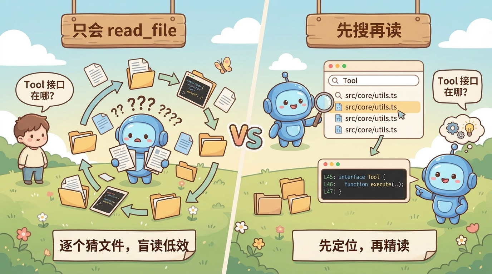

# E01-S002：让 Agent 能在内容里定位信息

> 这是 Epic 1 的第二个 Story。目标不是让 Agent "读得更多"，而是让它学会更接近工程师真实工作的方式：先搜索定位，再精读上下文。

[Epic 1：能看 / 能查](../README.md) | [首页](../../../README.md) | [迭代日志](../../../CHANGELOG.md#e01-s002-grep-search-done)

---

## 只会读文件还不够

在 `S001` 里，Agent 已经能 `read_file` 和 `list_directory`。这让它具备了"看项目"的最小能力，但还不具备"在项目里找信息"的能力。

问题在于，很多真实任务并不是"把这个文件读完"，而是"先找到答案大概在哪，再决定读哪一段"。例如：

```text
用户：帮我找 Tool 接口定义在哪里。
```

如果 Agent 只有 `read_file`，它通常会陷入两种低效行为：

| 场景 | 只有 `read_file` 时会发生什么 | 问题 |
|------|-------------------------------|------|
| 文件很大 | 把整个文件从头读到尾 | 浪费 token，也不一定读到重点 |
| 文件很多 | 逐个猜文件、逐个打开 | 盲读，效率极低 |

人类工程师这时不会先通读项目，而会先搜索关键词，再打开最相关的结果。`S002` 要补的就是这一步。

你可以把 `S001` 和 `S002` 的差别理解成下面这张工作方式对照表：

| 阶段 | `S001` 的典型动作 | `S002` 的典型动作 |
|------|-------------------|-------------------|
| 第一步 | 猜一个文件并读取 | 先搜索关键词缩小范围 |
| 第二步 | 继续猜下一个文件 | 根据搜索结果选择目标文件 |
| 第三步 | 反复试错 | 再用 `read_file` 精读命中位置 |

<p align="center">
  
</p>

这一篇最重要的能力跃迁只有一句话：

> Agent 从"只会通读"进化为"先搜索定位，再精读上下文"。

---

## 这个 Story 要做什么

理解问题后，再看这一步的任务定义。

### 问题

要让 Agent 真正具备"搜着看"的能力，需要解决三个问题：

- **怎么搜索内容**：给定一个模式，如何在项目内容里找到候选位置
- **怎么把搜索结果交给 Agent**：返回什么格式，Agent 才能继续决策
- **怎么控制结果规模**：搜索天生容易返回很多结果，第一版如何收住

### 目标

做完后，Agent 多出一个 `grep_search` 工具，并形成一条自然的工作流：

- 先用 `grep_search` 在文件内容里定位候选位置
- 返回文件路径、行号、匹配内容和可选上下文
- 再配合 `read_file` 对局部内容做精读

### 边界

这一篇只解决"内容搜索"这一件事，不把问题摊开：

- **做**：内容搜索工具、结果格式化、排序、基础截断
- **不做**：文件名搜索（glob 维度，留给 `S003`）
- **不做**：复杂截断策略、超时机制、降级策略、相关性排序

---

## 关键实现

这一步表面上是在新增一个 `grep_search`，更重要的是在练一件事：**怎么为 Agent [设计一个真正能接进工作流的工具](./deep-dive/01-tool-design-methodology.md)。**

### 工具先解决工作流问题

`grep_search` 不是为了替代 `read_file`，而是为了把"该读哪里"这个问题先解决掉。

两者的职责不同：

| 工具 | 主要职责 | 输出应该回答什么问题 |
|------|----------|----------------------|
| `grep_search` | 定位 | "哪些位置值得继续看？" |
| `read_file` | 理解 | "这段内容到底是什么意思？" |

这也是为什么 `S002` 的核心不是"增加一个搜索工具"，而是让 Agent 的工作流从：

```text
猜文件 -> 读文件 -> 不对 -> 再猜
```

变成：

```text
搜索定位 -> 选择结果 -> 精读上下文 -> 回答
```

<p align="center">
  
</p>

### 为什么是这 5 个参数

第一版参数不是越多越好，而是只暴露 Agent 真正需要控制的那部分。最终保留 5 个参数：

| 参数 | 为什么需要它 | 没有它会怎样 |
|------|--------------|--------------|
| `pattern` | 搜索工具的核心输入，决定要找什么 | 工具失去意义 |
| `path` | 限定搜索目录，避免全项目无差别扫描 | 搜索范围过大，噪音升高 |
| `include` | 限定候选文件类型或路径模式 | Agent 很难精确聚焦 |
| `exclude` | 排除已知无关目录，如构建产物或依赖目录 | 结果容易被噪音淹没 |
| `context` | 给匹配行补充上下文，帮助判断要不要继续读文件 | 匹配结果太孤立，后续决策困难 |

这里的判断标准不是"底层 grep 支持什么"，而是：

1. 哪些控制权必须交给 Agent
2. 哪些默认行为应该由工具自己承担
3. 哪些参数会直接影响后续 `read_file` 的效率

如果你想看更细的参数推导过程，可以继续看 [details/00-overview](./details/00-overview.md) 和 [details/01-technical-design](./details/01-technical-design.md)。

### 输出契约为什么这样定

搜索工具的输出如果太少，Agent 不能决策；如果太多，又会重新退化成"读一大段文本"。所以第一版输出定成：

- 文件路径
- 行号
- 匹配内容
- 可选上下文行

这个契约的目标很明确：**让 Agent 先判断"值不值得继续读"，而不是在搜索阶段就把阅读阶段做掉。**

因此，`grep_search` 返回的是"定位信息"，不是"完整答案"。

### 排序为什么按修改时间降序

搜索一旦有多个结果，排序就在决定：**Agent 最先看到什么。**

第一版选择按文件修改时间降序排序，考虑的是工程场景里的一个高频假设：

- 最近改过的文件，更可能与当前任务相关

这不是绝对正确的相关性算法，但它有三个优点：

| 考量 | 说明 |
|------|------|
| 简单 | 不需要额外引入复杂评分逻辑 |
| 可解释 | 读者和 Agent 都容易理解为什么这样排 |
| 有工程直觉 | 对真实开发任务通常有帮助 |

其他策略当然也存在，比如按路径、按原始命中顺序、按语义相关性排序。但在第一版里，"简单且好解释"比"理论上更优"更重要。

### 为什么先做 100 条上限

搜索结果天然可能爆炸。第一版先加 100 条匹配上限，目的不是做到完美，而是先把工具做成一个可控的教学样本：

- 让结果规模有上界
- 避免一次返回过多内容
- 让后续改进点有明确落点

这也是本项目一贯的节奏：先做能工作的第一版，再逐步扩展边界处理。

这里还有一个在生产里会继续放大的矛盾：你当然希望搜索结果尽量"信息丰富"，这样 Agent 更可能少调几次工具；但你也必须控制返回量，否则上下文很快会被搜索结果吃掉。当前版本只先把这个问题收住，后面再继续展开更复杂的[上下文控制思路](./deep-dive/02-search-result-context-sizing.md)。

### 实现轮廓

在上述设计判断之下，这次实现最终落成三个点：

1. **新增 `grep_search` 工具**
   - 实现在 `packages/core/src/tools/grep-search.ts`
   - 底层调用 [ripgrep](./deep-dive/03-content-search-implementation-options.md)（通过 `@vscode/ripgrep` npm 包）

2. **接入现有工具体系**
   - 实现 `Tool` 接口
   - 注册到 `packages/core/src/tools/index.ts`

3. **保持工作流不变，只补能力**
   - 不重写 Agent 主循环
   - 只是在现有 ReAct 流程里补上"先搜索再精读"这一步

### 推荐阅读顺序

如果你想顺着这一篇去看代码，建议按这个顺序：

1. 先看 [details/00-overview](./details/00-overview.md)
   - 建立整体设计感，先理解参数、输出和工作流位置

2. 再看 [details/01-technical-design](./details/01-technical-design.md)
   - 看 ripgrep 集成、结果格式化、排序和截断如何落地

3. 然后重点看代码：
   - `packages/core/src/tools/grep-search.ts` — 搜索工具实现
   - `packages/core/src/tools/index.ts` — 工具注册入口

4. 最后回看 [CHANGELOG.md](../../../CHANGELOG.md#e01-s002-grep-search-done)
   - 把这一篇放回整个 Epic 的演进里看

看代码时，重点留意三件事：

- ripgrep 是怎么被调用的
- 输出结果是怎么格式化的
- 排序和结果上限是在哪一步处理的

---

## 做完后的效果

完成这一步后，你应该能观察到这些变化：

- Agent 遇到"找某个定义或字符串"的任务时，不再盲读多个文件，而会先搜索
- `grep_search -> read_file` 这条工具链能自然跑通
- 日志里能清楚看出 Agent 先定位、再精读的行为模式

这一篇做完后，Agent 的能力变化不是"多了一个命令"，而是：

> 它开始具备真正可用的"定位信息"能力。

资料入口：

- [总览](./details/00-overview.md)
- [技术设计](./details/01-technical-design.md)
- [任务清单](./details/02-task-list.md)
- [验收检查清单](./details/03-verification-checklist.md)
- [Backlog](./details/04-backlog.md)
- [迭代日志](../../../CHANGELOG.md#e01-s002-grep-search-done)
- Git tag：`E01-S002-grep-search`

---

## 技术实现细节

| 文档 | 说明 |
|------|------|
| [details/00-overview](./details/00-overview.md) | 设计概述 |
| [details/01-technical-design](./details/01-technical-design.md) | 技术设计方案 |
| [details/02-task-list](./details/02-task-list.md) | 开发任务清单 |
| [details/03-verification-checklist](./details/03-verification-checklist.md) | 验收检查项 |
| [details/04-backlog](./details/04-backlog.md) | 后续优化方向 |

## 延伸阅读

如果你已经理解了这一版 `grep_search` 的主线实现，下面这些问题值得继续想下去：

| 文档 | 说明 |
|------|------|
| [设计一个 Agent 工具时，应该先想什么？](./deep-dive/01-tool-design-methodology.md) | 哪些判断应该先于参数和选库？ |
| [搜索结果的上下文大小应该怎么控制？](./deep-dive/02-search-result-context-sizing.md) | 为什么"多给上下文"和"少占上下文窗口"天然冲突？ |
| [内容搜索的技术选型：为什么选择 ripgrep](./deep-dive/03-content-search-implementation-options.md) | 工具能力、性能、生态、兼容性怎么比较？ |
| [`grep search` 和 `codebase search` 到底有什么区别？](./deep-dive/04-grep-search-vs-codebase-search.md) | 什么时候该先做 grep search，什么时候才值得上 codebase search？ |
| [当 `ripgrep` 还不够快：正则搜索为什么会走向索引化](./deep-dive/05-fast-regex-search-indexing.md) | 当全仓扫描开始成为瓶颈时，为什么 regex search 会继续演进到文本索引？ |

---

上一篇：[E01-S001：让 Agent 跑起最小只读闭环](../S001-react-basic/README.md)
