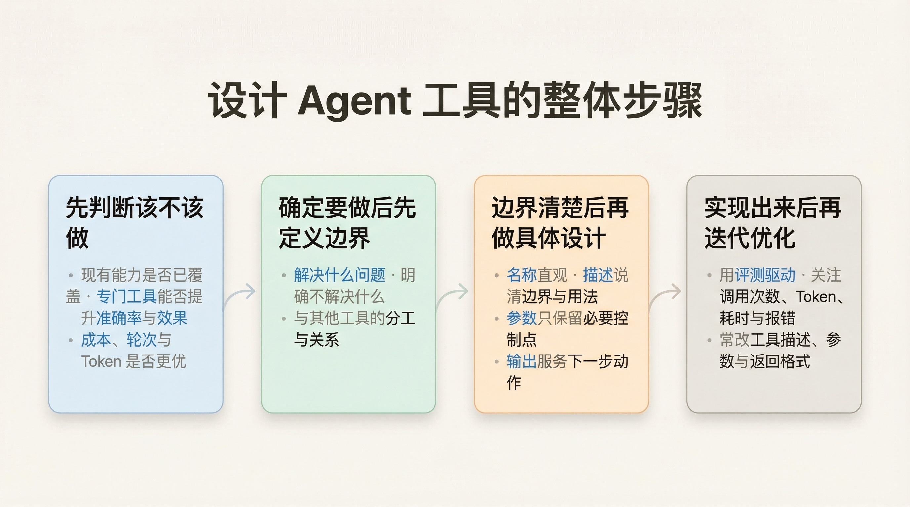

# 01. 设计一个 Agent 工具时，应该先想什么？

设计工作区工具时，我更认同这样一条原则：

> 对人友好的工具，对 Agent 也应该友好；对 Agent 友好的工具，人也应该能很好地使用。

原因很简单。如果一个工具连人类开发者拿着文档都很难快速理解它“能做什么、不能做什么、出错会怎样”，那 Agent 只拿到工具描述和参数定义时，通常也很难稳定用对。

所以，工具设计的重点不是“把能力做出来”，而是“把能力做成一个容易被正确使用的接口”。

## 设计 Agent 工具的整体步骤

后面各节是对每一步的展开；如果只想先抓住主线，可以只看下面这张图里的四步顺序。

## 先判断：这个工具到底该不该做

工具不是越多越好。新增一个工具之前，先看 3 个判断方向：

1. **现有能力的覆盖度**  
   现有工具链能不能完成这件事，例如通过已有工具组合、`run_command`、临时脚本执行等方式实现。

2. **准确率与效果的提升**  
   虽然现有方案能替代，但新增专门工具后，是否能明显提高整体准确率、稳定性或最终效果。这里最好结合评测或案例，而不是只靠主观感觉。

3. **成本与速度的优化**  
   即使替代方案可用，也要看新工具是否能减少 Token 消耗、缩短执行链路、减少轮次，或者让整体执行更快。

例如计算任务，Agent 往往可以直接写一段 Python 在终端执行。这时要不要专门做一个“数学计算器工具”，核心就看这 3 点是否成立，而不是只看“能不能做”。

## 确定要做后，先定义边界

如果判断“这个工具值得做”，下一步先把边界写清楚：

1. 它解决什么问题
2. 它明确不解决什么
3. 它和其他工具是什么关系

边界不清楚，后面就容易出现两个问题：

- 这个工具什么都想做
- 它和别的工具互相重叠

以 `S002` 为例，更清晰的边界是：

- `grep_search` 负责“定位候选位置”
- `read_file` 负责“精读具体内容”
- `grep_search` 不负责替代阅读，也不负责直接给完整答案

## 定义好边界后，再做具体设计

边界清楚后，再进入接口设计。这里先看 4 件事。

### 1. 名称是否直观

工具名要直接表达动作，不要绕。

- `grep_search` 比抽象名字更容易理解
- `read_file` 这种命名也比模糊名字更好用

### 2. 描述是否说清边界和用法

工具描述要让人和 Agent 一眼看懂：

- 这个工具适合什么场景
- 不适合什么场景
- 返回的大概是什么

如果描述说不清楚，后面就很容易误用。

### 3. 参数是否只保留必要控制点

参数不要从“底层支持什么”出发，而要从“Agent 真需要控制什么”出发。

一个简单判断标准是：

- 不传它，Agent 会不会做错关键决策
- 它会不会明显影响结果质量
- 这部分复杂度能不能由工具内部处理

### 4. 输出是否服务下一步动作

输出设计不要贪多。关键是看它是否能支撑下一步。

例如 `grep_search` 更合适的输出是：

- 文件路径
- 行号
- 匹配内容
- 少量上下文

因为它的目标是“告诉 Agent 接下来读哪里”，不是“直接替代阅读”。

这里也能看出一个原则：名称、描述、参数和输出，本质上是在一起定义这个工具到底该怎么被使用。

## 设计实现出来后，再考虑如何迭代优化

工具做出来并不代表设计结束了。上线后还要继续看它是否真的好用。这本身也是个很复杂的话题，这里就先不扩展。

Anthropic 在这篇文章里提到他们如何做一个工具的，感兴趣的可以了解下：

- 先做一个可用原型，再尽快让 Agent 和人真正用起来
- 用评测而不是感觉来判断工具是否变好了
- 不只看最终正确率，也要看工具调用次数、Token、耗时和报错
- 很多优化点不在实现本身，而在工具描述、参数定义和返回格式
- 可以直接让 Agent 帮你分析评测结果，再反过来优化工具

如果你对这个方向感兴趣，可以直接读原文：  
[Writing effective tools for AI agents](https://www.anthropic.com/engineering/writing-tools-for-agents)

## 用 `grep_search` 套一下

放回这个 Story，可以按这 4 步走一遍。

### 1. 先判断它值不值得做

`grep_search` 是值得做的，理由主要有 3 个：

1. **现有能力覆盖不够好**  
   只靠 `read_file`，Agent 很容易陷入“猜文件 -> 读文件 -> 不对 -> 再猜”的流程。虽然也可以调用命令或脚本临时搜索，但不够稳定。

2. **效果会明显更好**  
   专门的搜索工具能把“先定位，再精读”这条工作流固定下来，比让 Agent 临时拼命令或盲读文件更容易做对。

3. **成本和速度更优**  
   先搜索再读，通常比直接通读多个文件更省 Token，也更容易减少无效轮次。

### 2. 再定义它的边界

确定要做后，边界要立刻写清楚：

- `grep_search` 负责“定位候选位置”
- `read_file` 负责“精读具体内容”
- `grep_search` 不负责替代阅读，也不负责直接生成答案

这样做的好处是，工具关系清楚，Agent 更容易选对。

### 3. 再做具体设计

这一层主要就是名称、描述和参数设计。

- 名称：`grep_search` 直接表达动作
- 描述：要说清它适合定位，不适合替代阅读
- 参数：只保留搜索和范围控制的关键点

更具体的接口设计可以直接看：

- [details/00-overview](../details/00-overview.md)
- [details/01-technical-design](../details/01-technical-design.md)

### 4. 实现后继续迭代优化

第一版至少要提前想清楚：

- 结果太多怎么办
- 没有结果怎么办
- 输入不合法怎么办
- 超时、大文件、权限问题怎么办

在 `S002` 里，第一版就是先用上下文参数和结果上限把结果规模收住。后面如果继续做，再通过评测和真实使用情况去优化。

