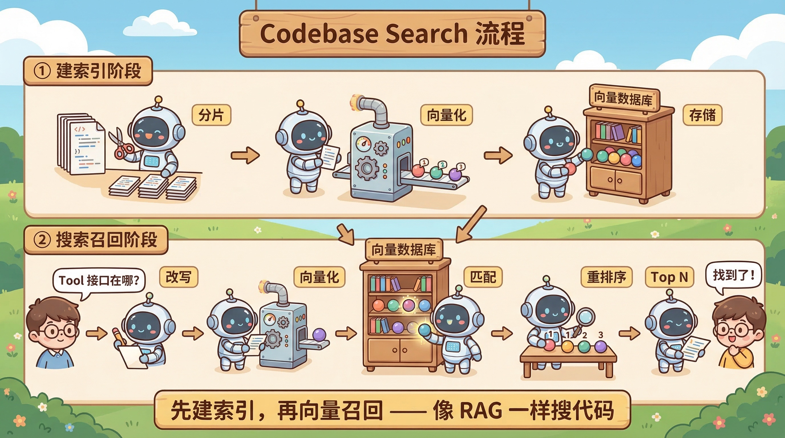
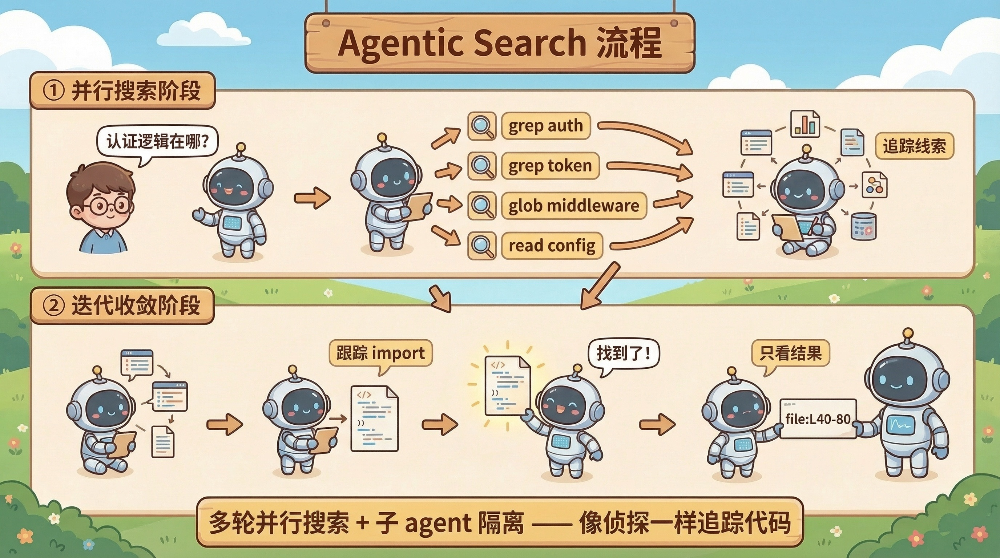
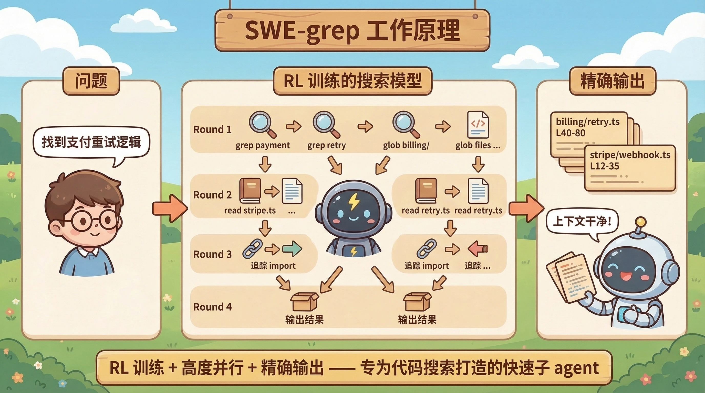
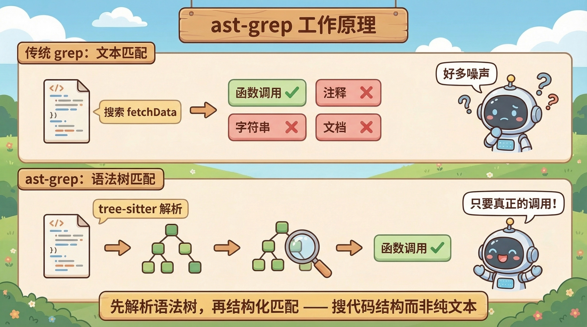

# 04. `grep search` 和 `codebase search` 到底有什么区别？

在前面的内容里，我们做的是 `grep search`。

它解决的问题很直接：给定一个关键词、字符串或正则模式，快速在代码库里找出命中的位置，再把文件路径、行号和上下文交回来。

但如果再往前走一步，就会遇到另一类大家经常提到的能力：`codebase search`。

这里说的 `codebase search`，不是单纯把 `grep` 换个名字，而是指一套更偏 RAG 的代码库搜索能力。它通常会先把代码切片、建索引、做向量化或其他形式的召回，再把候选结果整理后返回给模型。

所以这两类搜索，核心差别不在"都能不能搜到东西"，而在"它们到底在用什么方式帮助 Agent 找信息"。

## `grep search` 在做什么

`grep search` 更像一种直接、可控、面向模式匹配的搜索能力。

它的特点通常是：

- 输入明确：关键词、字符串、正则
- 返回直接：命中位置、文件路径、行号、上下文
- 行为可预期：搜什么，就尽量返回什么
- 成本相对可控：不需要先建一整套索引系统

对 Agent 来说，这类工具最大的好处是可控。

它知道自己搜了什么，也大致知道为什么会得到这些结果。如果结果不对，它也更容易调整下一次搜索条件。

## `codebase search` 在做什么

`codebase search` 是一套代码库级别的召回系统。

它不一定只依赖关键词，而更强调：怎样把整个代码库变成一个可检索的知识源，在用户问题比较模糊、比较自然语言化时，仍然能召回一批可能相关的代码片段。

它的整体工作流程可以分为两个阶段：

**① 建索引阶段**（离线 / 准实时）

在搜索发生之前，系统需要先把代码库"消化"一遍：

1. **分片**：把源码文件按语义单元切成片段（通常按函数、类、逻辑块），而不是简单按行数截断
2. **向量化**：用 embedding 模型把每个代码片段转成一个向量，捕捉它的语义信息
3. **存储**：将向量和对应的代码片段元信息（文件路径、行号范围等）写入向量数据库

这个阶段的产出是一个可检索的向量索引。后续代码发生变更时，还需要增量更新这个索引。

**② 搜索召回阶段**（在线）

当 Agent 发起一次搜索时，流程大致是：

1. **Query 改写**：对用户的问题或 Agent 生成的搜索意图做预处理，比如提取关键信息、补充上下文
2. **向量化**：用同一个 embedding 模型把 query 转成向量
3. **匹配**：在向量数据库中做相似度检索（通常是余弦相似度），找出最接近的一批候选片段
4. **重排序**：对候选结果做进一步排序，可能结合关键词匹配、代码结构等信号
5. **Top N**：取排名靠前的 N 个结果，返回给模型

所以它解决的不是"精确搜某个词"，而是"当问题不够精确时，怎样仍然把相关代码找回来"。本质上就是一套面向代码的 RAG 流程。

## 产品调研：各大 Coding Agent 都在用什么搜索能力？

有了上面两个概念之后，一个自然的问题是：现在主流的 Coding Agent 产品里，到底谁在用 `grep search`，谁在用 `codebase search`？

我们做了一轮产品调研（截至 2026 年 3 月），覆盖了市面上主要的 Coding Agent 产品。

### 总览

| 产品 | Grep Search | Codebase Search（语义） | 备注 |
|------|:-----------:|:----------------------:|------|
| Claude Code | ✅ | ❌ | 明确不做 embedding，用子 agent 做多步搜索 |
| Cursor | ✅ | ✅ | 自研 embedding 模型，两套搜索并行 |
| Codex CLI | ✅ | ❌ | 社区提议语义搜索，尚未落地 |
| Gemini CLI | ✅ | ❌ | 社区提交过语义搜索 PR，未合入，推荐走 MCP |
| OpenCode | ✅ | ❌ | 有实验性 LSP 工具，无语义搜索 |
| GitHub Copilot | ✅ | ✅ | 有语义搜索 |
| Windsurf | ✅ | ✅ | 索引 + SWE-grep |
| Aider | ✅ | ❌ | 用 tree-sitter 做 repo map，不做向量化 |

## 我的看法：为什么很多 Coding Agent 不做 RAG Code Search

从上面的调研可以看到，Claude Code、Codex CLI、Aider 这几个产品明确选择了只做 grep search，没有引入 RAG 式的 codebase search。这不是技术能力不够，而是在 Coding 这个场景下，有几个很现实的原因。

### 效果：Grep Search 在代码场景下已经够准

代码和自然语言文档有一个根本性的区别：**代码是高度结构化的内容**。

在普通文档或内部知识库里，同一个概念可以用很多不同的表述来描述，语义的稀疏性很强，关键词匹配经常失准。但代码不一样——它有固定的语法结构、可预测的命名模式、明确的模块组织方式。一个函数叫 `validateToken`，它不太可能在另一个地方被叫做"检验令牌有效性"。

更重要的是，今天的大模型在训练过程中已经见过海量代码，对主流语言的命名惯例、项目组织方式、常见设计模式都形成了很强的先验认知。当 Agent 需要在代码库里找某段逻辑时，它往往能直接推断出合理的关键词或符号名，配合 Grep 和文件系统工具就能高效定位。

这意味着在代码场景里，grep search 的"天花板"本身就比在文档场景里高很多。

### 成本：RAG Code Search 的系统负担远不止 Token

有些文章提到 codebase search 可以提升 Token 效率——通过更精准的召回减少无效内容进入上下文。这个逻辑说得通，但实际落地时，成本账要算得更完整。

RAG Code Search 的成本至少包含两层：

**硬件成本**：最大的开销来自向量数据库。在线实时向量检索对资源的要求很高。当一个团队几千上万人，日常在几十个项目里开发时，产生的向量存储量非常可观。如果不做专门的技术优化（比如量化、分层索引、冷热分离），存储和计算成本会快速膨胀。

**技术复杂度**：即使不追求极致优化，RAG 本身就是一条完整的系统链路。索引阶段需要代码分片、向量化、存储；召回阶段需要 Query 改写、向量化、排序、重排。这些是最基本的步骤。而要把 RAG 真正做好——召回率稳定、结果质量可控、索引及时更新——还需要持续的维护和迭代投入。它不是一个"搭完就能跑"的东西，更像一个需要长期运营的系统。

回过头来看，如果 grep search 的效果在代码场景下本来就不差，那引入这么重的一套服务端链路，投入产出比就很难说划算。这也是为什么很多实际产品在做取舍时，不倾向于上这套重资产方案。

### 黑盒性：Agent 更难操控 RAG 的搜索结果

还有一个容易被忽略的问题：**对 Agent 来说，grep search 的可操控性远好于 RAG code search**。

Grep 的行为是透明的：Agent 生成关键词 `ABC`，搜到的结果就是包含 `ABC` 的代码行。如果没搜到想要的，它知道是关键词不对，可以换一个再试。整个过程是一个可预期、可修正的闭环。

但 RAG code search 中间经过了切片、向量化、相似度匹配、重排等多个步骤。Agent 输入 `ABC`，返回的结果里可能并不显性包含这三个字符。对模型来说，这是一个不太可控的黑盒——它没办法准确预测自己会搜到什么，也不容易判断搜索结果"不对"的原因是什么。这会让 Agent 的自我修正变得更难。

在需要精确定位的场景里，"我能准确操控搜索"比"系统帮我模糊召回"往往更可靠。

### RAG 并没有被淘汰

以上并不是说 RAG 没有价值。

Coding 场景的特殊性——数据高度结构化、命名可预测、模型已有强先验——使得 grep search 就能覆盖大部分需求。但在其他场景里，情况可能很不一样。

比如在企业内部文档、客服知识库、合规条款这类场景中，信息结构零散、表述多变、关键词不可预测，纯 grep 就力不从心了。这时候 RAG 的语义召回能力就有明显的优势。

而且 RAG 也不一定是一个独立的方案。在一些实际系统里，它更多是和其他搜索能力做组合——比如先用 grep 做精确匹配，再用 RAG 补充语义召回，或者用 Agentic Search 在多步推理中按需触发 RAG。

所以更准确的说法是：**在 Coding Agent 这个具体场景下，grep search 的性价比目前更高**。RAG 不是不好，而是这个场景暂时不是它发挥最大价值的地方。

## 扩展：搜索方向上的更多技术尝试

除了 grep search 和 RAG codebase search 之外，行业里还有一些值得关注的技术方向。

### Agentic Search（子任务 / 子 Agent + 上下文隔离）

狭义地说，主 Agent 自己多轮调用 grep、读文件、缩小范围，本身就已经在「像人一样」搜代码；前文讨论工具链时，本质上覆盖的是这一层含义。

本节要说的 Agentic Search，重点是另一种**组织结构**：把探索交给 **subtask（子任务）或 subagent（子 Agent）**，在**与主会话隔离的上下文**里独立完成多轮、并行搜索，最后只把筛过的结论（相关路径、片段、摘要）合回主线。主线对话不被「试错的搜索轨迹」挤占。

在这种形态下，常见机制包括：

**高度并行**：子侧每一轮同时发出多路工具调用（grep、glob、file read 等），用几轮覆盖原先需要很多轮串行才能扫到的区域。

**上下文隔离**：死胡同、误命中和大段中间结果留在子任务上下文；主 Agent 只看到精炼后的输出。上下文污染是能力掉线的主要原因之一，隔离直接对准这个问题。

优势是不需要预建向量索引，搜索过程可以带推理与追踪（如顺着 import / 调用边继续查）。代价是延迟通常更高（秒级）。工程上同类做法还包括把搜索专职化的小模型、以及产品里的 Task / Search 子 Agent。

### SWE-grep

SWE-grep 可以看成上一节「子 Agent + 隔离上下文 + 多轮并行搜索」范式的代表性落地：Cognition（Devin 背后的公司）用 RL 训了一个**专门负责搜代码**的小模型，由产品在合适的时机拉起**独立搜索会话**（例如 Windsurf 里作为 "Fast Context" 子 agent 触发），再把结构化结果还给主流程。

背景问题：Cognition 在实际数据中发现，Agent 超过 60% 的时间花在找代码上。RAG 不够准，通用大模型自己做完整条探索链又太慢，因此需要**既快又准的搜索专用模型**。

核心设计：用强化学习让模型学会高效的并行搜索策略。每轮最多 8 个并行工具调用，总共最多 4 轮。训练目标刻意偏向精确率——因为返回无关代码（上下文污染）比漏掉一些代码更有害。输出是精确的文件路径 + 行号范围。

### ast-grep

ast-grep 走的是另一条轴：**把代码当作语法树来搜索，而不是当作纯文本**。

传统 grep 搜索 `fetchUserData()` 时，注释里、字符串常量里、文档里出现的同名文本都会命中。ast-grep 的做法是先用 tree-sitter 把源码解析成 AST，然后在语法树上做结构化匹配。搜索模式不是正则，而是一段合法代码，用 `$VAR` 作为通配符。比如搜 `console.log($ARG)`，只会匹配真正的函数调用节点，注释和变量名里的同名文本会被自动排除。

理论上具有如下优势：

- **更少误报**：搜索结果更干净，Agent 不需要花 Token 过滤噪声
- **结构感知**：能区分函数定义、函数调用、变量声明等不同角色
- **搜索 + 重写**：不只能搜，还能做结构化代码替换

ast-grep 尚未被主流 Coding Agent 直接集成为内置工具，但「让搜索理解代码结构」这一思路对提高 Agent 上下文质量有可能有优势。
