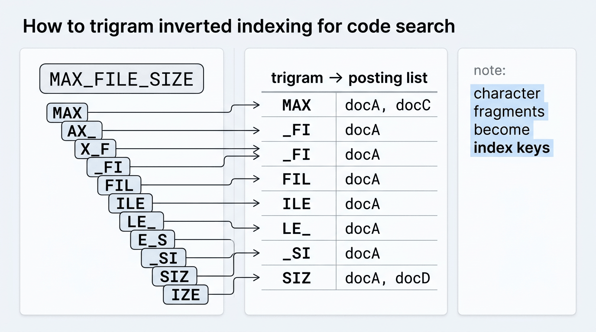
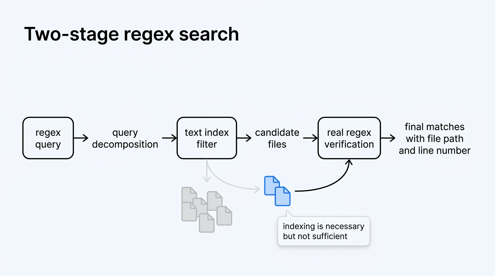
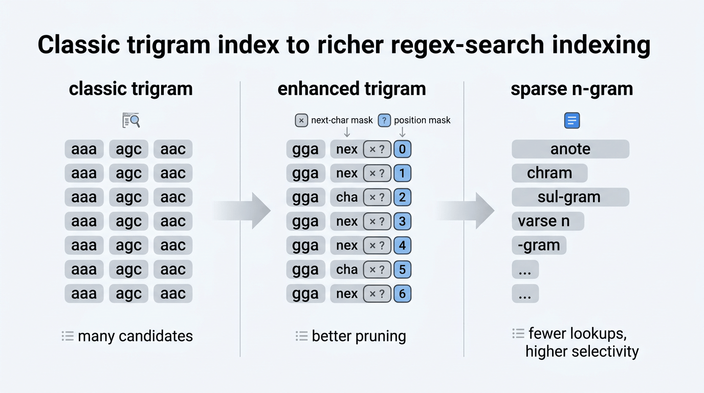

# 05. 当 `ripgrep` 还不够快：正则搜索为什么会走向索引化

在 `S002` 里，我们给 Agent 接入了 `grep_search`，底层选择了 `ripgrep`。

这是一个很合理的第一版：能力成熟、行为清晰、工程实现成本低，而且已经能覆盖绝大多数中小仓库里的搜索需求。

但如果再往前走一步，就会遇到一个更底层的问题：

> 如果 `ripgrep` 已经很快了，为什么还会有人继续为正则搜索专门建索引？

答案是：`ripgrep` 再快，本质上仍然是**扫描型搜索**。

它可以把“匹配一份文本”的过程做得非常高效，但对于一次搜索来说，它仍然通常需要把候选文件的内容读出来，再逐个跑匹配逻辑。仓库越大、文件越多、Agent 搜得越频繁，这个成本就越会暴露出来。

在小项目里，这不是问题；但在超大 monorepo、企业仓库或 Agent 高频多轮搜索的场景里，这会逐渐变成一个系统级瓶颈。也正因为这样，行业里一直存在另一条技术路线：**不是继续优化“怎么扫描”，而是优化“哪些文件值得扫描”**。

这条路线的核心，就是给正则搜索建立一层**文本索引**。

本文参考了 Cursor 博客 [《快速正则搜索：为 agent 工具构建文本索引》](https://cursor.com/cn/blog/fast-regex-search)，并结合 `S002` 的上下文，把其中涉及的关键技术脉络重新梳理一遍。重点不是复述产品宣传，而是回答下面这几个技术问题：

- 为什么传统搜索引擎的“按单词建索引”不适合正则搜索
- 为什么经典方案通常会走向 `n-gram`，尤其是 `trigram`
- 正则表达式怎样被分解成可用于索引检索的片段
- 为什么索引阶段只能做候选过滤，最终仍然需要真实 regex 验证
- 经典 trigram 方案有哪些局限，后续又演化出了哪些改进方向
- 为什么这类索引特别适合放在本地，而不是只放在服务端

## 问题的本质：`ripgrep` 快，但它还是“扫”

先把问题说得更准确一点。

在 `S002` 里，我们强调 `grep_search` 的价值，是让 Agent 从：

```text
猜文件 -> 读文件 -> 不对 -> 再猜
```

变成：

```text
先搜索定位 -> 再精读上下文
```

这一步解决的是**工作流效率**问题。

但当 `grep_search` 成为高频能力之后，还会出现第二层问题：**搜索本身的延迟**。

例如，Agent 在一个大仓库里连续执行下面这些操作：

1. 搜某个 symbol 名
2. 改一个 pattern 再搜一次
3. 加一个 path 限定再搜一次
4. 继续 grep 某个报错字符串
5. 再去读命中文件

这里每一次 grep，哪怕只是几十到几百毫秒，累计起来也会变成明显的交互摩擦；而在非常大的仓库里，单次搜索甚至可能直接进入秒级。

所以这里真正需要优化的，不再是“怎么把一次匹配写得更快”，而是：

> 能不能在真正执行 regex 之前，先用一个便宜很多的数据结构，把“不可能命中”的绝大多数文件提前排除掉？

如果能做到这一点，搜索流程就会从：

```text
对所有文件执行 regex
```

变成：

```text
先用索引筛出少量候选文件 -> 只对候选文件执行 regex
```

这就是正则搜索索引化的核心思路。

## 为什么“按单词建索引”不够用

很多人一提“搜索建索引”，第一反应是倒排索引。这个方向没有错，但麻烦在于：**正则搜索不是普通的全文搜索**。

普通搜索引擎最经典的做法，是把文档切成 token，例如按单词分词，然后建立：

```text
token -> 出现过这个 token 的文档列表
```

比如：

```text
"validate" -> [doc1, doc8, doc25]
"token"    -> [doc1, doc3, doc8]
```

查询 `"validate token"` 时，只要取两个 posting list 的交集，就能得到同时包含这两个词的文档。

这个模型对自然语言很好用，但对代码里的 regex 搜索有两个问题。

### 1. 正则不总是“词”

很多搜索并不是搜完整单词，而是搜：

- 一段字面量子串
- 带下划线、驼峰或路径分隔符的标识符
- 部分模式，如 `foo.*bar`
- 字符类、可选分支、重复表达式

这些查询和“按词分词”的边界并不一致。

如果索引只知道 `validate`、`token` 这些单词，却不知道 `_to`、`ken`、`foo/`、`MAX_` 这样的字符片段，那么很多 regex 查询根本没法被索引有效支持。

### 2. 代码的“词法世界”比自然语言更别扭

代码里常见的搜索目标包括：

- `MAX_FILE_SIZE`
- `useUserStore`
- `src/tools/grep-search.ts`
- `throw new Error`
- `fooBarBaz`

你当然可以设计更复杂的 tokenizer，试图理解各种命名风格和语言语法，但问题会迅速恶化：

- 不同语言的标识符规则不同
- 注释、字符串、路径、模板片段混在一起
- regex 本身又不是一个“词级”查询语言

所以如果目标是支持**正则表达式**，最自然的做法通常不是继续在“词”这个层级打补丁，而是往更底层走一步：**按字符片段建索引**。

## 经典方案：用 `n-gram` 作为索引 token

这条路线的经典做法，是把文档切成固定长度的字符片段，也就是 `n-gram`。

例如，对字符串：

```text
MAX_FILE_SIZE
```

如果取长度为 3 的 `n-gram`，就会得到一组重叠的 `trigram`：

```text
MAX
AX_
X_F
_FI
FIL
ILE
LE_
E_S
_SI
SIZ
IZE
```

然后建立倒排索引：

```text
trigram -> 包含这个 trigram 的文档列表
```

这样做有一个关键好处：**无论查询是单词、路径、常量名，还是更复杂 regex 中的字面量部分，它们最终都可以被映射到字符级片段上。**

<p align="center">
  
</p>

### 为什么经典方案常常选择 `trigram`

理论上你可以选 bigram、trigram、4-gram，甚至更长。

但长度不同，会直接影响索引结构：

### 1. `n` 太小，posting list 太大

如果用 bigram，例如长度为 2 的片段：

```text
MA
AX
X_
_F
...
```

这种 token 的种类有限，因此每个 token 会出现在非常多的文档里。结果是：

- 索引键数量不多
- 但每个键对应的 posting list 很长
- 查询时交集/合并成本很高
- 候选过滤能力偏弱

也就是说，索引“太宽”，区分度不够。

### 2. `n` 太大，索引键空间爆炸

如果用 4-gram 或更长片段，区分度当然更强，但代价也明显：

- 唯一键的数量急剧增加
- 索引更大
- 构建和存储成本上升
- 查询时也更容易因为表达式变化而缺少足够稳定的片段

也就是说，索引“太细”，维护成本会高很多。

### 3. `trigram` 是常见折中

所以很多经典实现会选择长度为 3 的片段。它不是数学上的唯一最优解，但在工程上常常是一个不错的平衡点：

- 比 bigram 更有区分度
- 比 4-gram 更容易控制索引规模
- 既能支持字面量查询，也能服务于 regex 分解

像早期 Google Code Search、`zoekt`、`google/codesearch` 一类方案，都属于这条技术脉络。

## 索引怎么用：先分解查询，再查 posting list

文档建好 trigram 索引之后，查询端要做的事情就变成了：

1. 把查询分解成一组三元组约束
2. 从索引中取出这些 trigram 对应的 posting list
3. 根据表达式结构做交集或并集
4. 得到“可能匹配”的候选文档集合
5. 最后再对候选文档执行真实 regex 匹配

这里最关键的一步，是**如何把 regex 分解成 trigram 约束**。

## 正则分解：从 regex 语法里提炼“必要片段”

如果查询只是一个字面量字符串，分解非常直接。

例如搜索：

```text
MAX_FILE_SIZE
```

可以提取所有重叠 trigram：

```text
MAX, AX_, X_F, _FI, FIL, ILE, LE_, E_S, _SI, SIZ, IZE
```

一个文档如果连这些 trigram 都不包含，那它就不可能包含完整字面量。

但 regex 比字面量复杂得多，所以真正的难点在于：**要从表达式语法中找出那些“命中时必须出现”或“至少某一支必须出现”的片段。**

### 字面量序列：做 AND

对于连续字面量，例如：

```text
/MAX_FILE_SIZE/
```

要求很简单：候选文档应该同时包含这些 trigram。

在索引层面，对应的就是对多个 posting list 求交集。

### 交替分支：做 OR

例如：

```text
/foo|bar/
```

这个表达式只要求命中任一分支即可，所以查询规划会变成：

```text
(foo 这一支的约束) OR (bar 这一支的约束)
```

在索引层面，对应的是并集。

### 小字符类：做有限展开

例如：

```text
/[rbc]at/
```

可以展开成几个有限候选：

```text
rat
bat
cat
```

然后对这些 trigram 分支做 OR。

但这只适合很小的字符类。如果字符类很大，例如 `[a-zA-Z0-9_]`，继续展开就会非常夸张，此时查询规划器通常只能在这个位置放弃提取，转而依赖表达式中其他更稳定的字面量片段。

### 宽泛通配：只能部分提取

例如：

```text
/foo.*bar/
```

这里 `.*` 中间可以吞掉任意内容，所以无法把整段都当作连续 trigram 约束。但仍然可以提取两端比较稳定的字面量片段：

- `foo`
- `bar`

然后要求候选文档至少同时包含这些更粗粒度的必要片段。

### 核心原则：索引提取的是“必要但不充分”的条件

这里要特别注意一个边界：

> 从 regex 中提取出来用于索引检索的片段，目标不是“直接证明匹配成立”，而是“尽可能排除不可能匹配的文档”。

这意味着查询规划器宁可保守一点，也不能太激进。

如果提取逻辑犯错，把本来可能命中的文档提前过滤掉，就会出现 **false negative**，这会直接让搜索结果错误。

所以很多实现都会遵守一个基本原则：

- 索引层可以接受 **false positive**
- 但不能接受 **false negative**

换句话说，候选放宽一点没关系，后面还能再验；但把真命中漏掉，是不能接受的。

## 为什么索引不能直接替代 regex 执行

到这里很容易产生一个误解：既然已经把 regex 拆成 trigram 约束了，为什么不直接把索引结果当最终结果？

因为 trigram 索引只能说明：

> “这个文档里出现过一些必要片段，所以它**有可能**匹配这个 regex。”

它并不能保证：

- 这些片段在正确的相对位置上
- 这些片段属于同一次匹配
- 它们满足重复、可选、边界、分组等全部 regex 语义

例如文档里同时包含 `foo` 和 `bar`，并不意味着它一定命中 `/foo.*bar/`，因为：

- 它们可能顺序相反
- 可能分别出现在完全无关的两段文本里
- 可能被边界条件排除

所以完整流程永远是两阶段：

1. **索引阶段**：做候选过滤
2. **验证阶段**：对候选文档执行真实 regex

这和数据库里的“先用索引缩小范围，再回表验证”是很像的思路。

真正的性能收益，不是来自“索引直接算出了答案”，而是来自：

> 绝大多数文件根本不用进入 regex 引擎。

<p align="center">
  
</p>

## 经典 trigram 方案的局限

经典 trigram 倒排索引已经很有用，但它并不完美。它至少有三类常见问题。

### 1. 索引仍然不小

虽然 trigram 比更长的 `n-gram` 更节制，但对大型代码库来说，索引本身仍然可能相当可观。

原因很简单：每个文件会产生大量重叠 trigram，而这些 trigram 都要进入 posting list。

### 2. 查询分解是个权衡题

如果查询规划器很保守，只提取少量 trigram，那么：

- posting list 查询次数少
- 但候选集合会更大
- 后续 regex 验证成本会上升

如果查询规划器很激进，提取很多 trigram，那么：

- 候选集合会更小
- 但需要读取更多 posting list
- 索引层本身的查询成本会上升

所以这里没有一个永远正确的固定策略，本质上是在“索引查询成本”和“后续验证成本”之间找平衡。

### 3. 三元组只知道“出现过”，不知道“怎么出现”

一个文档同时包含 trigram `foo` 和 `bar`，并不意味着它们：

- 相邻
- 顺序正确
- 来自同一段短语

这就会造成不少候选误报，尤其是常见 trigram 会非常“吵”。

也正因为这些局限，后续很多工作都在尝试回答同一个问题：

> 能不能在不把索引体积做爆的前提下，让索引对“短语关系”和“片段区分度”有更多感知？

## 一个有代表性的改进方向：给 trigram 增加额外信息

Cursor 文章里提到了一类很有代表性的思路：索引键仍然使用 trigram，但在每个 posting 上附加额外的概率性信息。

它解决的是经典 trigram 的两个薄弱点：

- trigram 太短，区分度不够
- trigram 只知道“出现过”，不知道“是不是以合理位置相邻出现”

### 1. 用“后继字符”近似四元组

如果只用 trigram，查询 `abcd` 时，索引只会看到：

```text
abc
bcd
```

这两个 trigram 可能分别存在于文档的不同位置。

一种改进办法是：仍然以 trigram 作为键，但在 posting 里记录“这个 trigram 后面可能跟过哪些字符”的压缩信息。

这样一来，查询时虽然索引键还是 `abc`，但系统实际上可以更接近四元组那样去过滤候选，例如：

- `abc` 后面跟过 `d`
- 而不是跟过一堆别的字符

它的本质是：**不真的建完整 4-gram 索引，但借一些附加信息，拿到接近 4-gram 的过滤效果。**

### 2. 用位置掩码近似相邻关系

另一类附加信息，是记录 trigram 出现位置的一些压缩特征。

例如，不记录每一次精确位置，而是记录某种简化过的位置模式。这样在查询多个 trigram 时，就能先做一轮非常便宜的相邻性判断：

- 两个 trigram 是否有机会在文本里连续出现
- 如果连这种粗判断都过不了，就不用进入候选集

这仍然是概率性的，不是最终证明；但它能显著减少“明明不可能拼成同一段文本，却因为都出现过而被放进候选集”的情况。

### 3. 为什么这里可以接受概率性

这些附加结构常常会使用 Bloom filter 一类的概率型表示。

它的特点是：

- 可能误报
- 但不会漏报

这和 regex 索引的总体目标非常一致，因为最终还有真实匹配做兜底。也就是说，只要它能把大量明显不相关的文档提前挡掉，就已经有价值。

<p align="center">
  
</p>

## 另一条思路：不要固定长度，而是做更“稀疏”的 `n-gram`

除了给 trigram 增强信息，另一条很重要的演进路线，是**减少需要查询的片段数量，同时保持足够高的区分度**。

Cursor 文章里提到的 Sparse N-grams 就属于这一类。

它背后的动机很直接：

- 经典 trigram 会提取每一个长度为 3 的重叠片段
- 这些片段之间高度重叠，信息冗余很多
- 查询时往往需要访问不少 posting list

Sparse N-gram 的思路是：

1. 不再强制每个 token 都是固定长度
2. 用一个确定性的权重规则，从文本中挑出一批“代表性更强”的片段
3. 建索引时可以提取很多候选片段
4. 查询时则用覆盖算法，只提取足够少、但区分度足够高的那一小部分

这套方法的核心收益是：

- 查询时要看的 posting list 更少
- 片段通常更有辨识度
- 因而整体查询会更快

从直觉上说，它是在做一件事：

> 不是把文本机械地切成一堆固定小片，而是尽量挑出那些“最能代表这段文本”的特征片段。

如果再进一步，把字符对频率统计也引入权重函数，那么那些更罕见、更有区分度的片段就更容易被选中。这会进一步降低候选集合规模。

## 番外：后缀数组为什么有意思，但不太像通用答案

除了倒排索引路线，文章还提到了一种很有代表性的不同方向：后缀数组（suffix array）。

它的思路不是存：

```text
token -> 文档列表
```

而是把所有文本组织成一个可以按后缀做有序查找的结构，再通过字面量分解和二分查找来定位潜在匹配位置。

这个方向很有意思，因为它不是建立传统倒排索引，而是从字符串检索本身出发去做设计。

但它有一个很现实的问题：它更适合把一整份大文本当作统一语料来处理。

如果你面对的是：

- 很多仓库
- 很多文件
- 高频本地修改
- 需要快速增量更新

那么后缀数组要把位置映射回原始文件、并在变更后高效维护，都会变得更麻烦。

所以它更像是一个值得理解的分支实现，而不是今天通用工程方案里最容易扩展的路线。

## 为什么这类索引特别适合放在本地

如果上面的思路成立，接下来就要回答另一个工程问题：

> 这套索引应该放在哪？

对 regex search 来说，一个很自然的答案是：**尽量放在本地**。

### 1. 最终验证本来就要读本地文件

前面说过，索引只能筛候选，最终还是要对候选文件跑真实 regex。

这意味着即使索引在服务端，你最后仍然绕不开：

- 把文件同步上去
- 或者把候选范围和内容来回传输

而如果索引和文件都在本地，那么候选过滤和最终验证都能在同一侧完成，中间不需要额外网络往返。

### 2. 这类索引要“非常新鲜”

语义索引在很多场景下可以接受轻微滞后，因为 embedding 空间上的“邻近关系”通常不会因为一次小改动就完全失效。

但 regex search 不一样。

如果 Agent 刚写进一行：

```text
MAX_FILE_SIZE
```

随后又立刻去搜它，那么索引如果还没更新，搜索就会直接 miss。对 Agent 来说，这不是一个“小误差”，而是一次会误导后续推理的失败。

所以正则搜索索引要比很多语义索引更强调**实时性**或至少**准实时性**。

### 3. 本地索引更贴合编辑器交互延迟

Agent 搜索是一个高频、短路径、常常并行的操作。

如果每次查询都要额外经过网络：

- 延迟会抬高
- 抖动会更明显
- 失败模式也会更多

而这些问题恰好都会直接破坏 Agent 的交互体验。

## 一个典型的本地工程形态

从工程实现上看，这类本地索引通常会倾向于：

### 1. 查找表和 posting 数据分离

一种常见做法是把索引拆成两部分：

- 一个较小的 lookup table，用来记录 `n-gram hash -> posting list offset`
- 一个较大的 postings 文件，顺序存储真正的 posting list 数据

查询时先在 lookup table 里定位偏移，再到 postings 文件读取对应数据。

这样做的好处是：

- 常驻内存的数据可以更小
- 查找路径更清晰
- posting 数据可以顺序写盘，更适合构建阶段

### 2. 只把轻量结构映射进内存

如果 lookup table 足够紧凑，可以只对这一部分做 `mmap`，然后用二分查找找到目标项。

这样可以避免把完整 postings 都搬进内存。

对编辑器或本地 Agent 来说，这种设计很重要，因为它直接关系到：

- 启动成本
- 常驻内存占用
- 多仓库并存时的可扩展性

### 3. 用“稳定基线 + 变更层”的方式同步

对于 Git 仓库，一个实用思路是：

- 以某个稳定提交对应的文件内容作为索引基线
- 用户工作区和 Agent 写入产生的改动，作为增量层叠加

这样做的目标不是概念上优雅，而是工程上务实：

- 冷启动更快
- 增量更新成本更低
- 不必在每次修改后完全重建整份索引

## 它和 `S002` 的关系：不是替代第一版，而是解释下一步

看到这里，可能会自然冒出一个问题：

> 那我们 `S002` 是不是一开始就该做索引？

我的判断是否定的。

`S002` 第一版的重点，是把 `grep_search` 作为一个**工作流能力**接入 Agent，让它从“盲读”变成“先搜再读”。在这个阶段，`ripgrep` 已经是非常合适的底座：

- 工程复杂度低
- 能力足够成熟
- 交互契约清晰
- 方便把注意力放在工具设计而不是搜索内核

而本文讨论的这些技术，回答的是更靠后的一个问题：

> 当 `grep_search` 已经成为高频能力，而且仓库规模足够大时，正则搜索为什么还会继续往“索引化”演进？

所以它和 `S002` 的关系不是“否定前者”，而是：

- `S002` 解决的是：**先把 grep 工具做对**
- 这篇解决的是：**当 grep 已经做对之后，下一层性能优化在什么地方**

## 它和 LSP、RAG、Codebase Search 分别是什么关系

为了避免概念混淆，最后把几个容易串在一起的东西分开说一下。

### 1. 和 LSP 的关系

LSP 解决的是符号级、语法级、类型级导航问题，比如：

- 跳定义
- 查引用
- 重命名

而本文讲的索引，是为**文本 / regex 搜索**服务的。它们都叫“索引”，但索引对象和查询语义完全不同。

### 2. 和 RAG Codebase Search 的关系

RAG codebase search 关注的是：

- 用户问题不够精确时，如何做语义召回
- 如何从整个代码库里找“相关”片段

而 regex 索引关注的是：

- 当查询本身已经相对明确时，如何以更低延迟做模式匹配

一个偏语义召回，一个偏精确过滤。

### 3. 和 `ripgrep` 的关系

它不是 `ripgrep` 的对立面，而更像 `ripgrep` 的前置加速层。

完整流程更像：

```text
regex query
-> 查询规划
-> 索引筛候选
-> 对候选文件执行真实 regex
-> 返回命中位置和上下文
```

也就是说，**索引不是取消 regex 引擎，而是减少 regex 引擎必须工作的范围。**

## 小结

如果把这篇的重点压成一句话，那就是：

> `ripgrep` 优化的是“如何高效扫描文本”，而 Fast Regex Search 这类方案优化的是“如何避免去扫描绝大多数无关文本”。

正则搜索之所以会走向索引化，不是因为 `ripgrep` 不够优秀，而是因为当 Agent 把 grep 变成高频基础操作之后，系统瓶颈开始从“单次匹配速度”转移到“全仓扫描成本”。

从经典的 trigram 倒排索引，到带附加掩码的 posting，再到 sparse n-gram，本质上都在做同一件事：

- 把 regex 中的必要片段提炼出来
- 用索引快速排除大部分不可能命中的文件
- 保留最终的真实匹配验证，确保结果正确

这也是为什么这类技术非常适合作为 `S002` 之后的纵深阅读材料：它不是另一套产品故事，而是对 `grep_search` 这条路线的“下一层工程问题”的展开。

## 参考资料

- Cursor 博客：[《快速正则搜索：为 agent 工具构建文本索引》](https://cursor.com/cn/blog/fast-regex-search)
- Russ Cox: [Regular Expression Matching with a Trigram Index](https://swtch.com/~rsc/regexp/regexp4.html)
- Google Code Search 开源实现：[google/codesearch](https://github.com/google/codesearch)
- Sourcegraph 检索引擎：[sourcegraph/zoekt](https://github.com/sourcegraph/zoekt)
- Nelson Elhage: [Regular expression search with suffix arrays](https://blog.nelhage.com/2015/02/regular-expression-search-with-suffix-arrays/)
