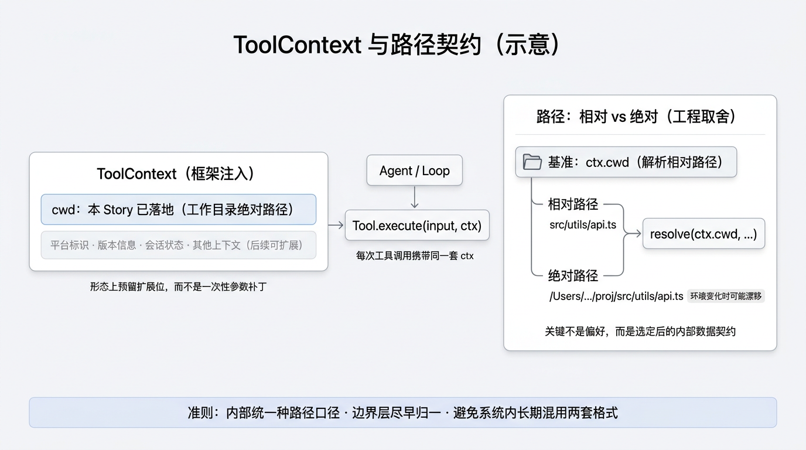

# E01-S003：让 Agent Harness 能在项目里找到该看的文件

> 这是 Epic 1 的第三个 Story。目标是让 Agent Harness 从"逐个试文件"进化为"按模式精准定位文件"，同时补上工具体系缺失的工作目录基础设施。

[Epic 1：能看 / 能查](../README.md) | [首页](../../../README.md) | [迭代日志](../../../CHANGELOG.md#e01-s003-file-search-done)

---

## 能搜内容了，但找不到文件

`S002` 给 Agent 补上了"在内容里搜关键词"的能力。现在它可以用 `grep_search` 快速定位某个符号出现在哪些行。但另一个高频场景还没覆盖：

```text
用户：帮我找一下项目里所有的测试文件。
```

`grep_search` 搜的是**文件内容**，回答的问题是"哪一行出现了某个词"。上面这个问题问则更关心**文件路径**，也就是哪些文件名匹配 `*.test.ts` 这个模式。这是两种不同的搜索维度：


| 维度   | 已有工具            | 问题            |
| ---- | --------------- | ------------- |
| 内容搜索 | `grep_search` ✅ | "哪一行包含这个关键词？" |
| 文件搜索 | ❌ 没有            | "哪些文件匹配这个模式？" |


没有文件搜索时，Agent 会怎么做？它只能用 `list_directory` 递归列出整个目录树，然后在一大堆输出里自己查看然后脑内过滤。这和 `S001` 里"没有 grep 就只能逐个读文件"是一样的低效模式。这种低效不仅会表现为耗时长，还会实际消耗更多 token。

---

同时，我们之前的仓库里，还有个隐藏问题：前两个 Story 的所有工具（`read_file`、`list_directory`、`grep_search`）都在用相对路径，但它们其实没有一个统一的"相对于什么"的答案——全靠启动进程时 `process.cwd()` “碰巧”是对的。当然，这个很多时候都能工作，但随着我们的系统变得复杂，工具数量增加，这种隐式依赖某个假定早晚会出问题。

所以`S003` 同时解决这两件事。

---

## 这个 Story 要做什么

### 问题

处理两个问题：

1. **明面上**：我们的 Agent Harness 缺少按文件名/路径模式搜索的能力，面对"找所有 `*.test.ts`""找 `config` 相关文件"这类任务效率低
2. **暗线的**：现有工具的相对路径全部隐式依赖 `process.cwd()`，没有明确约定的、统一的工作目录

### 目标

希望当前 Story 完成后：

- Agent Harness 多出一个 `find_files` 工具，能按 glob 模式搜索文件路径
- 所有工具共享统一的工作目录（`ToolContext.cwd`），相对路径有明确的解析基准
- `find_files → read_file` 和 `find_files → grep_search` 两条工具链自然跑通，完成配套搜索功能

### 边界

- **做**：`find_files` 工具实现、`ToolContext` 基础设施、现有三个工具适配
- **不做**：复杂截断策略、权限模型、路径安全检查、降级策略。这些会留到未来课程里

---

## 关键实现

### find_files 的参数设计

和 [S002](../S002-content-search/README.md) 一样，参数设计的出发点不是「底层工具支持什么」，而是「Agent 需要控制什么」——更完整的思路见 S002 延伸阅读 [《设计 Agent 工具时，应该先想什么？》](../S002-content-search/deep-dive/01-tool-design-methodology.md)。


| 参数        | 为什么需要它         | 没有它会怎样                     |
| --------- | -------------- | -------------------------- |
| `pattern` | 文件搜索的核心输入      | 工具失去意义                     |
| `path`    | 缩小搜索范围，避免全项目扫描 | 噪音过多                       |
| `include` | 额外包含过滤         | Agent 无法精细控制               |
| `exclude` | 排除已知无关目录       | 结果被 `dist/`、`build/` 等目录淹没 |


没有暴露的控制：

- **排序**：固定 mtime 降序（和 `grep_search` 一致，最近改的文件在前）
- `**.gitignore`**：ripgrep 自动尊重（和 `grep_search` 一致）
- **截断**：固定 100 条上限

### 工程化考量

这一篇里，我们会专门说下 `ToolContext` 和相对/绝对路径的选择。虽然看起来都只是小设计点，但从它们可以看出，**做生产型 Agent Harness 时，即使很小的点也需要考虑，以保障工程质量。**

<p align="center">
  
</p>

#### 为未来扩展预留空间：为什么要 ToolContext？

> **工程化设计提示**  
> 这一步不做成“顺手给 `find_files` 配个参数”，而是在给整个 Agent Harness 工具体系建立统一的运行上下文的机制。

前两个 Story 里，相对路径靠 `process.cwd()` 隐式解析；一到 `find_files` 要稳定输出相对路径，就必须显式回答：相对于谁？返回值能否直接喂给 `read_file`？进程工作目录变了怎么办？

`ToolContext` 是框架注入的**工具运行环境**。本 Story 里先只放 `cwd`（工作目录的绝对路径），由 Agent 初始化、loop 每次调用时传入，路径统一用 `path.resolve(ctx.cwd, relativePath)` 解析，不再依赖进程全局。

但它的重要性不只在 `cwd`。在真实的 Agent Harness 或产品系统里，这类 Context 往往还会继续承载平台标识、版本信息、会话状态，甚至某些带状态的数据。也就是说，我们现在做的虽然是最小切片，只解决“工作目录”这一个具体问题，但**形态上已经提前为未来的系统演进留好了扩展位**。

这也是为什么这里不用“多加一个参数”来临时补洞，而要显式引入 `ToolContext`：因为我们要的不是一次性的修补，而是一个后续新工具都能复用、扩展、约束一致的公共载体。

改动面不大（`types.ts`、`loop.ts`、`agent.ts`、三个现有工具、`cli.ts`），却是在为后续所有新工具建立公共基座。

#### 用统一契约保证工程质量：相对路径还是绝对路径？

这个偏好会有影响，例如：

- **绝对路径**：工作区整体搬迁或换挂载点后，字符串仍指向旧位置，可能出现「位置漂移」。 
- **相对路径**：始终相对约定好的工作目录，搬迁后仍可读；但跨工作目录、跨沙箱时要额外约定解析规则，实现上更啰嗦。

但并没有那么关键。**真正关键的，不是你偏好相对路径还是绝对路径，而是你一旦选定，就要把它变成系统内部稳定的数据契约。**界面和产品上常有偏好，**没有**「相对一定优于绝对」的定论。更关键的是把格式管清楚：

- **贯彻统一**：全链路选定一种口径。  
- **边界收口**：与外界或模块交界处尽早标准化路径或明确报错。  
- **内部闭环**：内核里只流通一种格式。

若选定相对路径，要把解析与归一写清楚。若系统里相对、绝对混用且约定松散，很容易在边界处埋 bug。核心就是，系统内部不要长期混用两套路径；若入口不得不接两种格式，也尽量在外层接口或校验层把它们收敛掉。系统真正依赖的，不该是“这个人更喜欢哪种展示形式”，而应该是“内部拿到的路径一定满足什么契约”。

本仓库与 S002 的 `grep_search` 一致，工具输出选用相对路径，并把 `ToolContext.cwd` 作为统一解析基准。这样做既满足省 token、工具链衔接和风格一致，也更重要地让整个系统内部围绕**一套明确的路径契约**来运转。

### find_files 和 list_directory 怎么分工

它们解决不同的问题：

|                  | `list_directory` | `find_files`        |
| ---------------- | ---------------- | ------------------- |
| **问的问题**         | "这个目录下有什么？"      | "项目里哪些文件匹配这个模式？"    |
| **输出**           | 缩进目录树            | 扁平路径列表              |
| **底层**           | `fs.readdir`     | `rg --files --glob` |
| **搜索范围**         | 指定目录（可选递归）       | 默认全项目递归             |
| `**.gitignore`** | 不感知              | 自动尊重                |

`list_directory` 回答"结构是什么"，`find_files` 回答"文件在哪"。Agent 的典型用法：先 `find_files` 缩小范围，再 `read_file` 精读；或者先 `list_directory` 了解目录结构，再 `find_files` 在特定目录下精确搜索。

### 实现轮廓

这次改动分三步：

1. **ToolContext 基础设施**
  - `packages/core/src/tools/types.ts`：新增 `ToolContext` 接口，修改 `Tool.execute` 签名
  - `packages/core/src/loop.ts`：构造 `ToolContext`，传给工具调用
  - `packages/core/src/agent.ts`：`AgentOptions` 新增 `cwd`
2. **现有工具适配**
  - `read-file.ts`、`list-directory.ts`、`grep-search.ts`：用 `ctx.cwd` 解析路径
  - `packages/tui/src/cli.ts`：显式传入 `cwd`
3. **find_files 工具**
  - `packages/core/src/tools/find-files.ts`：底层调用 `rg --files --glob`
  - 注册到 `packages/core/src/tools/index.ts`

### 推荐阅读顺序

1. 先看 [details/00-overview](./details/00-overview.md)
  - 建立 ToolContext + find_files 的全局感
2. 再看 [details/01-technical-design](./details/01-technical-design.md)
  - 重点看 ToolContext 怎么穿透各层，find_files 怎么调用 rg
3. 然后看代码（按改动顺序）：
  - `packages/core/src/tools/types.ts` — ToolContext 定义
  - `packages/core/src/loop.ts` — 上下文传递
  - `packages/core/src/tools/find-files.ts` — 新工具实现
  - `packages/core/src/tools/index.ts` — 注册入口
4. 最后回看 [CHANGELOG.md](../../../CHANGELOG.md#e01-s003-file-search-done)

看代码时，重点留意三件事：

- ToolContext 是怎么从 Agent 层传到工具层的
- 现有工具是怎么从 `process.cwd()` 迁移到 `ctx.cwd` 的
- `find_files` 的 rg 参数构造和 `grep_search` 有什么异同

---

## 做完后的效果

完成这一步后，你应该能观察到：

- Agent 遇到"找所有 `*.test.ts`"或"找 config 相关文件"时，会先用 `find_files` 定位，再用 `read_file` 精读
- `find_files → read_file` 和 `find_files → grep_search` 工具链自然跑通
- 所有工具的相对路径行为一致，不再依赖进程启动目录

这一篇做完后，Agent 的能力变化不是"多了一个命令"，而是：

> 它的搜索能力从一维（内容搜索）扩展到了二维（内容搜索 + 文件搜索），同时工具体系从隐式假设升级到了显式基础设施。

资料入口：

- [总览](./details/00-overview.md)
- [技术设计](./details/01-technical-design.md)
- [任务清单](./details/02-task-list.md)
- [验收检查清单](./details/03-verification-checklist.md)
- [Backlog](./details/04-backlog.md)
- [迭代日志](../../../CHANGELOG.md#e01-s003-file-search-done)
- Git tag：`E01-S003-file-search`

深入了解：

- [用 Benchmark 验证技术选型：AI 协作下的快速决策](./deep-dive/01-benchmark-driven-tech-selection.md)
- [Agent Debug 方法论：从静态分析到运行时调试](./deep-dive/02-agent-debug-methodology.md)

---

## 技术实现细节

| 文档                                                                          | 说明     |
| --------------------------------------------------------------------------- | ------ |
| [details/00-overview](./details/00-overview.md)                             | 设计概述   |
| [details/01-technical-design](./details/01-technical-design.md)             | 技术设计方案 |
| [details/02-task-list](./details/02-task-list.md)                           | 开发任务清单 |
| [details/03-verification-checklist](./details/03-verification-checklist.md) | 验收检查项  |
| [details/04-backlog](./details/04-backlog.md)                               | 后续优化方向 |

---

## 相关文档

| 文档                                                                          | 说明                                           |
| --------------------------------------------------------------------------- | -------------------------------------------- |
| [讨论记录](../../../.discuss/2026-03-29/e01-s003-glob-repo-research/outline.md) | 技术选型讨论（D01–D04）                              |
| [竞品调研](../../../researches/glob-search/)                                    | OpenCode / Codex / Pi / Gemini CLI 的 glob 实现 |
| [Benchmark 源码](../../../benchmarks/)                                        | Glob + Grep 技术选型的完整 benchmark                |
| [S002：在内容里搜索定位](../S002-content-search/README.md)                           | 上一篇（grep_search）                             |

---

上一篇：[E01-S002：让 Agent Harness 能在内容里定位信息](../S002-content-search/README.md)