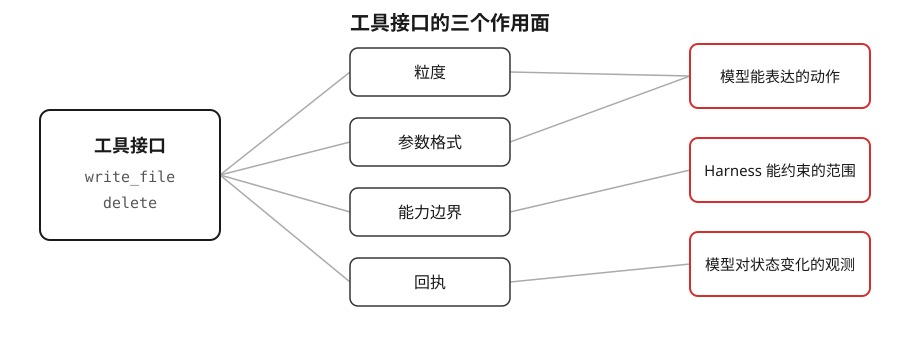
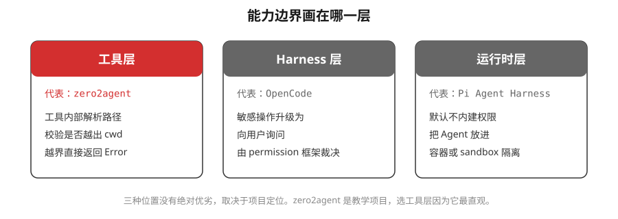

# 01. 工具接口就是 Agent 的行动语言

Epic 2 的第一个 Story 给 Agent 装上了 `write_file` 和 `delete`，让它第一次能改动工作区。这两个工具的实现本身很简单，就是调用文件系统的写和删。但如果只把它们当成对 `fs.writeFile`、`fs.unlink` 的一层封装，就会漏掉一件更重要的事：**你设计的工具接口，决定了模型能做什么、不能做什么、以及它怎么知道自己做成了没有。**

这篇文章讲的就是这件事。它不重复 [README](../README.md) 里的具体决策，而是退一步看：为什么工具接口的设计，比工具的实现更值得花时间。

## 工具接口的三个作用面

一个工具接口由四部分组成：粒度（一个工具管多大一件事）、参数格式（模型要填什么）、能力边界（工具允许和拒绝什么）、回执（工具做完后返回什么）。这四部分不是各管各的，它们共同决定了三件事。

- **模型能表达的动作**：模型不能凭空操作文件，它只能调用你给的工具。你给了 `write_file`，它就能写文件；你没给 append，它就没法只追加一行。工具集就是模型的动作词汇表，词汇表有多大，它能表达的意图就有多丰富。
- **Harness 能约束的范围**：写和删是有副作用的。副作用要不要拦、在哪拦，取决于工具接口留没留下拦截点。参数走工具、而不是让模型直接执行 shell，Harness 才有机会在执行前做校验。
- **模型对状态变化的观测**：模型调用完工具，工作区变了，但模型看不到磁盘，它只能靠回执知道发生了什么。回执写得清楚，模型下一步就走得稳。

下面分别看这三个面上，已有项目和研究给出的证据。

## 一、工具的粒度决定模型能表达什么

模型解决一个任务，是靠一连串工具调用拼出来的。可用的工具越贴合任务，拼起来越顺；工具缺一块，模型就得绕路，绕路就容易出错。

SWE-agent 这篇工作给了一个直接的数据。它们研究的是「给 Agent 什么样的工具接口，它在 SWE-bench 上解题率更高」，其中一个对照实验是：把专门的文件编辑动作去掉，让模型退回用更通用的方式改文件。结果解题率从 18.0% 掉到 10.3%。另一个实验里，关掉带格式校验的编辑能力后，编辑出错的次数涨到原来的约 9 倍。

同一个模型，能力没变，只是换了一套工具接口，效果差出这么多。这说明工具的粒度不是实现细节，它直接决定了模型能不能顺畅地表达自己要做的动作。

放回我们的 Story：`write_file` 只做全量写，不做 append，也不做局部替换。这不是偷懒，而是把「改一小段」这件事留给后面的 `replace_in_file`。两个动作分成两个工具，模型选哪个、表达什么意图，就都清清楚楚。相反，如果做一个既能全量写又能局部改、还带各种 mode 开关的大工具，模型反而要先想清楚该拨哪个开关，出错的机会更多。

## 二、参数格式决定模型能不能填对

有了合适的工具，模型还得把参数填对。参数格式看起来是小事，但它直接影响模型输出的成功率。

Aider 这个项目做过一组很清楚的对比。它让模型改代码时，试了不同的编辑格式：一种是让模型输出「搜索旧内容、替换成新内容」，另一种是让模型输出标准的 unified diff 补丁。工具的能力完全一样，只是让模型填的格式不同，GPT-4 Turbo 的正确率从 20% 提到了 61%。

原因不难理解：某些格式对模型来说更好生成，写错的概率更低。格式选得不好，模型频繁写出工具没法解析的东西，任务就卡住了。这里还有一个值得注意的细节：让 GPT-4 Turbo 正确率更高的是「搜索旧内容、替换新内容」，而不是更标准的 unified diff。也就是说，对当时的模型来说，越接近它训练数据里常见写法的格式，成功率越高，而不是越规范越好。

这里要克制一下，编辑格式本身是个大话题，具体哪种格式更好、为什么好，是下一个 Story（`replace_in_file`）要展开的。这里只用这个数据说明一件事：**参数格式是工具接口的一部分，它和工具能力同样重要。** 我们的 `write_file` 参数只有 `path` 和 `content` 两个，没有格式选择的负担，这是全量写这种简单动作的天然好处。

## 三、能力边界画在哪一层

写和删能碰到工作区之外的文件，这是必须拦住的。但「在哪里拦」有不同的做法，不同项目给出了三种不同的位置。

- **工具层**：在工具内部解析路径，判断是否落在 `cwd` 目录树内，越界就直接返回 `Error`。zero2agent 选的是这一层。
- **Harness 层**：工具本身不拦，把敏感操作上报给 Harness，由一个 permission 框架决定是放行、拒绝，还是弹出来问用户。OpenCode 是这种做法。
- **运行时层**：Agent 本身不做权限控制，而是整个跑在一个受限的容器或 sandbox 里，越界这件事在操作系统层面就被隔离掉了。Pi Agent Harness（原 badlogic/pi-mono，现 earendil-works/pi）默认走这条路，它不内建权限系统，把隔离交给外部环境。

这三种位置没有绝对的对错，取决于项目要什么。Harness 层灵活，能做交互式询问，但要维护一套 permission 框架；运行时层最彻底，但需要容器这样的外部依赖。zero2agent 是教学项目，选工具层是因为它最直观：一段路径校验的代码就能讲清楚「边界在哪、越界会怎样」，读者不需要先理解一套权限框架或容器机制。

要说明的是，我们这一层拦的是**物理边界**，也就是「能不能碰工作区外的文件」。至于「这个删除该不该做、要不要先问用户」，那是意图层面的破坏性确认，属于 Epic 3 的内容，这个 Story 有意不做。

## 四、回执是模型唯一的观测窗口

模型看不到磁盘。它调用完 `write_file`，文件到底写成没有、是新建还是覆盖，它只能从回执里读。所以回执不是给人看的日志，而是模型判断下一步的依据。

我们的回执做了两处刻意设计：

- `write_file` 区分新建和覆盖。新建返回「已创建文件 ...」，覆盖返回「已覆盖文件 ...」。这个区分零成本，但对模型有用：它能确认自己到底是建了新文件还是改了旧文件，避免误判。
- `delete` 支持批量，且逐条汇总结果。删三个文件，其中一个不存在，回执会明确写清哪些删了、哪个没删、为什么没删。模型据此决定要不要重试，而不是面对一个模糊的「部分成功」。

一个反面情况是：如果回执只返回「成功」两个字，模型就丢掉了「新建还是覆盖」「哪个删了哪个没删」这些信息。工具在磁盘上做的事没变，但模型能观测到的东西变少了，它后续的判断就更容易出错。回执写多写少，本质上是在决定模型能看见多少世界的变化。

## 五、接口是当前模型阶段的快照

前面四节看下来，会发现一个共同点：严格的参数格式、工具层的边界校验、事无巨细的回执，很多都是在替模型「补课」。模型还不够可靠时，工具多做一点校验和兜底，能明显拉高任务的成功率，前面 SWE-agent 和 Aider 的数据就是证据。

但反过来想，这也意味着工具接口不是一个永久最优解，而是**当前模型能力的一张快照**。可以从两个方向看这件事：

- **模型吸收工具的约束**：今天要靠工具强制的格式、要靠工具校验的边界，本质上是当前模型能力的短板，需要工具这一层替它补上。
- **工具随模型精简**：模型越强，需要工具替它把的关就越少。当模型能稳定输出正确格式、自己判断路径是否越界时，一部分校验和格式约束就可以从工具里拿掉。

所以我们这一版 `write_file` 和 `delete` 的接口设计，是针对当前模型能力做的取舍，不必当成不变的标准。随着模型变强，这套接口大概率还会继续调整，这本身也是 Agent 工具设计的常态。

## 小结

`write_file` 和 `delete` 的实现只有几十行，但它们的接口设计要考虑的东西远不止调用文件系统那么简单。工具的粒度决定模型能表达什么动作，参数格式决定它能不能填对，能力边界决定 Harness 能拦住什么，回执决定模型能观测到什么。

所以设计一个 Agent 工具时，先问的不该是「这个功能怎么实现」，而是「模型需要表达什么、需要被约束什么、需要观测到什么」。想清楚这三点，接口的粒度、参数、边界和回执自然就定下来了。实现只是最后一步。

还要记住的一点是，这套接口是给当前模型设计的。今天的很多约束是在替模型补它还不够可靠的地方，模型变强之后，接口也会跟着变。所以工具设计不是一次做完的事，而是会随模型能力一起演进。

---

参考资料：

- SWE-agent: Agent-Computer Interfaces Enable Automated Software Engineering — 关于工具接口对解题率影响的对照实验
- Aider — 不同编辑格式对模型正确率影响的对比数据
- [竞品调研](../../../../researches/write-file/README.md) — opencode / codex / pi-mono / gemini-cli / aider 五家的写删文件实现

---

[← Story 入口](../README.md) · [Backlog](../details/04-backlog.md)
