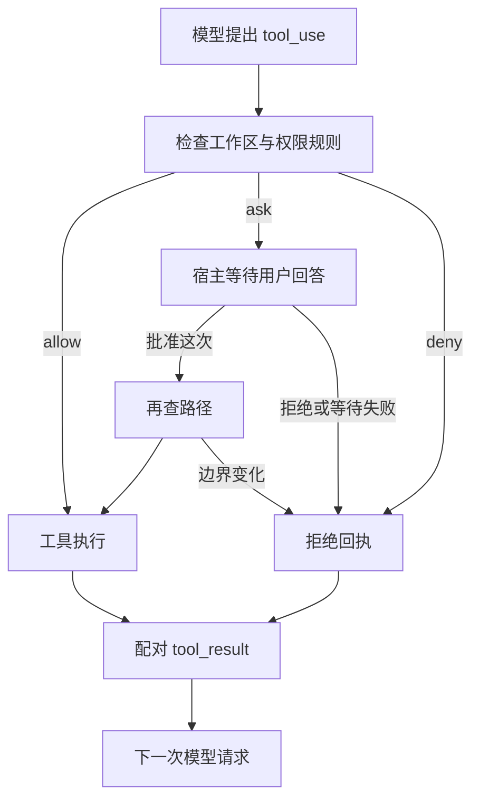

# E03-S002：执行前，先判断是否允许

> 模型提出工具调用，Harness 决定是否执行。本课实现三态权限规则与一次 Approval 闭环，保留多轮会话和人工终端接管。

[Epic 3](../README.md) | [首页](../../../README.md) | [迭代日志](../../../CHANGELOG.md)

## “帮我修好项目”，授权到了哪一步

读取源码、替换一段代码、运行命令都可以是修复的一部分，但它们产生的影响不同。用户说“先分析”，不能由模型自行把它扩大为“修改并执行”。把“执行前先问我”写进 Prompt 能影响提议，真正的权限判断必须放到工具 execute 之前。

## 本课的规则怎样工作

工具的 read / write / execute 元信息由宿主注册；没有元信息的工具需要询问，不能仅凭名字 read_file 获得读权限。

| 模式 | 工作区读 | 工作区写 | 命令与未知工具 |
|---|---|---|---|
| default | 允许 | 询问 | 询问 |
| read-only | 允许 | 拒绝 | 拒绝 |
| accept-edits | 允许 | 允许 | 询问 |
| bypass | 默认允许 | 默认允许 | 默认允许 |

显式规则优先级为 **deny > ask > allow**，不依赖在数组中的位置；bypass 也保留显式 deny / ask。read-only 的只读约束和写工具的工作区硬边界不能被规则或用户批准放宽。外部读在默认模式询问，可由宿主显式授权；写越界始终拒绝。

规则支持工具全名或 `*`，以及顶层标量参数精确匹配。例如允许 terminal 的 `command: 'git status'` 不会匹配 `git status; another-command`。这只表示原始输入被授权，不表示命令通过了安全分析。

## 批准一次，怎样只执行这一次

Approval 请求含随机 ID、模型调用 ID、原始参数副本和 cwd。宿主返回相同 requestId 的 allow / deny；参数被冻结，展示事件与审批回调不能改写要执行的输入。默认最多等待 120 秒，没有宿主、异常、非法响应、超时或取消都返回拒绝。

CLI 在 TTY 显示工具和完整 JSON 参数，`y` 批准本次，其余回答拒绝。管道输入中的 `y` 不能代替交互审批。SDK 使用 `permissions.requestApproval` 接自己的 UI；`cancelPendingApprovals()` 只取消正在等待的询问，不回滚已执行工具，也不取消整个 Turn。

## 拒绝之后，Agent 还能知道发生了什么

每个 tool_use 都有相同调用 ID 的 tool_result。拒绝是 `is_error: true` 的结果，记录明确原因；onToolStart 仅在允许并重新校验后触发。批量调用不会因为某个拒绝而留下未配对消息，下一次请求仍能看到拒绝证据。文件工具返回的 `Error:` 回执也标成 is_error。

已有人工终端有第二层交接：模型提出 terminal 时先过通用权限，再由宿主确认是否交给人控制 PTY。用户主动 `/terminal` 或 `--terminal` 继续走人工终端流程。批准执行不表示批准把人工终端正文发给模型。

## 按什么顺序读代码

1. [permissions.ts](../../../packages/core/src/permissions.ts)：规则、模式、Approval 请求与有限等待。
2. [loop.ts](../../../packages/core/src/loop.ts)：先授权再执行，拒绝也配对结果；[agent.ts](../../../packages/core/src/agent.ts)维护实例自己的 Controller。
3. [path-guard.ts](../../../packages/core/src/tools/path-guard.ts)：解析已有软链接祖先，写工具再次检查；[approval.ts](../../../packages/tui/src/approval.ts)处理 TTY 回答与 readline 清理。
4. 按[跟练](./follow-along.md)先验证临时文件副作用，再观察真实 CLI。离线跟练不消耗模型用量。

代码、确定性测试和本机 50 项真实 MiniMax-M2.7 + CLI 验收已具备（本课权限 22 项含真实 PTY，旧功能 28 项）；最终证据见[验收清单](./details/03-verification-checklist.md)。16 页图解已纳入[在线教程站点](../../../docs/site.md)，课程 HTML 与制作资料在本仓库维护。本课不实现系统沙箱、永久授权或 TUI。路径重查不能完全阻止并发文件系统替换，shell 仍使用当前宿主权限。

[概述](./details/00-overview.md) | [设计](./details/01-technical-design.md) | [任务](./details/02-task-list.md) | [Backlog](./details/04-backlog.md)

## 深入了解

1. [批准与隔离，各自限制什么](./deep-dive/01-approval-and-isolation.md)：从一次命令授权推导持久范围、规则优先级和系统边界的不同职责。

上一篇：[E03-S001 多轮会话与压缩](../S001-multi-turn/README.md) | 下一篇：E03-S003 运行状态与 TUI（待设计）
