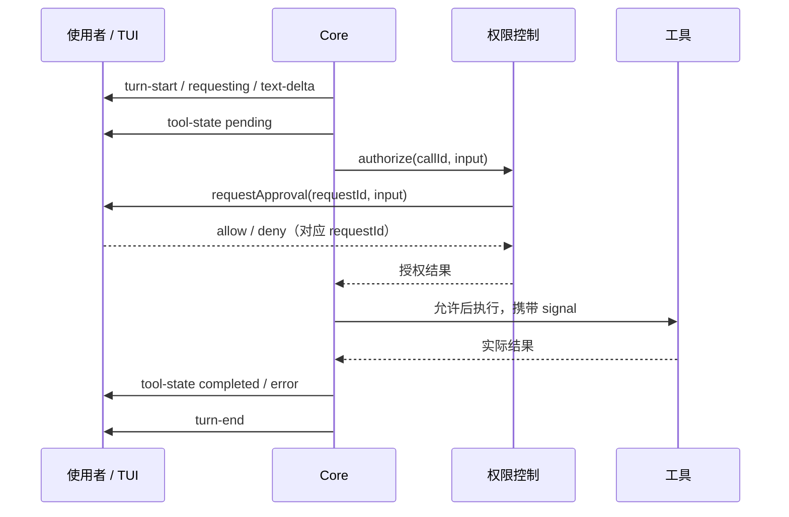

# E03-S003：运行状态与 TUI——让 Agent 的运行过程看得见、控得住

> 从“终端里不断打印内容”，走到能看进度、审工具、改输入和取消任务的交互界面。

[Epic 3](../README.md) | [首页](../../../README.md) | [迭代日志](../../../CHANGELOG.md)

固定跟练版本：`E03-S003-runtime-tui`。[PR #19](https://github.com/alienzhou/zero2agent/pull/19) 已交付，等待人工审查与合并；在线站点尚未部署本章。

## 终端停住了，它是在思考还是等你回答

你让 Agent 修改一个文件。屏幕先出现一段文字，随后安静了十秒。它可能正在请求模型，也可能在等命令退出，甚至已经在等你批准写入。只有一串 stdout，使用者很难知道该继续等、回答问题，还是取消。

这一课把运行过程变成明确的状态，并提供对应的操作。TUI 是 Terminal User Interface：仍在终端里运行，但会维护输入区、状态和可更新的内容。好的界面让你连续做完任务；支撑它的是 Core 能够准确报告正在发生的事，并接受控制。

## 先看一段可重复的交互

按照[跟练](./follow-along.md)启动离线演示。输入“重复”，你会依次遇到两个 write_file 调用。拒绝第一个，批准第二个，界面保留两张不同状态的工具卡；第一个文件不存在，第二个文件真实生成。输入“慢速”后取消，界面回到可输入状态，再继续下一轮。

演示通过本地固定模型响应驱动生产 CLI、SDK 和工具，不调用外部模型。这样你能稳定触发审批、错误和取消，先理解界面与执行的关系。

## 为什么不能直接从日志画界面

| 信息 | 来源与身份 | 界面用途 |
|---|---|---|
| 模型文字 | text-delta，属于某个 turnId | 连续拼接回答 |
| 当前阶段 | phase + turnId + seq | 显示准备、请求、输出、执行或取消中 |
| 工具进展 | tool-state + toolCallId | 更新这一张工具卡，避免同名调用互相覆盖 |
| 权限询问 | 独立 requestId、完整参数与 signal | 让用户决定本次是否允许 |
| Harness 提示 | notice / compaction | 说明执行限制或上下文处理 |

一次 Turn 里可能多次请求模型、调用多个工具，因此“工具完成”不等于“整轮结束”。事件携带递增 seq，界面可以忽略重复或迟到消息；最终 turn-end 才决定整轮完成、出错或取消。

事件是通知。onEvent 抛错、异步拒绝或改动收到的对象，都不能批准工具、修改参数或破坏配对结果。权限回答和取消是独立的控制接口。

## 按取消之后，需要等什么

Ctrl-C 触发 Agent.cancelTurn()，界面先显示“正在取消”。模型请求被中断，待审批请求失效，后续工具不再启动；支持 signal 的前台工具收到中断。只有已启动工作完成收尾，Session 才重新开放。

如果工具忽略 signal，它可能仍在写文件。此时提前显示空闲并运行下一轮，会让两个 Turn 同时修改工作区。因此本课选择等待工具实际结束，并保留它真正产生的结果。取消不会回滚文件，也不会清除已完成工具的证据；没有执行的 tool_use 同样要有配对回执，供下一轮理解中断点。

## 输入区为什么只能有一个主人

日常输入、权限审批和人工终端都使用同一个 stdin，但它们接受的内容不同。审批焦点只回答当前 requestId；人工 PTY 接管后，密码和终端正文只属于该终端；结束后再恢复 TUI。两个监听器同时读取输入，会导致误批准、丢字或把私密内容加入聊天。

界面支持编辑、多行粘贴、命令提示、输入历史、运行草稿和工具详情，快捷键随当前焦点显示。长输出可滚动，长审批参数完整可达。中文、emoji 与控制字符先转换为可绘制单元，再加入受信样式；模型不能靠一段 ANSI 控制码伪造界面。

## 按什么顺序读实现

1. [runtime.ts](../../../packages/core/src/runtime.ts)与[loop.ts](../../../packages/core/src/loop.ts)：事件身份、状态变化与工具配对。
2. [agent.ts](../../../packages/core/src/agent.ts)：取消接口、在途操作互斥；继续追踪 ToolContext.signal 到 terminal。
3. [runtime-state.ts](../../../packages/tui/src/runtime-state.ts)：事件如何成为界面状态，旧事件和长历史如何处理。
4. [runtime-tui.ts](../../../packages/tui/src/runtime-tui.ts)：绘制、输入、审批和人工 PTY 所有权；[display-text.ts](../../../packages/tui/src/display-text.ts)处理安全文本和宽度。
5. 按[跟练](./follow-along.md)验证文件效果、取消和交接，再阅读[设计](./details/01-technical-design.md)与[验收证据](./details/03-verification-checklist.md)。

单次消息、管道输入、TERM=dumb 和 --plain 沿用逐行 CLI。会话仍只存在当前进程；事件也不是永久日志。完整任务与验收进度见[任务清单](./details/02-task-list.md)，各平台结论以实际证据为准。

## 深入了解

1. [为什么取消后还要等待](./deep-dive/01-cancellation-and-evidence.md)：从异步任务和副作用解释取消、超时、回滚的不同边界，以及何时需要进程隔离。

[总览](./details/00-overview.md) | [Backlog](./details/04-backlog.md) | [竞品研究](../../../researches/runtime-tui/README.md)

上一篇：[E03-S002 权限与 Approval](../S002-permissions/README.md) | 下一篇：E03-S004 会话落盘与恢复（待实现）
