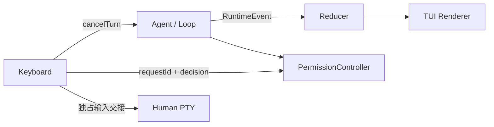

# E03-S003：事件、取消与终端输入

[课程](../README.md) | [总览](./00-overview.md) | [验收](./03-verification-checklist.md)

## 事件与控制是两个方向

[运行事件类型](../../../../packages/core/src/runtime.ts)由 Core 导出。onEvent 是观察接口，不接受执行决策；Approval 返回值和 cancelTurn 才是控制。保留旧 onText/onToolStart 等回调以支持旧 CLI/SDK；新 TUI 仅消费结构化事件，避免双重输出。

## 身份和状态转换

每次 Turn 使用独立 turnId，seq 在该 Turn 内单调增加。界面以 turnId + toolCallId 识别工具卡片，不能按工具名称覆盖。顺序为 turn-start → preparing → requesting → streaming 或 tools → turn-end；工具经过 pending、可选 approval、running 和终态。拒绝为 denied，工具 Error 回执为 error，未启动但因 Turn 取消跳过的调用为 cancelled。多轮中同名甚至重复使用调用 ID 仍由 turnId 隔离。

模型 text-delta、Harness notice、compaction 分类型。展示通知不能成为模型输出，也不自动持久化。观察者同步抛错、异步拒绝和修改事件副本不能影响真实执行；terminal 事件后不再发布属于该 Turn 的晚到展示。UI 丢弃旧 Turn 和已处理 seq。

## 取消是收尾协议

cancelTurn() 无在途 Turn 时返回 false；有在途操作则发送中断，进入 cancelling。AbortSignal 传到模型请求、计数/摘要、权限等待和 ToolContext。完整取消应满足：

1. 不开始下一次模型请求或后续工具。
2. 已知的每个 tool_use 都留下同 ID 的 tool_result，包括未执行的调用。
3. 已完成工具的真实结果保留；已写文件不回滚。
4. 前台 terminal 中止所属进程并完成输出收尾；先前主动 skip 到后台的进程保持已有语义。
5. 非协作工具完成前继续等待，不把 UI 空闲误作工作已停止。
6. 完成后抛 TurnCancelledError，发出唯一 turn-end cancelled，再允许新 Turn。

部分模型流仅供展示，未经完整响应不能作为 assistant 工具调用写入历史。Session 原有中断说明继续保留。reset 拒绝在途状态；取消与清空历史分开。

## TUI 与输入焦点

TTY 交互采用 alternate screen；TERM=dumb、非 TTY 和显式 --plain 保留逐行界面。带单次消息参数仍沿用 CLI。界面顶部提供阶段/耗时，主体呈现会话和工具，底部仅一个输入所有者：空闲编辑输入、审批查阅并回答、运行中取消、人工 PTY 交接。

审批关联 requestId，展示 cwd、完整参数和理由。长内容可完整滚动，并明确显示当前范围；y 批准本次、n/Enter 拒绝，终端控制字符转为可见内容。超时、取消与退出解除该请求，晚回答不能批准后续调用。

人工 PTY 交接先暂停绘制和移交输入，保持已有私密正文不入模型历史的约定。返回后重新绘制、恢复编辑；不能保留第二个 keypress 监听器吞掉密码或重复触发取消。

## 终端边界

绘制裁剪基于显示宽度，覆盖中文、组合字符和 emoji；模型与工具输出中的 ESC/OSC/控制码不执行。保留有限界面历史并提示截断，不改变 Core 会话历史。resize 重新布局；正常退出、异常、SIGINT/SIGTERM/SIGHUP 清理 raw mode、游标和 alternate screen。

架构判断见 [D01](../../../../.discuss/2026-10-07/e03-s003-runtime-tui/decisions/D01-events-and-control.md)。持久化、日志与回滚范围见 [Backlog](./04-backlog.md)。
