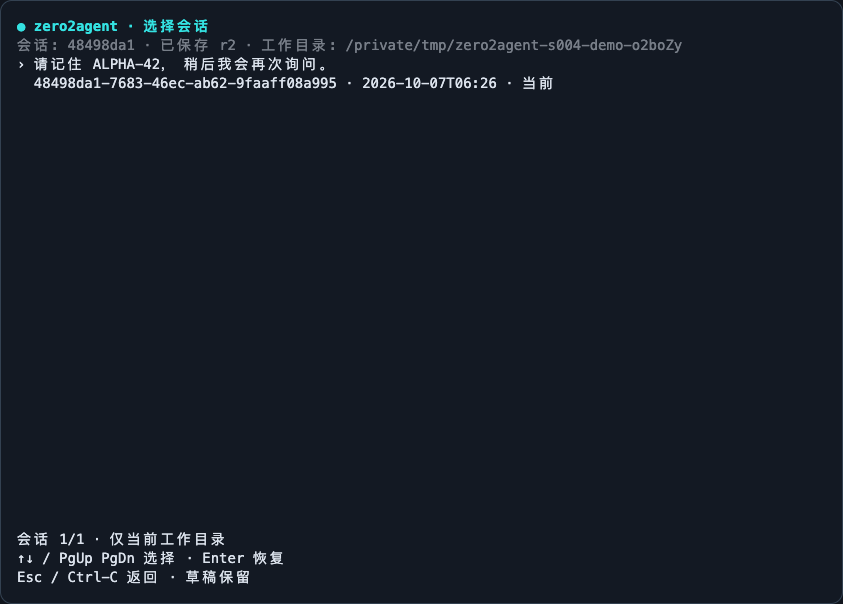
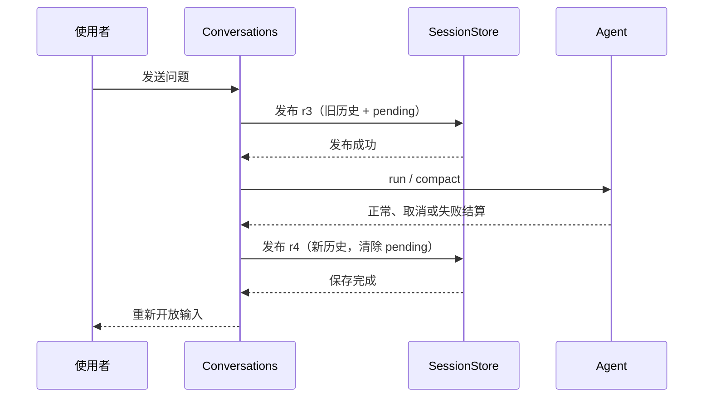

# E03-S004：会话落盘与恢复——关掉程序，下次还能接着聊

> 把已结算的对话保存下来，重新启动后找到它，用当前运行环境继续一轮。

[Epic 3](../README.md) | [首页](../../../README.md) | [迭代日志](../../../CHANGELOG.md)

固定跟练版本：`E03-S004-session-persistence`。交付与实测状态见[验收清单](details/03-verification-checklist.md)。

## 昨天的文件还在，对话为什么没了

你让 Agent 阅读文件、尝试修改，最后确认了一种方案。退出 CLI 后，文件继续存在，进程里的 messages 数组却消失了。再次打开程序，模型看不到昨天已经检查过什么，甚至可能把完成的操作再做一次。

会话保存需要解决两个问题：把可恢复的数据写到磁盘；让使用者找到正确的记录，并知道恢复后能做什么。我们会保留原始消息、工具回执和已经采用的压缩摘要，同时重新建立模型客户端、权限控制与终端输入。上一课的 TUI、审批、取消和人工终端继续工作。

## 先完成一次跨进程续聊

按[跟练](follow-along.md)运行离线演示：进程 A 留下识别码并退出；进程 B 列出会话，选择 UUID，恢复后询问旧识别码。演示检查实际发给 SDK 的 messages，再生成可观察的回答。

日常使用时，每轮开始前和结束后会自动保存；TUI 状态栏区分“本轮未结算”“正在保存”和“已保存”。输入 `/sessions` 打开选择器，↑↓ 选择、Enter 恢复、Esc 返回。`/session` 显示完整 UUID，`/new` 开始另一条对话，旧记录仍留在列表。

```sh
node packages/tui/dist/cli.js --list-sessions
node packages/tui/dist/cli.js --resume <完整UUID>
node packages/tui/dist/cli.js --continue "继续刚才的讨论"
node packages/tui/dist/cli.js --no-save
```

`--list-sessions` 不需要 API key。`--continue` 选择当前工作目录最近更新的会话；损坏或仍在运行时会明确失败，不偷偷退回较旧记录。`--no-save` 使用临时会话，不能同时列出或恢复。



上图来自本课离线演示的真实 CLI/PTY 输出，经 xterm 重放；不是竞品截图。

## 哪些数据值得跨越进程边界

| 数据 | 保存内容 | 重启后的处理 |
|---|---|---|
| 原始对话 | 用户/助手消息、完整 tool_use 与 tool_result | 作为历史，供查看和下次请求使用 |
| 已采用摘要 | summary 与覆盖到的消息边界 through | 重建工作上下文；原始记录仍在 |
| 会话身份 | UUID、cwd、时间、标题、revision、version | 校验工作区并找到最新完整版本 |
| 未结算状态 | 操作种类、PID、主机名 | 判断旧运行是否仍在；中断后提醒检查文件 |
| 运行环境 | 不序列化客户端、审批决定、进程对象与配置凭据 | 使用当前启动配置重新建立 |
| 临时压缩对象 | 不保存后台 Promise、预算缓存和正文替换文件引用 | 从原始历史重新计数、裁剪或压缩 |

用户主动写入聊天或工具返回的正文会随历史保存。宿主不会额外写入环境变量中的 API key，人工终端的私密输入与输出也不进入历史。会话目录位于用户私有目录，默认权限为目录 0700、文件 0600；这是本地文件权限，不是加密。

## 一轮对话为什么保存两次

第一份快照标记 pending，保存上一结算边界，并且必须在发模型请求、执行工具之前发布。第二份在正常结束、出错或取消后保存新历史，清除 pending。



如果进程在写文件后被强制结束，磁盘上的文件可能已经变化，r3 却只知道“这一轮没有保存结果”。此时恢复上次结算的历史，并加入中断提醒；不推断工具成功，不重放未结算的调用。旧 PID 仍存活或来自另一台主机时保守拒绝恢复。PID 复用也可能导致保守拒绝；本课没有自动抢占旧运行。

## 保存完整文件，还要防止覆盖

默认目录为 `~/.zero2agent/sessions/<sha256(realpath(cwd))>/<UUID>/`，其中 `1.json`、`2.json` 是完整快照。可通过 `ZERO2AGENT_SESSION_DIR` 更改存储根目录；会话仍按真实工作目录隔离。

写入过程是“写临时文件 → fsync 文件 → 独占 hard link 发布下一个 revision → 清理临时文件”。读取者只选已发布的最高 revision。两个进程同时尝试发布 r5 时，只能有一个成功；失败者保留内存并报告冲突，不覆盖胜出者。目录 fsync 为尽力执行，断电级持久性不能在未验证的文件系统上保证。

完整快照便于理解和检查，代价是存储增长：每轮通常多两份，旧 revision 暂不自动清理，单份上限 32 MiB。生产产品常用追加日志、索引和压缩；具体取舍见[快照与日志](deep-dive/01-snapshot-and-journal.md)。

## 恢复失败时，当前对话不能跟着消失

读取快照后先检查版本、身份、工作目录、消息结构、工具配对和摘要边界，全部通过后才替换当前 Session。最高版本损坏时报告错误，保留原文件供排查，不悄悄恢复旧版本。

保存失败后内存继续保留，界面提示“尚未保存”；`/save` 可重试。切换或正常退出前也会尝试保存，失败则保留当前界面。外部终止信号和进程崩溃不能提供同样的交互保障。revision 冲突需要先协调其他写入者；盲目重试不能消除冲突。

恢复出来的工具卡标记为历史，展开时可看旧参数与回执。显示历史不发运行事件，也不调用工具。新一轮仍由当前权限策略判断；昨天允许过一次写入，不代表今天的写入自动获准。

## 按这个顺序读代码

1. [session-snapshot.ts](../../../packages/core/src/session-snapshot.ts)：数据结构、工具配对与摘要边界。
2. [session.ts](../../../packages/core/src/session.ts)和[context-manager.ts](../../../packages/core/src/context-manager.ts)：导出原史，恢复已采用摘要，重新建立临时状态。
3. [session-store.ts](../../../packages/tui/src/session-store.ts)：工作区隔离、私有文件、独占版本发布与损坏处理。
4. [conversations.ts](../../../packages/tui/src/conversations.ts)：运行前后保存、中断恢复与当前会话身份。
5. [runtime-tui.ts](../../../packages/tui/src/runtime-tui.ts)和[cli.ts](../../../packages/tui/src/cli.ts)：选择器、命令、保存状态与旧交互兼容。

[总览](details/00-overview.md) · [设计](details/01-technical-design.md) · [任务](details/02-task-list.md) · [验收](details/03-verification-checklist.md) · [Backlog](details/04-backlog.md) · [竞品研究](../../../researches/session-persistence/README.md)

上一篇：[E03-S003 运行状态与 TUI](../S003-runtime-tui/README.md) | 下一篇：E03-S005 运行日志与问题追查（待实现）
