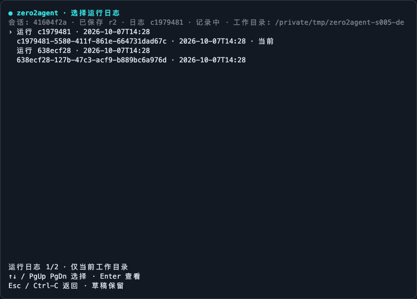

# E03-S005：运行日志与问题追查

[Epic 3](../README.md) | [首页](../../../README.md) | [迭代日志](../../../CHANGELOG.md#e03-s005)

## 对话能继续，不代表故障能追查

上一课让你重启后接着聊。但是，模型说「执行完成」，不足以回答另一个问题：它实际请求了几次？文件写入前有没有审批？取消时哪个工具已经启动？

屏幕会滚动，模型上下文会压缩。你需要一份独立的运行记录，把这些事实按身份连接起来。本课先用[离线跟练](follow-along.md)执行一次写文件，再用另一进程在没有 API key 的情况下查看日志。

```text
会话快照           当前屏幕             运行日志
让下次继续聊       让此刻看得见         让事后追得上
messages / 摘要    状态 / 草稿 / 审批    请求 / 权限 / 工具 / 保存
```

三个载体描述同一任务的不同方面。查看日志不会把记录加入模型消息，也不会执行旧工具。

## 本课要解决什么

你要做到：运行时记录请求、权限、工具与保存状态；关闭程序后仍能只读查看；发生写盘故障时让用户知道记录不完整，任务仍能继续。

本课日志只保存元信息：模型名、消息数量、身份、用量、耗时、错误分类、工具状态、参数字段数和结果字符数。prompt、文件路径参数、文件正文、工具输出、原始异常、headers 与人工终端字节都不复制到日志。需要了解具体参数时，用 sessionId / toolCallId 对照上一课保存的原始会话；日志不会自动打开或导入那份会话。

## 先把身份分清楚

| 身份 | 含义 | 为什么需要 |
| --- | --- | --- |
| runId | 一个 CLI 进程的一份日志 | 两个进程不会写同一个文件 |
| sessionId | 一段可保存的对话 | 恢复对话后，新 run 仍能指向同一会话 |
| operationId | 一次提交或手动压缩 | 错误、取消和后台工作有共同起点 |
| requestId | 一次逻辑 SDK 请求 | 区分主模型、摘要与 provider 计数 |
| toolCallId | 模型给出的调用身份 | 相同工具名或重复 ID 也能结合 requestId 区分 |

文件 seq 决定记录顺序，at 用于显示时间。请求与操作耗时使用单调时钟；不能靠两台机器的时间戳猜测因果。

后台摘要和转后台命令可能在当前轮结束后才完成。它们沿用启动时的身份，不能被误记到下一轮。

## 事实从哪里来

Core 在调用 SDK 前创建请求身份，完成后记录用量与停止原因，失败时记录分类和 HTTP 状态。SDK 自己的网络重试属于这一次逻辑调用；本课没有为每次内部 HTTP attempt 建立独立 span。

工具经过 pending、权限判定、执行与结算。终端退出码、PID、信号、转后台和后台结束来自原生进程结果；没有解析命令 stdout 来推断状态。人工终端只提供这些状态元信息。

这些通知没有审批权。观察者抛错或返回一个拒绝 Promise，不会改变工具输入、执行结果或消息历史。

## 完整行怎样成为可读记录

每次宿主运行独占一个 UUID 文件：

```text
~/.zero2agent/logs/
└─ <sha256(realpath(cwd))>/
   ├─ <run A>.jsonl
   └─ <run B>.jsonl
```

每行是一个有版本的 JSON 对象。串行写队列有上限，文件以独占创建方式打开；正常结算与退出进行 flush。不同进程不会覆盖彼此的记录。

这里有一个重要区别：S004 的保存失败可以阻止尚未开始的模型轮次；S005 的日志失败会显示降级，并让任务继续。运行记录提供追查线索，不是每个工具副作用的事务日志。

| 情况 | 查看结果 |
| --- | --- |
| 当前进程还在运行 | 读取当时文件前缀，提示尚未见退出记录 |
| 末尾写了一半 | 只展示之前完整的行，并标记尾行不完整 |
| 中部 JSON 损坏或版本未知 | 明确拒绝，保留原文件 |
| 操作、请求或后台进程未结束 | 显示未闭环数量；不要据此自动重试 |
| 写入失败或上限达到 | 当前界面显示日志不可用，已有记录可能不完整 |

## 怎么使用

```bash
pnpm install --frozen-lockfile
pnpm build
node scripts/e03-s005-logging-demo.mjs
```

| 入口 | 用途 |
| --- | --- |
| `/logs` | TUI 用方向键选择；plain 模式列出 ID |
| `/log [runUUID] [operationId]` | 查看当前或指定运行；方向键/Page/Home/End 翻阅，Esc 返回 |
| `--logs` | 无 API key 列出当前工作目录日志 |
| `--log UUID --log-operation UUID` | 无 API key 只读查看并过滤操作 |
| `--no-log` / `ZERO2AGENT_NO_LOG=1` | 关闭当前运行的日志记录 |
| `ZERO2AGENT_LOG_DIR` | 更改日志根目录，仍按工作区分组 |

`--no-save` 控制会话快照，`--no-log` 控制运行日志；两者同时使用才会关闭这两类持久数据。原有编辑、粘贴、审批、取消、压缩、会话浏览、人工终端、plain、单次调用和管道路径继续保留。



上图来自生产 CLI 的实际 PTY 字节，经 xterm 回放；按 Enter 进入独立查看器，Esc 返回。它与在线课程中的教学示意分别保存，原始字节和窄屏画面见[录制证据](../../../researches/runtime-logging/acceptance/screens/capture.json)。

## 做完之后你能观察什么

离线示例真实生成一个文件，日志里能把写入工具关联到提出它的模型请求。无密钥查看不会增加 HTTP 请求，也不改写文件、快照或日志。第二次模拟 HTTP 401 后，记录会明确显示 auth / 401，正文没有复制进去。

遇到转后台或强制终止时，先检查未结束的身份，再查看文件和原会话的证据。日志缺少结束行，不代表工具没有执行。

生产实现入口：[诊断事件](../../../packages/core/src/diagnostics.ts)、[循环](../../../packages/core/src/loop.ts)、[本地日志](../../../packages/tui/src/run-log.ts)、[宿主会话](../../../packages/tui/src/conversations.ts)。

## 深入了解

1. [日志缺了一行，为什么不能直接重试工具](deep-dive/01-logs-and-side-effects.md)：区分运行记录、事务日志和幂等操作，理解崩溃时的证据边界。
2. [从本地身份到分布式 Trace](deep-dive/02-log-and-trace.md)：理解父子关系、请求重试和采样；本课没有实现云端 exporter。

[技术概述](details/00-overview.md) · [设计](details/01-technical-design.md) · [任务](details/02-task-list.md) · [验收](details/03-verification-checklist.md) · [Backlog](details/04-backlog.md)

上一篇：[E03-S004 会话落盘与恢复](../S004-session-persistence/README.md) | 下一篇：E03-S006 文件 Checkpoint 与回退（待实现）
