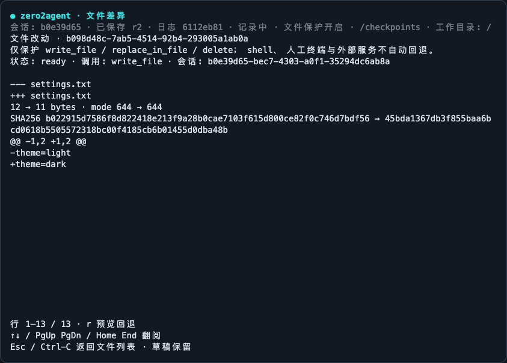
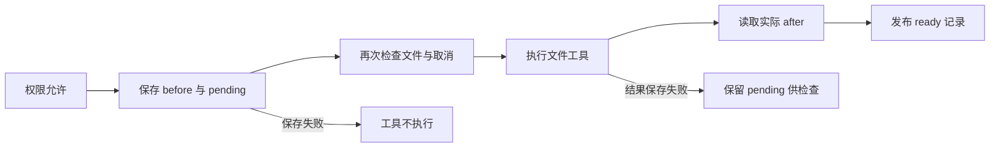

# E03-S006：文件 Checkpoint 与回退

[Epic 3](../README.md) | [首页](../../../README.md) | [迭代日志](../../../CHANGELOG.md)

2026-10-08 已通过 [PR #22](https://github.com/alienzhou/zero2agent/pull/22) 合入 main（`8a0d0e8`）。18 页课程固定 Tag `E03-S006-file-checkpoints-18p` 保持不变，课程网站尚未部署。[分层验收](./details/03-verification-checklist.md)已记录最终结果。

你让 Agent 改了配置，运行后发现方向不对。能否退回去，取决于写入之前有没有保存旧内容，也取决于你后来是否又改过同一个文件。把对话删掉、把日志倒着读，都不能回答这两个问题。

这节课给受控文件工具加上可验证的恢复能力：先留下旧版本，再执行；展示真实前后差异；确认回退时检查当前文件是否仍符合预期。**一次记录对应一次文件工具调用，回退只处理该记录的路径。**

## 先看到效果

```bash
pnpm install --frozen-lockfile
pnpm build
node scripts/e03-s006-checkpoint-demo.mjs
node scripts/e03-s006-checkpoint-demo.mjs --tui
```

离线演示通过本地 HTTP 返回确定性模型响应，生产 SDK、权限、工具、文件系统和存储都真实运行。它依次核对修改、差异、回退、撤销回退和后续编辑冲突；退出会清理临时文件。[固定版本跟练](./follow-along.md)给出完整操作。



上图来自实际 node-pty 字节流，在 xterm.js 中重放；不是用绘图拼出的终端截图。[原始字节与捕获说明](../../../researches/file-checkpoints/acceptance/screens/capture.json)保留来源和版本。

## 为什么不用第二套 Git 仓库

本课不初始化隐藏 Git、不复制仓库、不扫描整个工作区，也不修改用户的索引和提交。write_file、replace_in_file、delete 通过可信元数据声明路径；宿主只读取这些文件。

| 方案 | 保存成本 | 恢复条件 | 本课判断 |
| --- | --- | --- | --- |
| 全目录副本 | 随整个目录规模增长 | 基础实现直观 | 无关依赖与产物也可能消耗空间 |
| 隐藏 Git | 扫描、对象和维护成本；pack 可做增量压缩 | 依赖 Git 语义与忽略规则 | 不采用，不泛化为 Git 一定低效 |
| 仅存文本 patch | 小文本修改通常紧凑 | 依赖基础版本、链和匹配位置 | 不作为二进制、删除和中断恢复的基础 |
| 整文件内容寻址 | 相同整文件可复用 | 每个版本可独立校验 | 大文件小改动仍新增大对象 |
| 内容分块 + 压缩去重 | 读取涉及文件，新增不同内容块 | 清单保存有序块和完整哈希 | 本课实现；用有界读取与保留策略控制成本 |

内容定义分块让前部插入后有机会重新对齐边界。旧块可以复用，新块以 SHA-256 为地址、用 deflate 压缩。没有长补丁链；每个文件版本都能通过自身清单重建。

在固定 4 MiB 高熵文件的 20 次前部插入实验中，第一轮整文件副本约 160 MiB、整文件压缩去重约 84 MiB，分块方案约 5.7 MiB（分配约 6.0 MiB）。保存中位约 0.16 秒，恢复包含预览与检查。基线不具备完整锁、校验和同步落盘协议，耗时不能解释成同等保证下的性能胜负。[原始基准和重跑说明](../../../researches/file-checkpoints/README.md)列出条件和限制。

## 一次文件修改如何被保护



Core 的 FileMutationHandler 是会被等待的控制接口；它不同于可丢弃的日志或屏幕通知。工具返回错误或抛出异常后仍需读取文件，因为部分效果可能已经发生。没有变化的调用不保留记录。

这不是在 Agent 取消时自动回滚。取消停止后续工作，已产生的效果仍保留；用户从文件列表选择要处理的调用，检查差异，再决定回退。

## 回退为什么需要三方比较

before 是目标状态，after 是原工具结算后的状态，live 是现在的文件。只有 live 与 after 的字节及权限一致，正常回退才会继续。否则说明有后续编辑，整个预检拒绝覆盖。

预览生成的令牌绑定这份记录与当前文件。执行时重新检查，不能拿旧令牌覆盖刚刚发生的修改。回退自身先写入恢复意图，完成后也生成可撤销记录；想重做时，对它执行 `/undo`。

多文件回退是逐文件完成的。若中途退出，`/recover UUID` 会检查每个路径：已达到目标就跳过，仍处于预期来源就继续，出现第三种状态就停下。未结算的工具调用没有可靠 after，恢复预览会明确说明当前变化来源未知，确认后才恢复旧版本。

## TUI 与其他入口

| 操作 | TUI / plain | 无密钥 CLI |
| --- | --- | --- |
| 列表 | `/checkpoints` | `--checkpoints` |
| 文件差异 | `/diff UUID` | `--checkpoint UUID` |
| 回退预览 | `/undo [UUID]` | `--undo UUID` |
| 确认执行 | TUI 预览按 y；plain 重输 `/undo UUID TOKEN` | `--undo UUID --confirm TOKEN` |
| 检查未结算记录 | `/recover UUID` | `--recover UUID` |
| 查看占用 | `/checkpoint-stats` | `--checkpoint-stats` |
| 按保留规则清理 | `/checkpoint-prune` | `--checkpoint-prune` |

TUI 列表按 Enter 看差异，按 r 进入回退预览；y 确认，n / Enter / Esc 取消。查看器独占输入，粘贴不能确认也不会发送给模型。会话、日志、压缩、审批、草稿编辑和人工终端继续使用原有入口。

## 存储与保证范围

默认保存到 `~/.zero2agent/checkpoints/<工作区真实路径的 SHA256>/`，可用 ZERO2AGENT_CHECKPOINT_DIR 指定外部根目录。文件保护默认开启；`--no-checkpoints` 或 ZERO2AGENT_NO_CHECKPOINTS=1 显式关闭新捕获，与 `--no-save` 和 `--no-log` 独立。

默认单文件 32 MiB、每调用前像或后像合计 64 MiB、128 路径、50 条已完成记录、30 天、256 MiB 存储预算、16,384 个对象。每次捕获前清理过期且不再被引用的内容；pending 记录始终保留。容量不足会阻止新的受保护写入，已经发生的效果不会被伪装成撤销。

只恢复普通文件的字节与 rwx 权限。软链接、硬链接、目录、仓库元数据、依赖与常见凭据路径不进入保护；空父目录、所有者、ACL 和扩展属性不在恢复范围。快照包含正文，0700/0600 不是加密，路径排除也不是万能秘密识别器。

任意 shell、人工终端、其他会话、外部服务和未声明路径的自定义工具不自动捕获。回退前需停止其他写入者；同进程登记的后台命令会阻止交互宿主回退。路径和内容重验缩小竞争窗口，但普通 Node 文件 API 不能替代操作系统隔离。

## 从哪些代码开始读

1. [Core 控制契约](../../../packages/core/src/file-mutations.ts)与[权限之后的调用点](../../../packages/core/src/loop.ts)：谁有权阻止工具执行。
2. [文件存储](../../../packages/tui/src/checkpoint-store.ts)：分块、对象、清单、锁、恢复意图和回收。
3. [差异展示](../../../packages/tui/src/checkpoint-view.ts)与[交互宿主](../../../packages/tui/src/runtime-tui.ts)：展示边界和确认焦点。
4. [实际文件与崩溃测试](../../../e2e/src/checkpoint-store.test.ts)：验证保证而非只验证模型文字。

技术资料：[总览](./details/00-overview.md) · [设计](./details/01-technical-design.md) · [任务](./details/02-task-list.md) · [验收](./details/03-verification-checklist.md) · [Backlog](./details/04-backlog.md)。人工审查、PR 合并和线上部署状态以验收页为准。

## 深入了解

1. [为什么不用一条很长的 patch 链](./deep-dive/01-patches-and-chunks.md)：从恢复依赖、字节真实性和工作负载理解分块的成本。
2. [回退也是一次需要恢复的写入](./deep-dive/02-recovery-is-a-write.md)：用三方比较、持久化意图和故障点解释恢复协议，也解释它无法保证什么。

上一篇：[E03-S005 运行日志与问题追查](../S005-runtime-logging/README.md) | 下一阶段：[Epic 4 健壮性与上下文管理（规划）](../../../docs/roadmap/README.md)
